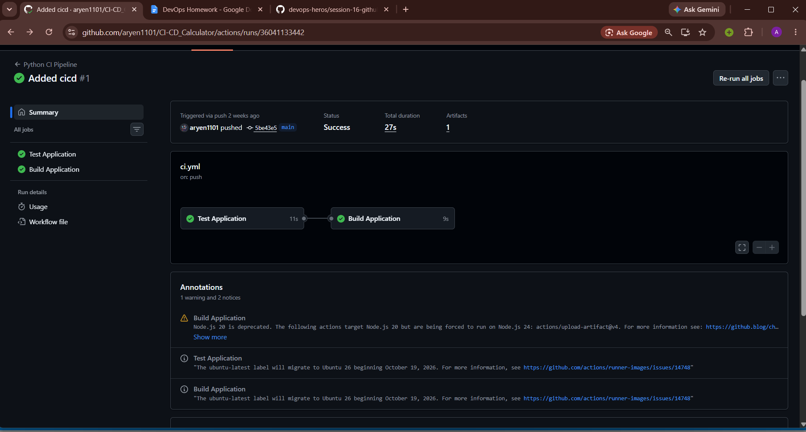

# CI/CD & GitHub Actions


## Project Structure

```text
CI_CD_Calculator/
├── .github/workflows/ci.yml   # GitHub Actions workflow (test job + build job)
├── app/calculator.py          # add, subtract, multiply, divide
├── tests/test_calculator.py   # 5 pytest tests
├── build.sh                   # copies the app into build/ and writes build-info.txt
├── requirements.txt           # pytest
├── .gitignore                 # ignores venv, __pycache__, build/
└── Report.md                  # assignment report
```

## Pipeline

```text
git push to main
      |
      v
GitHub Actions (ci.yml)
      |
      ├── Job 1: Test Application      checkout -> setup Python 3.12 -> pip install -> pytest -v
      |          needs: test
      └── Job 2: Build Application     checkout -> setup Python -> ./build.sh -> upload artifact
                                                                            |
                                                              calculator-build artifact
```

## Workflow file

```yaml
name: Python CI Pipeline
on:
  push:
    branches: [main]
  pull_request:
    branches: [main]
  workflow_dispatch:

jobs:
  test:
    name: Test Application
    runs-on: ubuntu-latest
    steps:
      - uses: actions/checkout@v6
      - uses: actions/setup-python@v7
        with:
          python-version: "3.12"
      - run: |
          python -m pip install --upgrade pip
          pip install -r requirements.txt
      - run: pytest -v

  build:
    name: Build Application
    needs: test
    runs-on: ubuntu-latest
    steps:
      - uses: actions/checkout@v6
      - uses: actions/setup-python@v7
        with:
          python-version: "3.12"
      - run: |
          chmod +x build.sh
          ./build.sh
      - uses: actions/upload-artifact@v4
        with:
          name: calculator-build
          path: build/
```

## Concepts covered

| Concept | Where it is in this project |
| :--- | :--- |
| CI vs CD | CI = test and build every push (this pipeline). CD = deploy what passed CI (not done here, see gaps below). |
| CI/CD pipeline | `ci.yml`: test job, then build job, then artifact |
| GitHub Actions | The service that runs `ci.yml` on GitHub's machines |
| Workflow | The file `.github/workflows/ci.yml`, named "Python CI Pipeline" |
| Jobs | `test` and `build`. `build` has `needs: test`, so it runs only if tests pass |
| Steps | Each `uses:` or `run:` line inside a job (checkout, setup Python, install, pytest, build.sh, upload) |
| Runners | `runs-on: ubuntu-latest`, a fresh Linux machine per job |
| Secrets | Not needed here. The pipeline does not push images or deploy, so no credentials are used |
| Artifacts | `upload-artifact` saves `build/` as `calculator-build`, downloadable from the run page |
| Build | `build.sh` copies `calculator.py` into `build/` and writes `build-info.txt` |
| Test | `pytest -v` runs 5 tests on add, subtract, multiply, divide and divide by zero |
| Pipeline execution | Triggered by push to `main`, PR to `main`, or manually with `workflow_dispatch` |

## Pipeline execution




