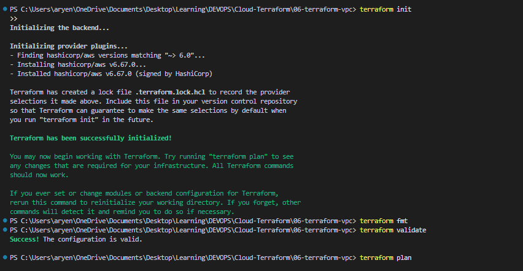
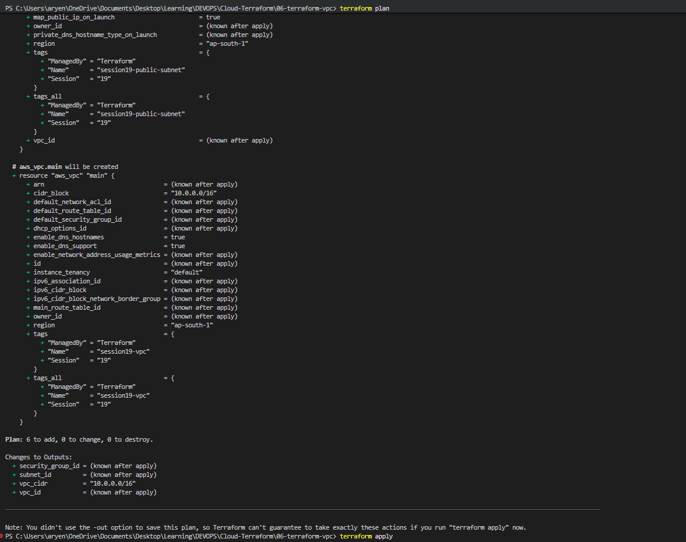
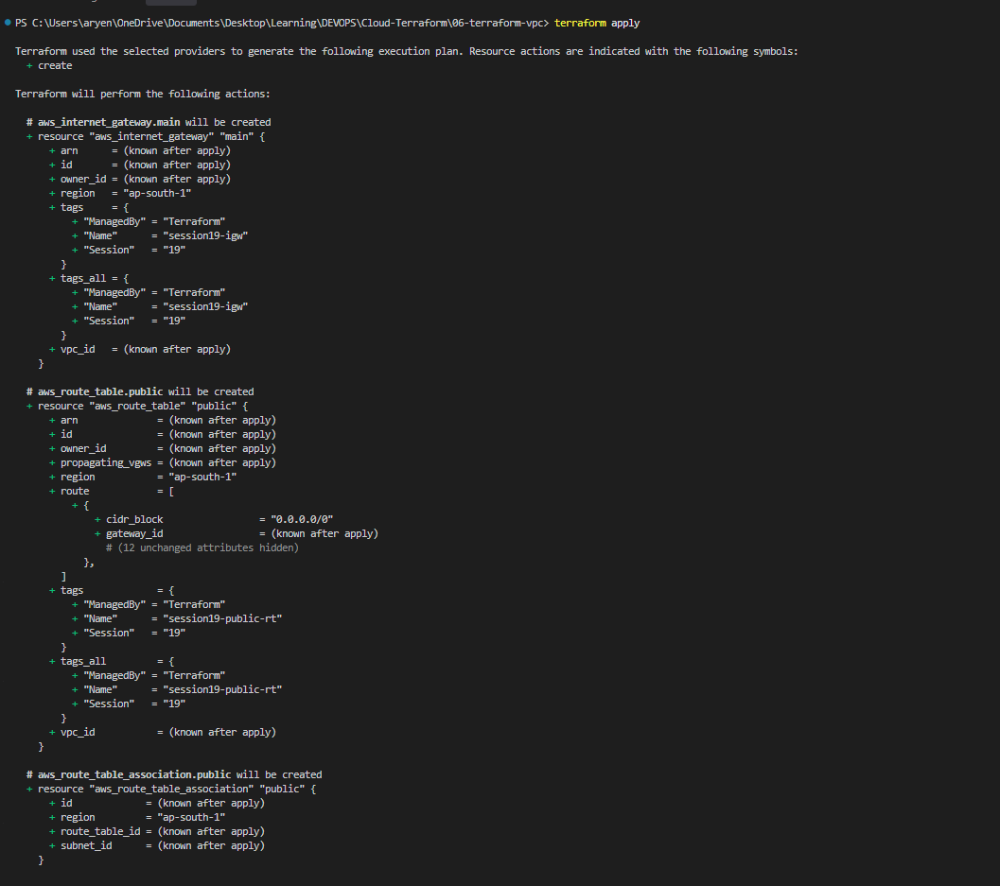
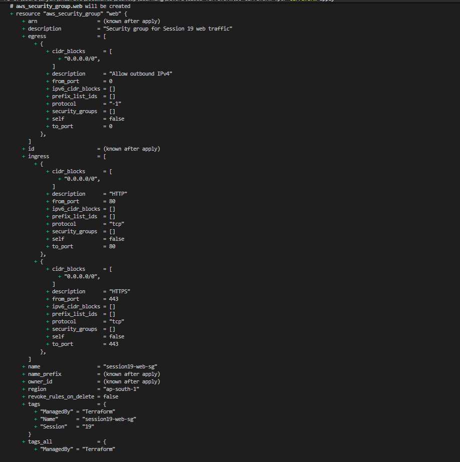
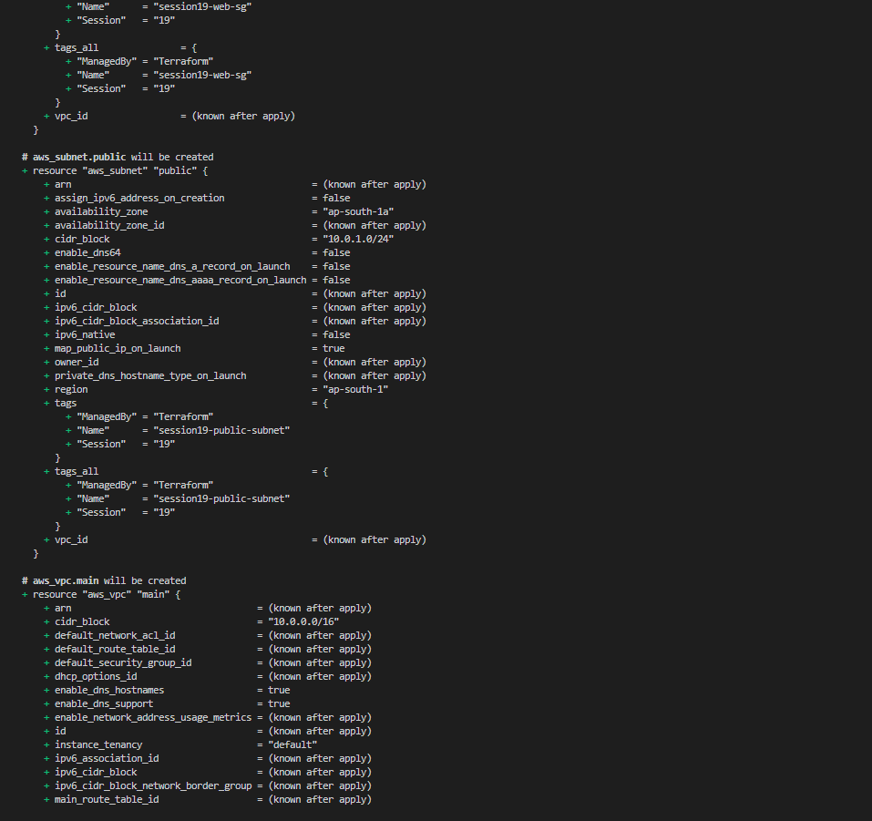
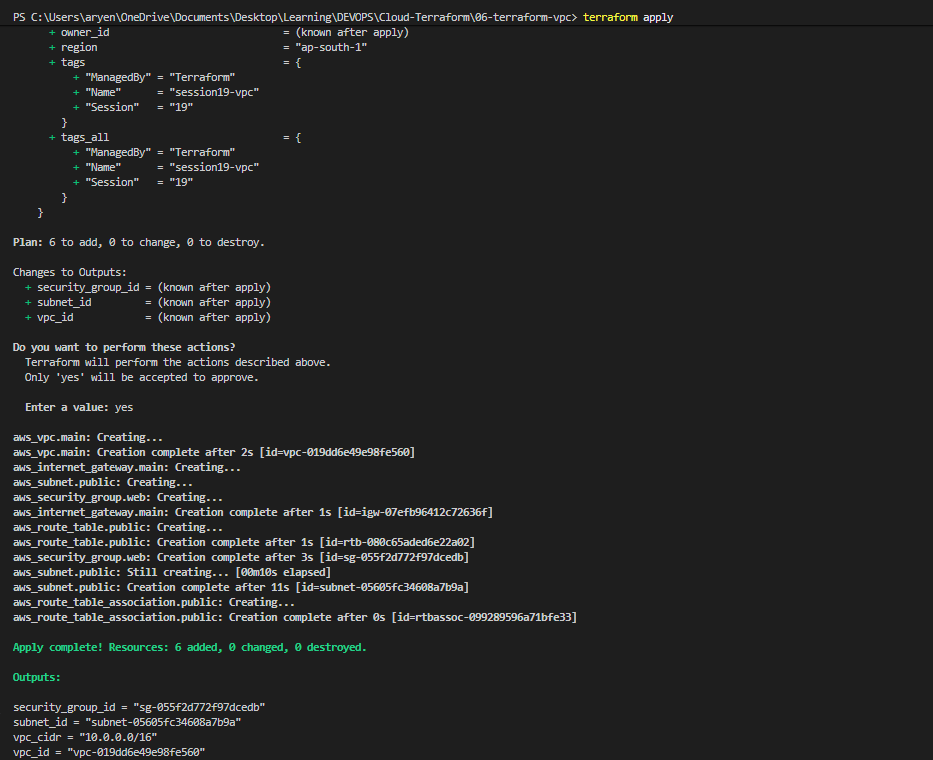
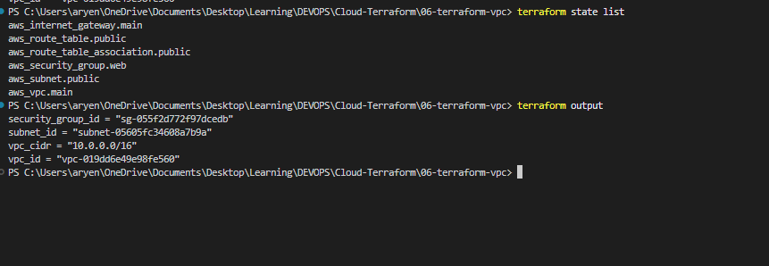
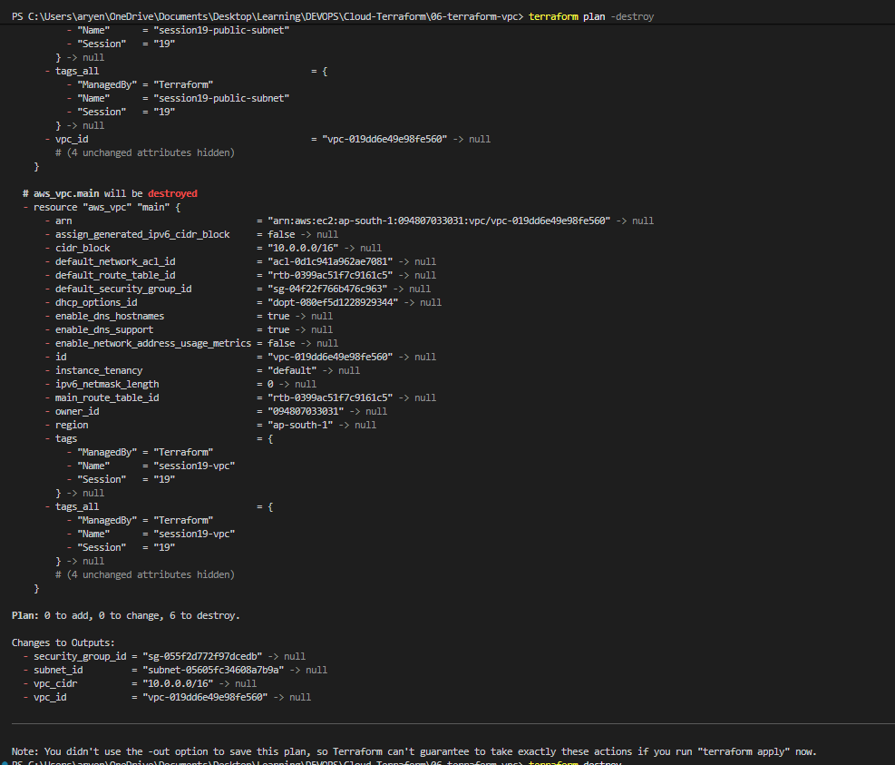
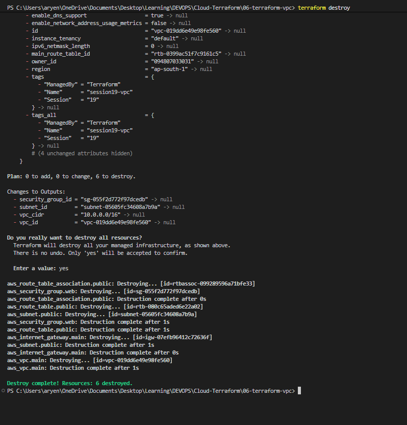

# Session 19: Cloud & Terraform in Action

End to end AWS network infrastructure built with Terraform. Project folder: `terraform-vpc/`

## Project Structure

```text
terraform-vpc/
├── versions.tf               # Terraform version + AWS provider (region from variable)
├── variables.tf              # aws_region variable
├── main.tf                   # VPC, subnet, internet gateway, route table, association, security group
├── outputs.tf                # vpc_id, vpc_cidr, subnet_id, security_group_id
├── terraform.tfvars.example  # sample variable values
├── .gitignore                # ignores state, tfvars, .terraform
└── README.md                 # step by step lab guide
```

## Architecture

```text
                      Internet
                          |
                          v
                 +------------------+
                 | Internet Gateway |  session19-igw
                 +--------+---------+
                          |
   +----------------------+----------------------+
   |                 VPC 10.0.0.0/16              |  session19-vpc
   |                                              |
   |   +--------------------------------------+   |
   |   |      Public Subnet 10.0.1.0/24       |   |  session19-public-subnet
   |   |      ap-south-1a, auto public IP     |   |
   |   |                                      |   |
   |   |   Security Group  session19-web-sg   |   |
   |   |   in : 80, 443 from 0.0.0.0/0        |   |
   |   |   out: all                           |   |
   |   +--------------------------------------+   |
   |                      |                       |
   |   Route Table  session19-public-rt           |
   |   0.0.0.0/0 -> Internet Gateway              |
   +----------------------------------------------+
```

## Resource Dependencies

Terraform works out the order from the references between resources. Nothing is created before the resource it points to.

```text
aws_vpc.main
 ├── aws_subnet.public               (vpc_id = aws_vpc.main.id)
 ├── aws_internet_gateway.main       (vpc_id = aws_vpc.main.id)
 ├── aws_security_group.web          (vpc_id = aws_vpc.main.id)
 └── aws_route_table.public          (vpc_id = aws_vpc.main.id, gateway_id = aws_internet_gateway.main.id)
      └── aws_route_table_association.public   (subnet_id + route_table_id)
```

Create order: VPC first, then subnet, gateway and security group in parallel, then route table, then association. Destroy runs in reverse.

## What the task asked for and where it is

| Requirement | Where |
| :--- | :--- |
| Terraform providers | `versions.tf`, `hashicorp/aws ~> 6.0` |
| Variables | `variables.tf`, `aws_region` |
| Resources | `main.tf`, 6 resources |
| Outputs | `outputs.tf`, 4 outputs |
| Dependencies | references between resources in `main.tf` |
| AWS infrastructure | VPC, subnet, internet gateway, route table, security group |
| Terraform state | `terraform state list` screenshot below |
| plan / apply / destroy | screenshots below |

## Terraform Commands

### terraform init, fmt, validate

```bash
terraform init
terraform fmt
terraform validate
```



### terraform plan

```bash
terraform plan
```



### terraform apply

```bash
terraform apply
```






### terraform state and output

```bash
terraform state list
terraform output
```



### terraform destroy

```bash
terraform plan -destroy
terraform destroy
```




## Result

```text
Plan:    6 to add, 0 to change, 0 to destroy
Apply:   Resources: 6 added
Destroy: Resources: 6 destroyed
```

All resources were created, verified with `terraform state list` and `terraform output`, and then destroyed so nothing is left running in AWS.
