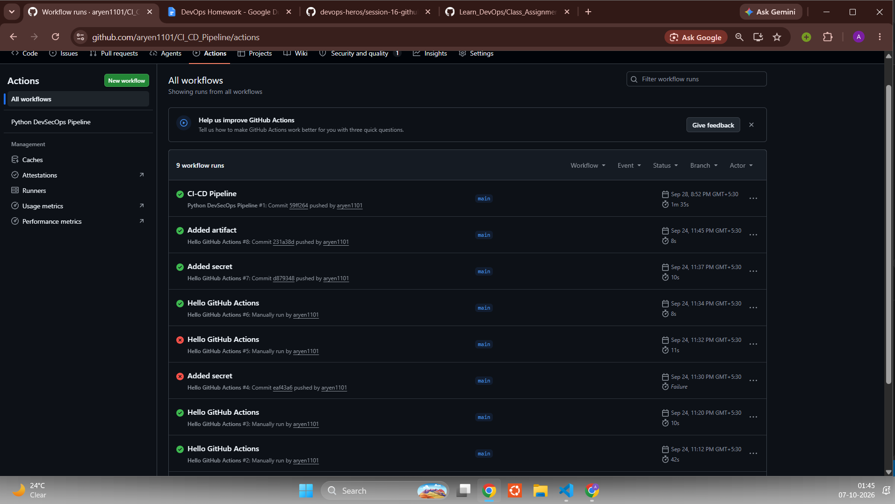
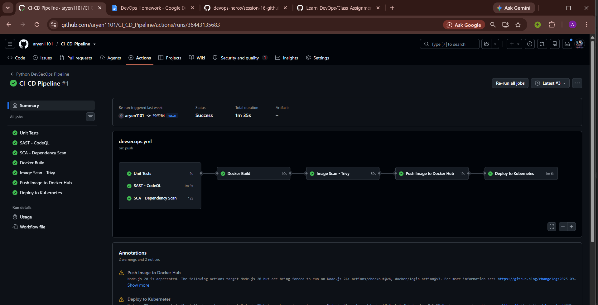
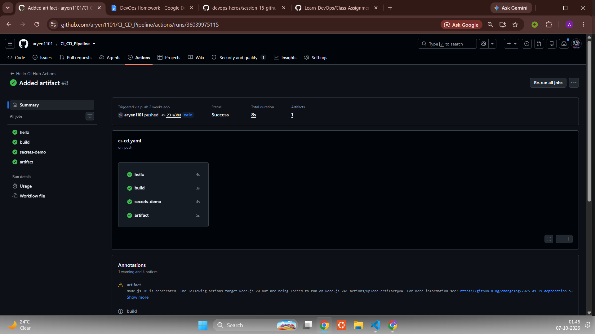

# Complete CI/CD & DevSecOps


## Project Structure

```text
CI-CD_Pipeline/
├── .github/workflows/devsecops.yml   # the pipeline (7 jobs)
├── app/                              # Flask app, templates, static files
├── tests/test_app.py                 # 8 pytest tests
├── Dockerfile                        # python:3.12-slim image
├── k8s/deployment.yaml               # 2 replicas
├── k8s/service.yaml                  # NodePort 30001 -> 5001
├── requirements.txt                  # Flask
├── requirements-dev.txt              # pytest, pytest-cov
└── pytest.ini
```

## Pipeline Flow

```text
git push to main
      |
      v
+-------------+   +---------------+   +----------------------+
| Unit Tests  |   | SAST - CodeQL |   | SCA - pip-audit      |   run in parallel
+------+------+   +-------+-------+   +----------+-----------+
       |                  |                      |
       +------------------+----------------------+
                          |  needs: all three
                          v
                   Docker Build
                          |
                          v
                 Image Scan - Trivy  (HIGH, CRITICAL)
                          |
                          v
              Push Image to Docker Hub  (secret: DOCKERHUB_TOKEN)
                          |
                          v
                Deploy to Kubernetes  (kind cluster, only on push to main)
                          |
                          v
          kubectl rollout status + curl the running app
```

## Jobs in `devsecops.yml`

| Stage | Job | What runs |
| :--- | :--- | :--- |
| Build + Unit Test | `test` | `pip install -r requirements-dev.txt`, `pytest --cov=app` |
| SAST | `sast` | `github/codeql-action` for Python, results go to the Security tab |
| SCA | `sca` | `pip-audit` checks `requirements.txt` for known CVEs |
| Docker Build | `docker-build` | `docker build -t session17-python:<sha> .`, needs test + sast + sca |
| Container Image Scan | `image-scan` | Trivy `--severity HIGH,CRITICAL` on the image |
| Push Image | `push` | `docker/login-action` with `secrets.DOCKERHUB_TOKEN`, push `<sha>` and `latest` tags |
| Deploy | `deploy` | create kind cluster, `kubectl apply -f k8s/`, `rollout status`, `curl` the service |

## Security Tools

| Tool | Type | Config |
| :--- | :--- | :--- |
| CodeQL | SAST | `github/codeql-action/init` + `analyze`, `languages: python` |
| pip-audit | SCA | installed in the job, run on `requirements.txt` |
| Trivy | Container image scan | installed from the Aqua apt repo, `--severity HIGH,CRITICAL` |
| GitHub Secrets | Credential handling | `DOCKERHUB_TOKEN` stored in repo secrets, never in code |

Security gate: the Docker build job has `needs: [test, sast, sca]`, so a failing test or a vulnerable dependency stops the image from being built. Push and deploy chain after the image scan with `needs`.

## Kubernetes Manifests

```yaml
# k8s/deployment.yaml
kind: Deployment
replicas: 2
image: 1101aryen/python-web:latest
containerPort: 5001

# k8s/service.yaml
kind: Service
type: NodePort
port: 80 -> targetPort: 5001
nodePort: 30001
```

## Pipeline Execution

All seven jobs passed. Total time 1m 35s.




Earlier practice run from the same repo (hello, build, secrets-demo, artifact jobs):



