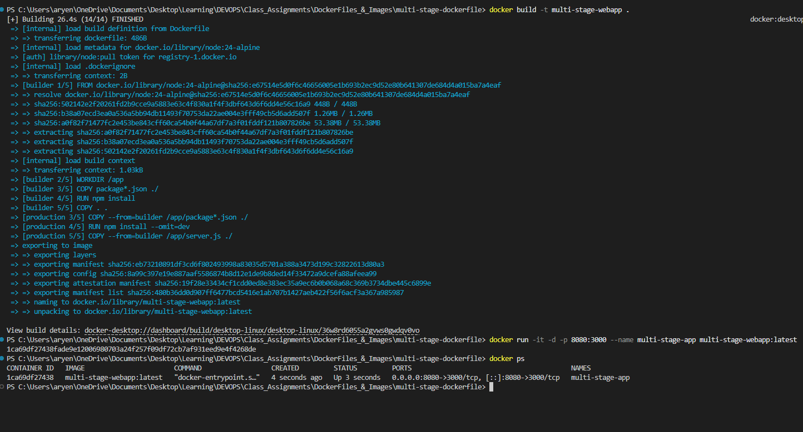
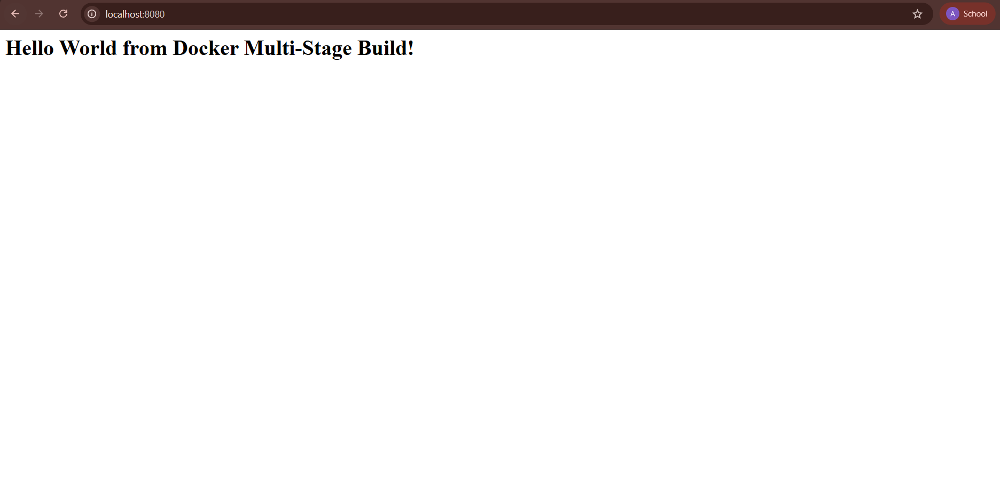
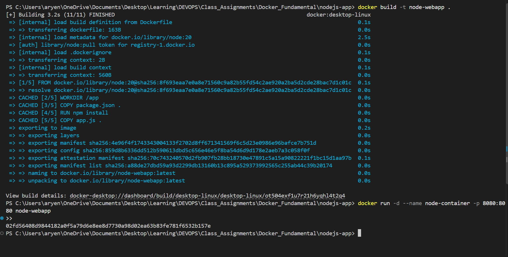

# DockerFiles & Images
**Name:** Aryen Mukundam

**Enrollment Number:** 10198

---

## Task 1: Run Multi-Stage Dockerfile


- Clone the repository containing the multi-stage Dockerfile.
- Build the Docker image using the multi-stage Dockerfile.
- Run a container from the image.
- Access the application running inside the container.
- Verify that the application displays `Hello World from Docker multi-stage build`.
- Verify the running container using `docker ps`.
- Confirm that the application is running on port `8080`.


### Dockerfile

```dockerfile
# -------------------------
# Stage 1: Build
# -------------------------
FROM node:24-alpine AS builder
WORKDIR /app
COPY package*.json ./
RUN npm install
COPY . .

# -------------------------
# Stage 2: Production
# -------------------------
FROM node:24-alpine AS production
WORKDIR /app
COPY --from=builder /app/package*.json ./
RUN npm install --omit=dev
COPY --from=builder /app/server.js ./
EXPOSE 3000
CMD ["npm", "start"]
```

### Commands

Build the image from the multi-stage Dockerfile:

```bash
docker build -t multi-stage-webapp .
```

Run the container and map host port `8080` to container port `3000`:

```bash
docker run -it -d -p 8080:3000 --name multi-stage-app multi-stage-webapp:latest
```

Verify the running container:


### Output






---

## Task 2: Documentation

**Name:** Aryen Mukundam

**Enrollment Number:** 10198

### Application running successfully


### docker ps showing the running container on port 8080


```text
CONTAINER ID   IMAGE                       COMMAND                  CREATED         STATUS         PORTS                                         NAMES
1ca69df27438   multi-stage-webapp:latest   "docker-entrypoint.s…"   4 seconds ago   Up 3 seconds   0.0.0.0:8080->3000/tcp, [::]:8080->3000/tcp   multi-stage-app
```

---

## Task 3: Docker Application Deployment

The requirement is to deploy at least 3 different types of applications using Docker: Node.js, Python and Java.

Each application has its own folder in this directory containing the application code, its `Dockerfile`, a `README.md`, and the output screenshot.

---

### 1. nodejs-app

**Files:** `app.js`, `package.json`, `Dockerfile`

```dockerfile
FROM node:20

WORKDIR /app

COPY package.json .

RUN npm install

COPY app.js .

EXPOSE 8080

CMD ["npm", "start"]
```

```bash
docker build -t node-webapp .
docker run -d --name node-container -p 8080:8080 node-webapp
```




---

### 2. python-app

**Files:** `app.py`, `requirements.txt`, `Dockerfile`

```dockerfile
FROM python:3.12

WORKDIR /app

COPY requirements.txt .

RUN pip install -r requirements.txt

COPY app.py .

EXPOSE 8080

CMD ["python", "app.py"]
```

```bash
docker build -t python-webapp .
docker run -d --name python-container -p 8080:8080 python-webapp
```


---

### 3. java-app

**Files:** `Main.java`, `Dockerfile`

```dockerfile
FROM eclipse-temurin:21-jdk

WORKDIR /app

COPY Main.java .

RUN javac Main.java

EXPOSE 8080

CMD ["java", "Main"]
```

```bash
docker build -t java-webapp .
docker run -d --name java-container -p 8080:8080 java-webapp
```


