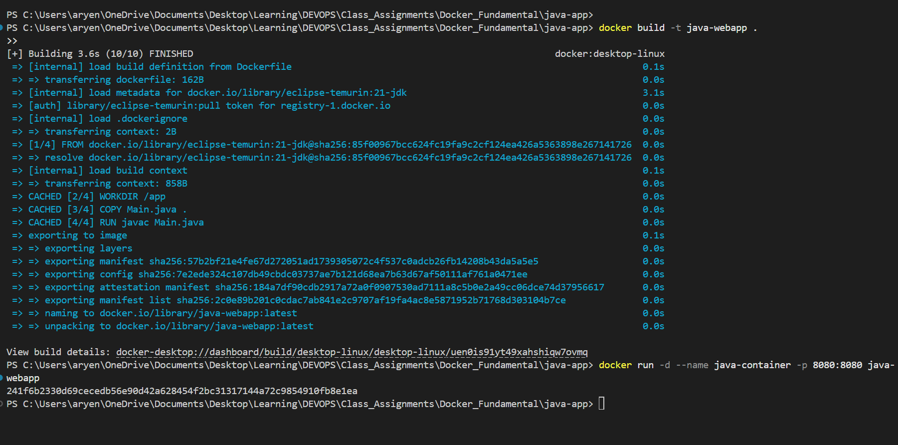
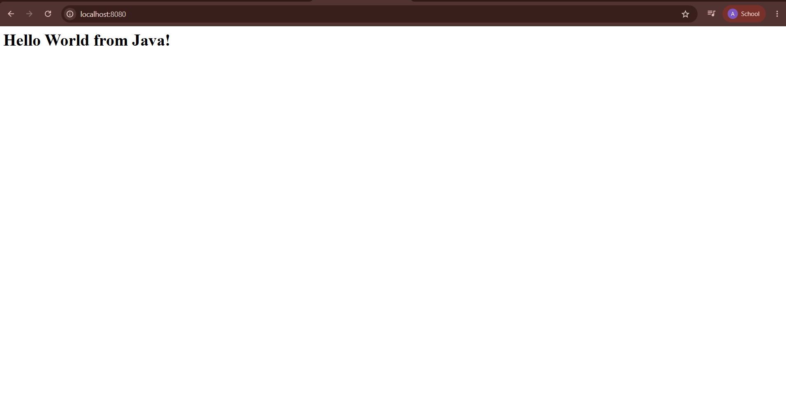
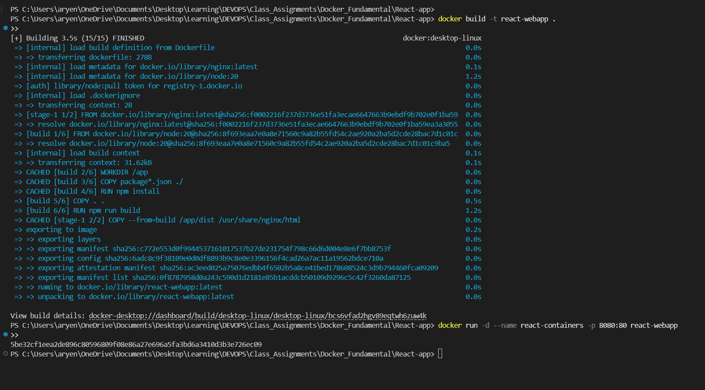
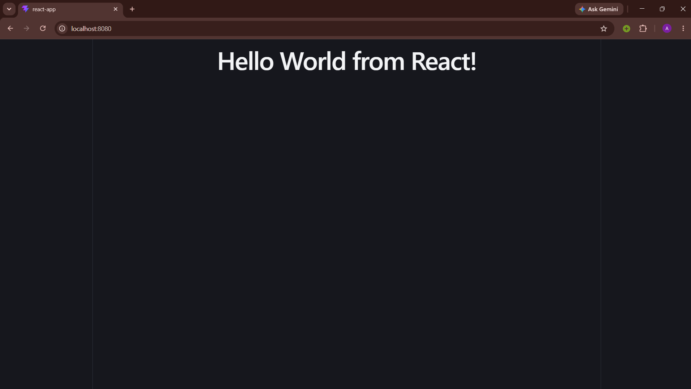
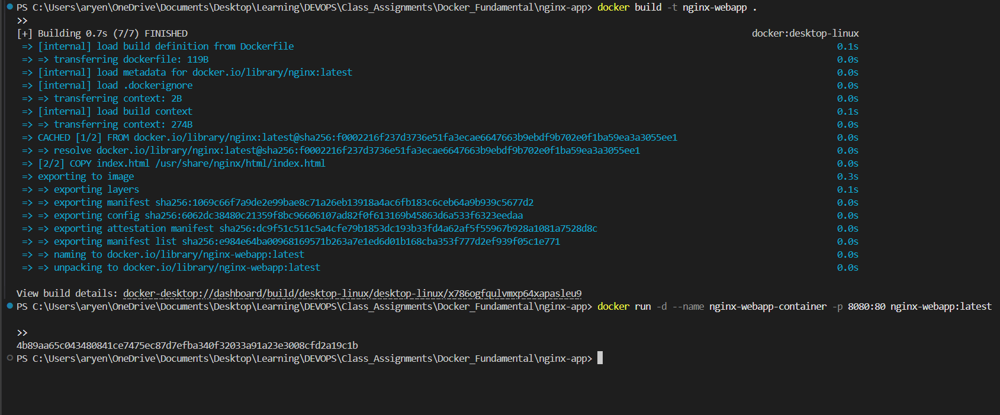

# Docker Homework Tasks

## Task: Hello World Applications

Simple Hello World web applications containerised with Docker.

Each application has its own folder containing the application code, a `Dockerfile`, and a screenshot of the output in the browser.


## 1. nodejs-app

### Files

`app.js`, `package.json`, `Dockerfile`

### Dockerfile

```dockerfile
FROM node:20

WORKDIR /app

COPY package.json .

RUN npm install

COPY app.js .

EXPOSE 8080

CMD ["npm", "start"]
```

### Commands

Build the image from the Dockerfile:

```bash
docker build -t node-webapp .
```

Run the container and map host port `8080` to container port `8080`:

```bash
docker run -d --name node-container -p 8080:8080 node-webapp
```


### Output


---

## 2. python-app

### Files

`app.py`, `requirements.txt`, `Dockerfile`

### Dockerfile

```dockerfile
FROM python:3.12

WORKDIR /app

COPY requirements.txt .

RUN pip install -r requirements.txt

COPY app.py .

EXPOSE 8080

CMD ["python", "app.py"]
```

### Commands

Build the image from the Dockerfile:

```bash
docker build -t python-webapp .
```

Run the container and map host port `8080` to container port `8080`:

```bash
docker run -d --name python-container -p 8080:8080 python-webapp
```


### Output


---

## 3. java-app

### Files

`Main.java`, `Dockerfile`

### Dockerfile

```dockerfile
FROM eclipse-temurin:21-jdk

WORKDIR /app

COPY Main.java .

RUN javac Main.java

EXPOSE 8080

CMD ["java", "Main"]
```

### Commands

Build the image from the Dockerfile:

```bash
docker build -t java-webapp .
```

Run the container and map host port `8080` to container port `8080`:

```bash
docker run -d --name java-container -p 8080:8080 java-webapp
```

### Output



---

## 4. Apache-app

### Files

`index.html`, `Dockerfile`

### Dockerfile

```dockerfile
FROM httpd:latest

COPY index.html /usr/local/apache2/htdocs/

EXPOSE 80
```

### Commands

Build the image from the Dockerfile:

```bash
docker build -t apache-webapp .
```

Run the container and map host port `8080` to container port `80`:

```bash
docker run -d --name apache-container -p 8080:80 apache-webapp
```

### Output


---

## 5. React-app

### Files

`src/App.jsx`, `src/main.jsx`, `src/index.css`, `index.html`, `package.json`, `vite.config.js`, `Dockerfile`

### Dockerfile

```dockerfile
FROM node:20 AS build

WORKDIR /app

COPY package*.json ./

RUN npm install

COPY . .

RUN npm run build

FROM nginx:latest

COPY --from=build /app/dist /usr/share/nginx/html

EXPOSE 80

CMD ["nginx", "-g", "daemon off;"]
```

### Commands

Build the image from the Dockerfile:

```bash
docker build -t react-webapp .
```

Run the container and map host port `8080` to container port `80`:

```bash
docker run -d --name react-containers -p 8080:80 react-webapp
```

### Output




---

## 6. nginx-app

### Files

`index.html`, `Dockerfile`

### Dockerfile

```dockerfile
FROM nginx:latest

COPY index.html /usr/share/nginx/html/index.html

EXPOSE 80
```

### Commands

**1. Run the official image**

Pull the official image from Docker Hub:

```bash
docker pull nginx
```

Run it and map host port `8080` to container port `80`:

```bash
docker run -d --name nginx-app -p 8080:80 nginx
```

**2. Build and run the custom image**

Build the image from the local Dockerfile:

```bash
docker build -t nginx-webapp .
```

Run the custom image:

```bash
docker run -d --name nginx-webapp-container -p 8080:80 nginx-webapp:latest
```

### Output

Running the official Nginx image:


Running the custom Nginx image built from the Dockerfile:



