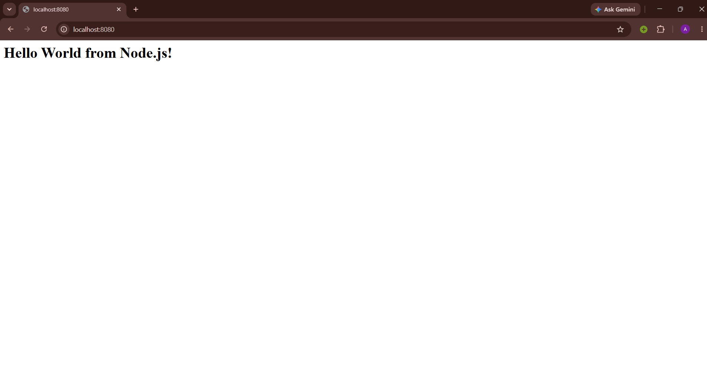

# Node.js Web App

## Image



## Dockerfile

```dockerfile
FROM node:20

WORKDIR /app

COPY package.json .

RUN npm install

COPY app.js .

EXPOSE 8080

CMD ["npm", "start"]
```

## Commands

Build the image from the Dockerfile:

```bash
docker build -t node-webapp .
```

Run the container and map host port `8080` to container port `8080`:

```bash
docker run -d --name node-container -p 8080:8080 node-webapp
```

### Terminal Output


