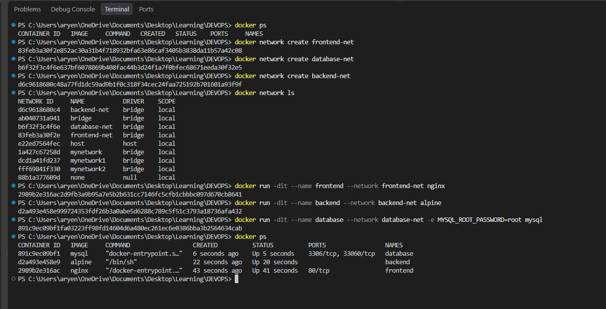
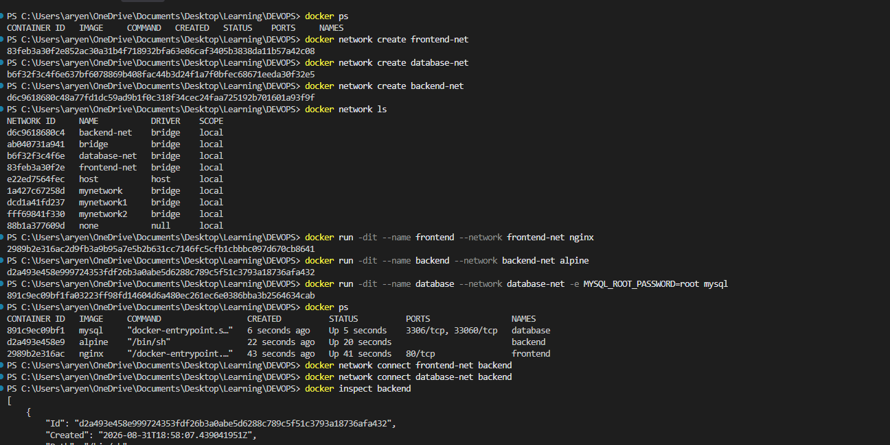
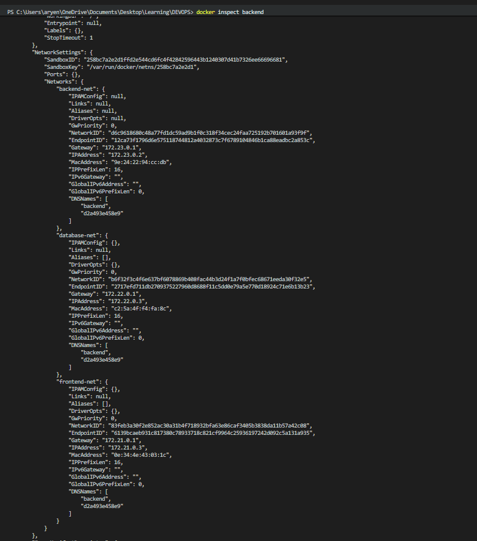
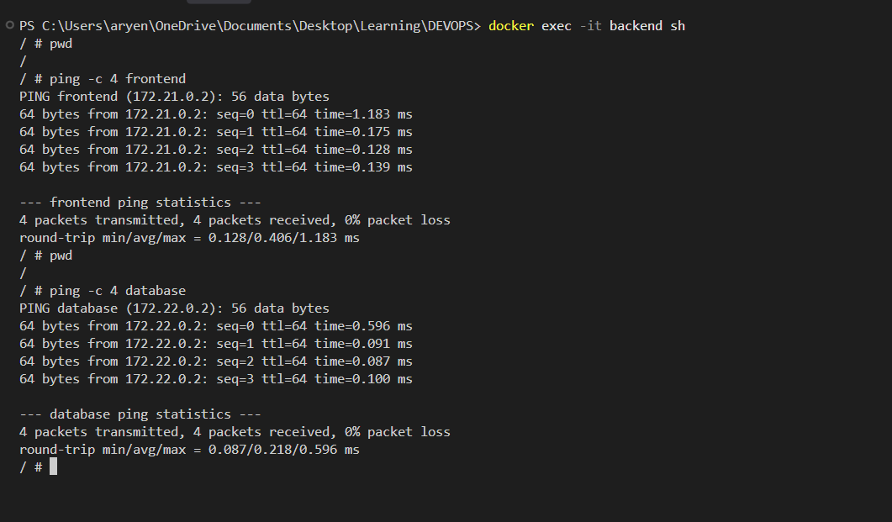
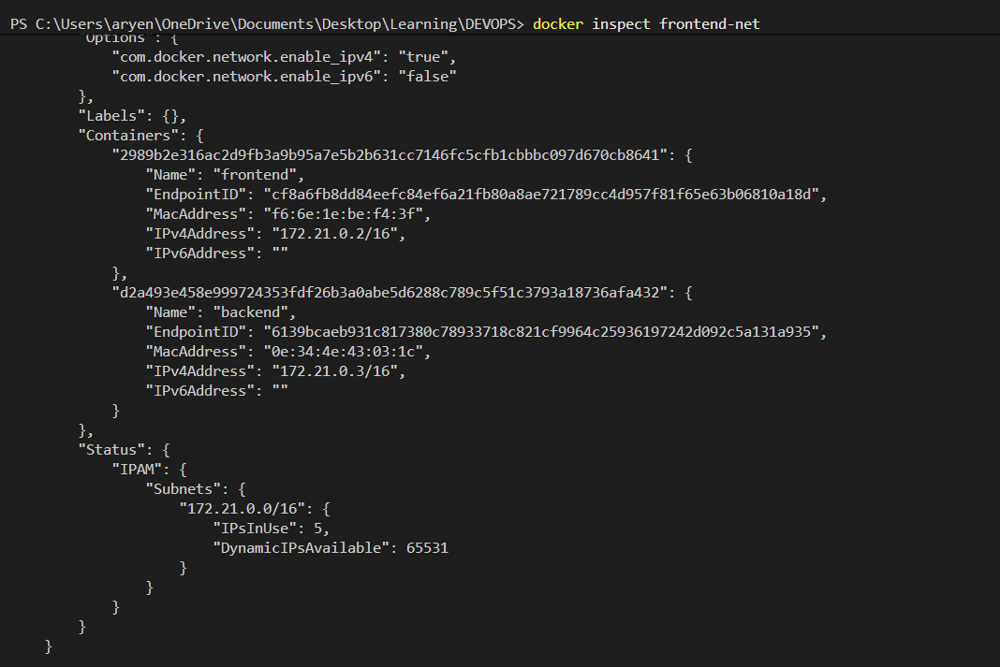
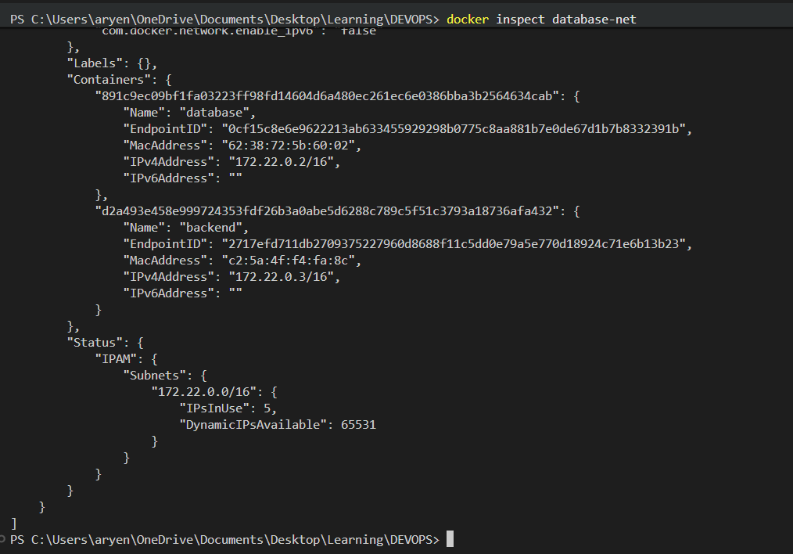
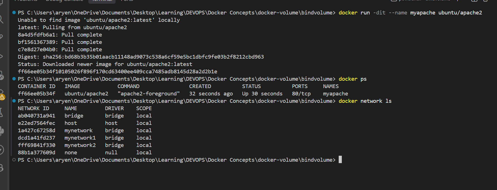
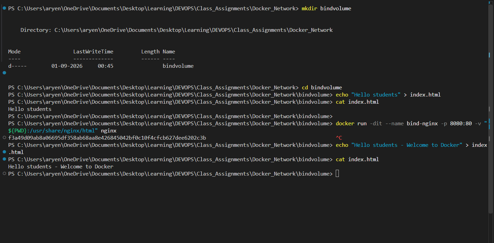

# Docker Network


## Task 1: Docker Container Networking


- Create 3 containers: Frontend, Backend, Database.
- Use Nginx or Alpine images for the frontend and backend.
- Use the MySQL image for the database.
- Create 3 different Docker networks.
- Add the backend container to 2 networks.
- Check connectivity between the containers.

### Commands

Create the 3 networks:

```bash
docker network create frontend-net
docker network create database-net
docker network create backend-net
docker network ls
```

Create the 3 containers, each on its own network:

```bash
docker run -dit --name frontend --network frontend-net nginx
docker run -dit --name backend  --network backend-net  alpine
docker run -dit --name database --network database-net -e MYSQL_ROOT_PASSWORD=root mysql
docker ps
```

Add the backend container to 2 more networks:

```bash
docker network connect frontend-net backend
docker network connect database-net backend
docker inspect backend
```

Check connectivity from the backend container:

```bash
docker exec -it backend sh
ping -c 4 frontend
ping -c 4 database
```

Verify which containers are attached to each network:

```bash
docker inspect frontend-net
docker inspect database-net
```

### Output



















---

## Task 2: Host Network

### Steps

- Pull the Apache2 image from Docker Hub.
- Create an Apache2 container using the host network.
- Access the Apache website directly on port 80.

### Commands

Pull the Apache2 image:

```bash
docker pull ubuntu/apache2
```

Create the container using the host network:

```bash
docker run -dit --name myapache --network host ubuntu/apache2
docker ps
```


Access the Apache website on port 80:

```bash
curl http://localhost:80
```

### Output





---

## Task 3: Bind Mount

### Steps

- Create a folder on your local machine.
- Create an `index.html` file with `Hello students` as the content.
- Bind mount the folder to an Nginx container.
- Access the Nginx website and verify the content.
- Modify the `index.html` file.
- Verify that the changes are reflected without restarting the container.

### Commands

Create the folder and the file:

```bash
mkdir bindvolume
cd bindvolume
echo "Hello students" > index.html
cat index.html
```

Bind mount the folder to an Nginx container:

```bash
docker run -dit --name bind-nginx -p 8080:80 -v "${PWD}:/usr/share/nginx/html" nginx
```

Open `http://localhost:8080` in the browser.

Modify the file:

```bash
echo "Hello students - Welcome to Docker" > index.html
cat index.html
```

Refresh `http://localhost:8080`. The container is not restarted.

### Output




`http://localhost:8080` serving the original content:


`http://localhost:8080` after modifying `index.html`, without restarting the container:


---

## Task 4: Overlay Network

### Steps

- Research Docker overlay networks.
- Understand their use cases.
- Understand how overlay networks work across multiple Docker hosts.

### What is an overlay network?

An overlay network is a Docker network that allows containers running on different Docker hosts to communicate with each other as if they were on the same network. It creates a virtual network on top of the physical networks of the Docker hosts.

### Why is it used?

A normal bridge network is limited to containers on the same Docker host. An overlay network is used when containers or services are distributed across multiple Docker hosts.

### How does it work?

Docker creates a virtual distributed network between Docker daemons and handles the routing of packets from a container on one host to the correct container on another host.

Docker Swarm mode is used to establish the multi-host environment. The participating Docker hosts become nodes in the same Swarm.

### Commands

```bash
docker swarm init
docker network create -d overlay my-overlay
docker network ls
```

### Use cases

- Docker Swarm applications
- Microservices distributed across multiple servers
- Frontend, backend and database services running on different hosts
- Applications requiring communication between containers on different Docker machines
- Distributed or scaled applications
