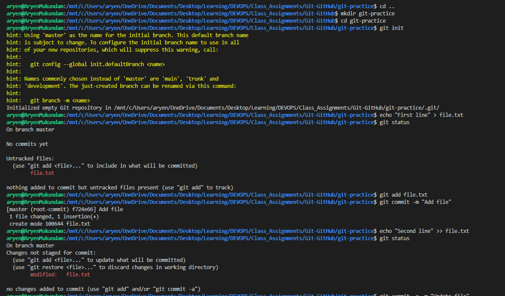
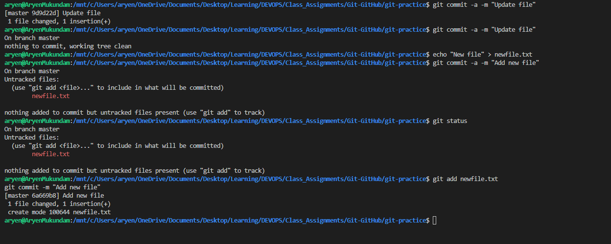
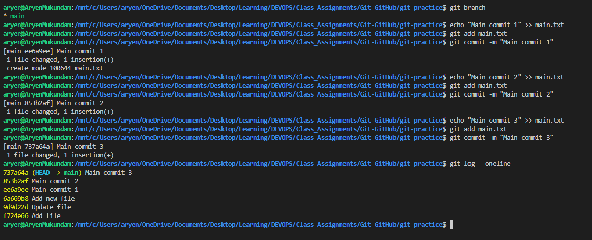
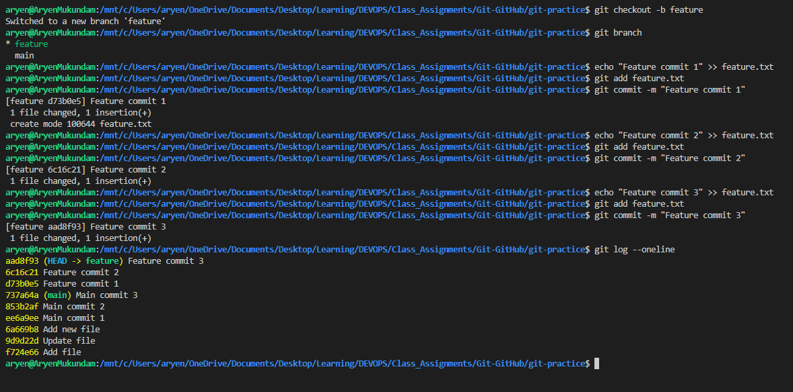
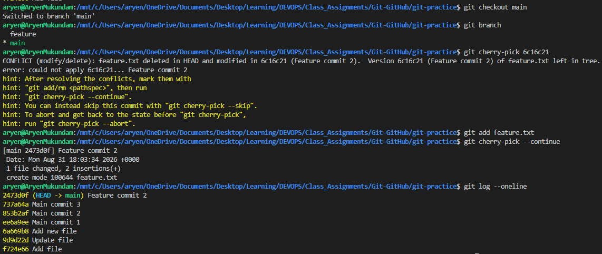
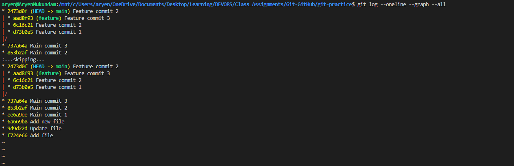

# Git & GitHub


## Task 1: git commit -a -m vs git commit -m

- Practice `git commit -a -m "message"`.
- Understand the difference between `git commit -a -m` and `git commit -m`.
- Test both commands and observe the difference.

### Commands

```bash
git init
echo "First line" > file.txt
git status
git add file.txt
git commit -m "Add file"

echo "Second line" >> file.txt
git status
git commit -a -m "Update file"

echo "New file" > newfile.txt
git commit -a -m "Add new file"
git add newfile.txt
git commit -m "Add new file"
```

### Explanation

`git commit -m` commits only the changes that are already staged.

```bash
git commit -m "message"
```

`git commit -a -m` automatically stages modified/deleted tracked files and commits them in one step.

```bash
git commit -a -m "message"
```

`-a` does not automatically include newly created/untracked files. Those still need `git add` first.

### Output






---

## Task 2: Git Cherry-Pick

- Create 2-4 commits in the main branch.
- Use `git log` to view the commits.
- Create a new branch.
- Make 2-3 commits in the new branch.
- Use `git log` to identify a specific commit.
- Cherry-pick one specific commit from the new branch into the main branch.
- Verify that the selected commit/change is now available in the main branch.

### Commands

```bash

git branch
echo "Main commit 1" >> main.txt
git add main.txt
git commit -m "Main commit 1"
echo "Main commit 2" >> main.txt
git add main.txt
git commit -m "Main commit 2"
echo "Main commit 3" >> main.txt
git add main.txt
git commit -m "Main commit 3"
git log --oneline

git checkout -b feature
git branch
echo "Feature commit 1" >> feature.txt
git add feature.txt
git commit -m "Feature commit 1"
echo "Feature commit 2" >> feature.txt
git add feature.txt
git commit -m "Feature commit 2"
echo "Feature commit 3" >> feature.txt
git add feature.txt
git commit -m "Feature commit 3"
git log --oneline

# cherry-pick "Feature commit 2" into main
git checkout main
git branch
git cherry-pick 6c16c21
git add feature.txt
git cherry-pick --continue
git log --oneline
git log --oneline --graph --all
```

### Explanation

`git cherry-pick <commit-hash>` copies one specific commit from another branch into the current branch, without merging the whole branch.

The commit hash is taken from `git log --oneline` on the feature branch.

The cherry-picked commit gets a new hash on `main` (`2473d0f`) even though the change is the same as `6c16c21`.

### Output










