# Session 15: Helm

Helm is the package manager for Kubernetes. A **chart** is the package (templates + values), a **release** is one installed copy of the chart, and **values** are the settings you pass in.

---

## Task 1: Helm Commands

### helm repo and helm search

`helm repo` manages chart repositories. `helm search` finds charts in them. Files in `01-what-is-helm/`.

```bash
helm version
helm repo add bitnami https://charts.bitnami.com/bitnami
helm repo update
helm repo list
helm search repo nginx            # search added repos
helm search hub wordpress         # search Artifact Hub
helm install my-nginx bitnami/nginx
kubectl get pods
kubectl get services
helm uninstall my-nginx
```

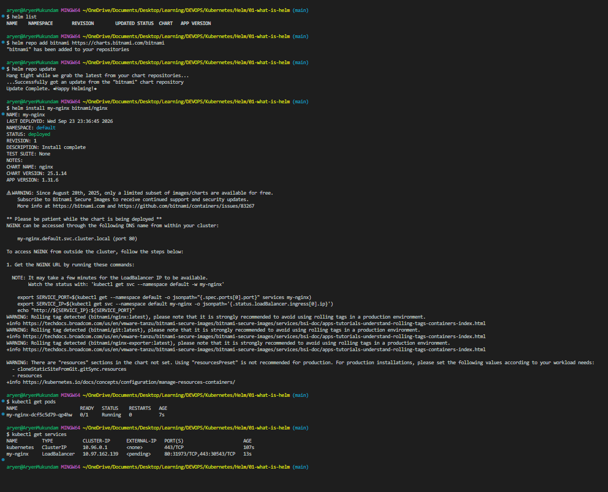

### helm create

Makes a new chart folder with a default `Chart.yaml`, `values.yaml` and `templates/`. Files in `02-helm-charts/`.

```bash
helm create demo-chart
ls demo-chart/
ls demo-chart/templates/
helm template my-release demo-chart     # render YAML locally, no cluster needed
helm install demo-release demo-chart
kubectl get pods
helm list
helm uninstall demo-release
```

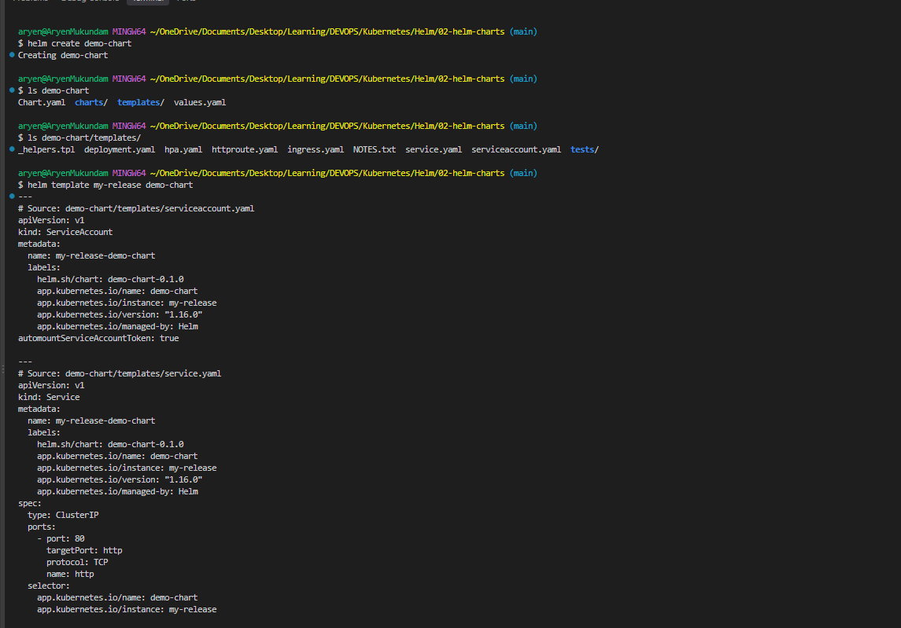
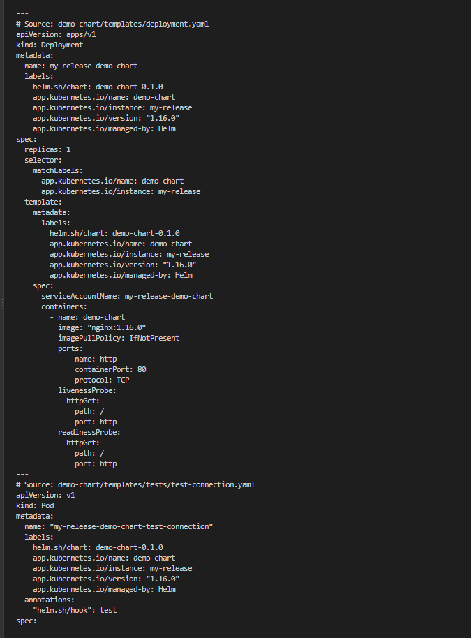
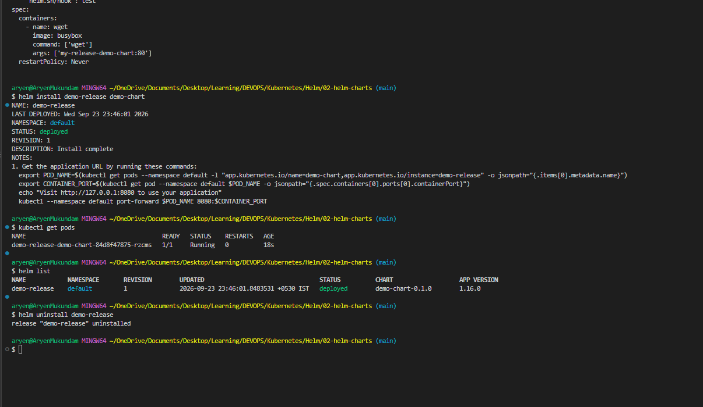

### helm install

Installs a chart into the cluster and creates a release (revision 1). Files in `03-chart-structure/`.

```bash
helm template my-release simple-chart
helm install my-release simple-chart
kubectl get pods
kubectl get services
helm uninstall my-release
```

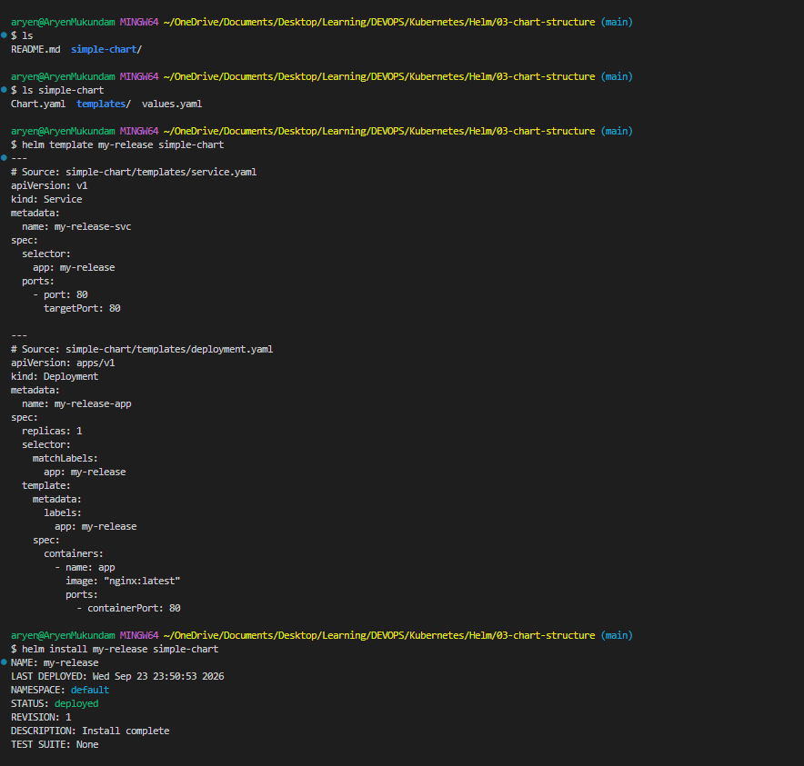
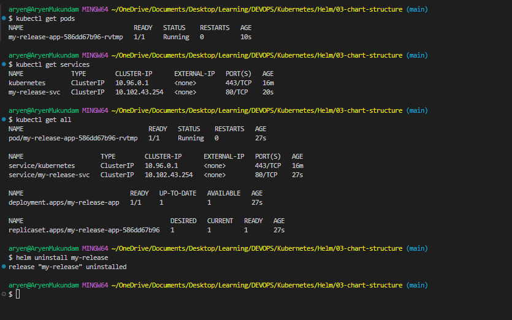

### helm lint

Checks a chart for mistakes before installing. Files in `04-chart-yaml/`.

```bash
helm lint my-app/
```

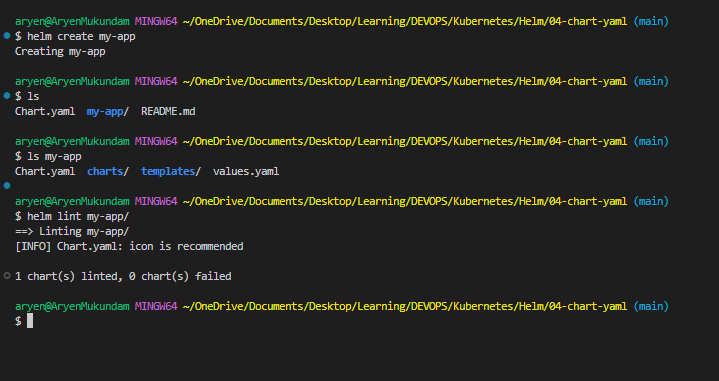

### Overriding values (-f and --set)

`values.yaml` holds defaults. `--set` changes one value on the command line. `-f` loads a whole values file. Files in `05-values-yaml/`.

```bash
helm install my-app ./chart --set replicaCount=3
helm install my-app ./chart -f values-prod.yaml
helm template my-app ./chart | grep "replicas:"
helm template my-app ./chart --set replicaCount=3 | grep "replicas:"
```

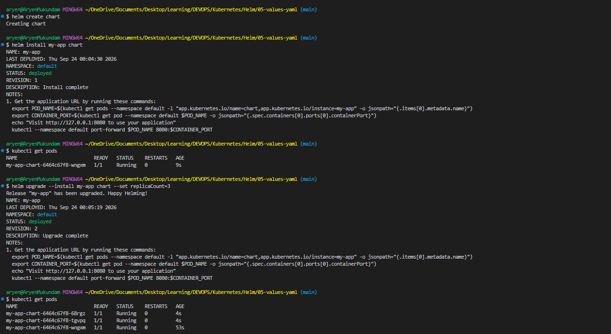
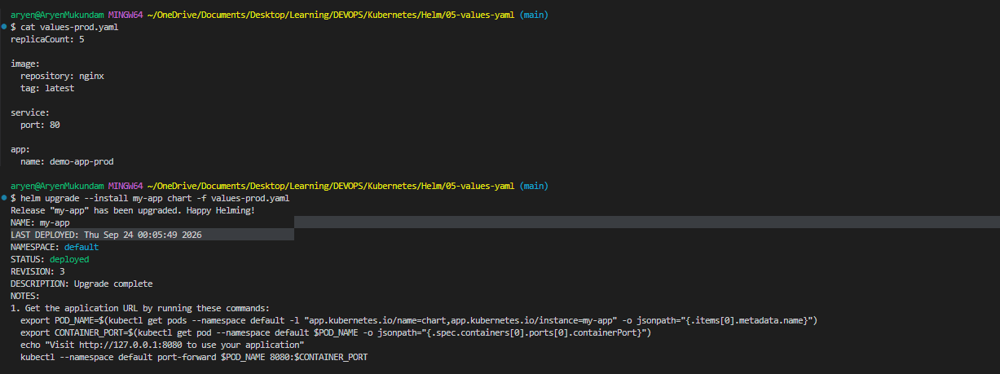
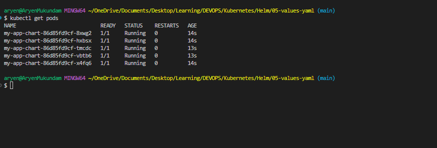

### helm template

Renders the templates with values and prints the final YAML. Good for checking `{{ }}` placeholders. Files in `06-templates/`.

```bash
helm template my-release template-demo
helm template my-release template-demo --set replicaCount=5 | grep "replicas:"
```

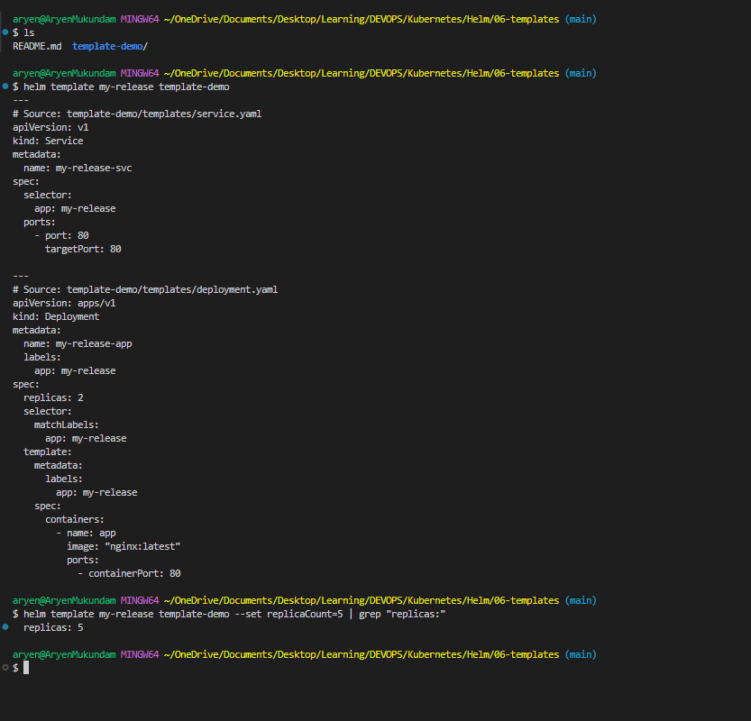

### helm list

Shows all releases in the namespace with their revision and status.

```bash
helm list
helm list -A          # all namespaces
```

### helm status

Shows the current state of one release: status, revision, and the notes from the chart.

```bash
helm status web-app
```

### helm get

Shows what Helm stored for a release.

```bash
helm get values web-app       # values used for this release
helm get manifest web-app     # the rendered YAML that was applied
helm get all web-app          # everything
```

### helm upgrade

Changes a running release to new values or a new chart version. Every upgrade creates a new revision. `--install` installs if the release does not exist yet. Files in `07-install-upgrade/`.

```bash
helm install web-app ./app-chart
kubectl get pods
helm list
helm upgrade web-app ./app-chart --set replicaCount=3
kubectl get pods
helm upgrade --install web-app ./app-chart
helm uninstall web-app
```

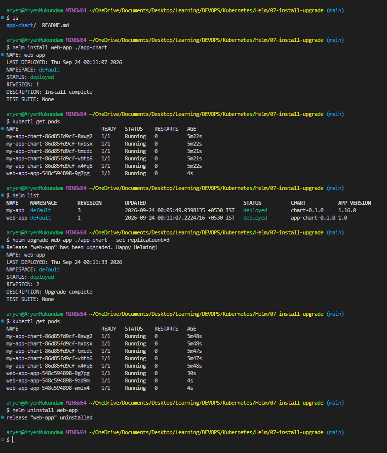

### helm history and helm rollback

`helm history` lists every revision of a release. `helm rollback <release> <revision>` goes back to an older revision, which creates a new revision. `--atomic` on an upgrade rolls back automatically if the upgrade fails. Files in `08-rollback/`.

```bash
helm install rollback-demo ./app-chart
helm upgrade rollback-demo ./app-chart --set image.tag=doesnotexist
kubectl get pods                       # ImagePullBackOff
helm history rollback-demo
helm rollback rollback-demo 1
kubectl get pods                       # Running again
helm history rollback-demo
helm upgrade rollback-demo ./app-chart --set image.tag=doesnotexist --atomic --timeout 60s
helm uninstall rollback-demo
```

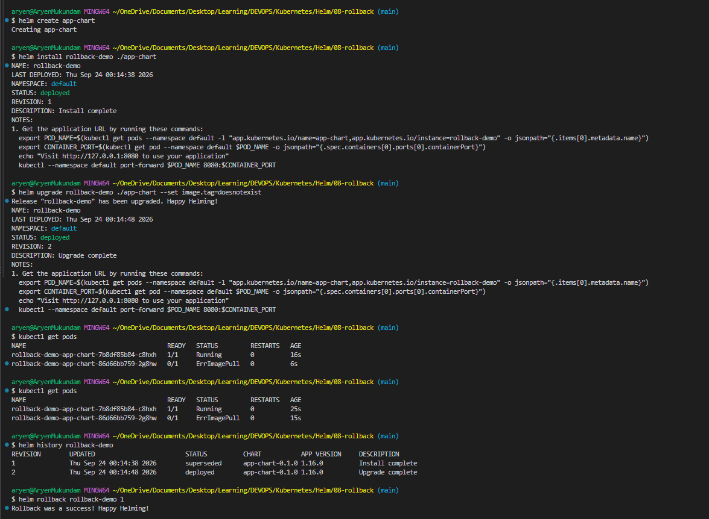
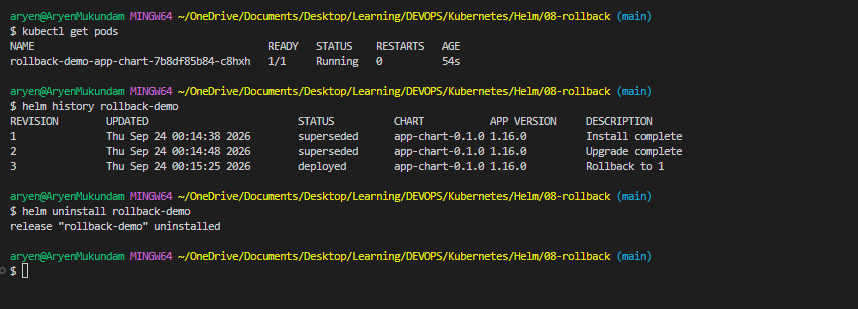

### helm uninstall

Removes the release and all the Kubernetes objects it created.

```bash
helm uninstall web-app
helm list
```


## Task 2: Helm Rollback

Full workflow using the guestbook chart in `09-deploying-application/`.

```text
Install (rev 1) -> Upgrade (rev 2) -> Verify -> Upgrade again (rev 3) -> Verify -> Rollback (rev 4) -> Verify
```

**1. Install**

```bash
helm lint guestbook-chart
helm template my-guestbook guestbook-chart
helm install my-guestbook guestbook-chart
kubectl get pods
kubectl get services
kubectl get configmaps
```

Revision 1, one Pod running.

**2. Upgrade and verify**

```bash
helm upgrade my-guestbook guestbook-chart --set replicaCount=3
kubectl get pods
helm history my-guestbook
```

Revision 2, three Pods running.

**3. Upgrade again and verify**

```bash
helm upgrade my-guestbook guestbook-chart --set image.tag=doesnotexist
kubectl get pods
helm history my-guestbook
```

Revision 3, Pods go to `ImagePullBackOff` because the image tag does not exist.

**4. Rollback and verify**

```bash
helm rollback my-guestbook 2
kubectl get pods
helm history my-guestbook
helm uninstall my-guestbook
```

Rollback creates revision 4 with the same values as revision 2. Pods are `Running` again.

**Output**

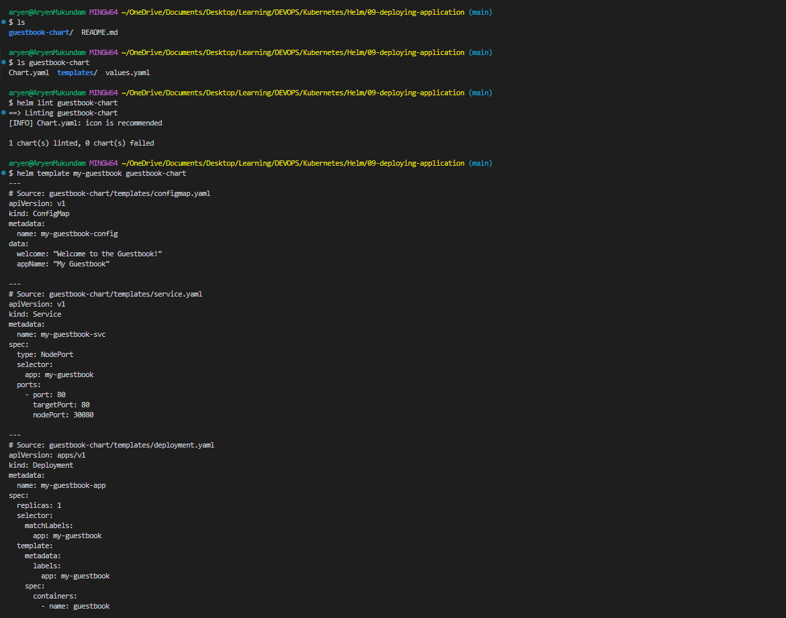
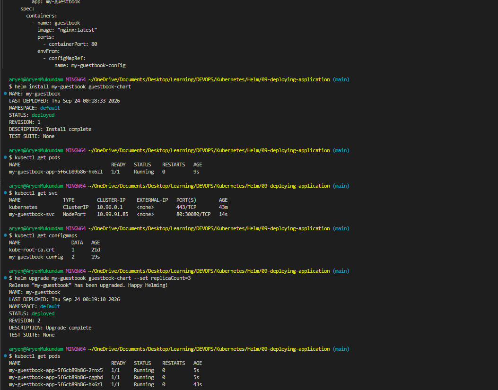
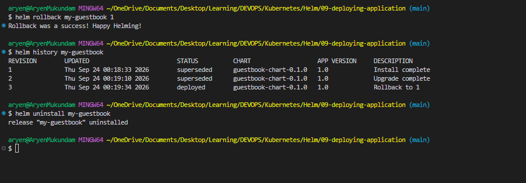

**Key points**

* Every install, upgrade and rollback makes a new revision. Rollback never deletes history.
* `helm history` shows which revision is `deployed` and which are `superseded`.
* Use `--atomic` on upgrades in production so a bad upgrade rolls back by itself.

---

## Task 3: Mini Project


**Steps**

```bash
cd mini-project
helm lint notes-chart
helm template notes-dev notes-chart

# Install (revision 1)
helm install notes-dev notes-chart
kubectl get pods
kubectl get services
kubectl get configmaps

# Upgrade to production values (revision 2)
helm upgrade notes-dev notes-chart -f notes-chart/values-prod.yaml
kubectl get pods                       # 3 Pods
helm history notes-dev

# Bad upgrade (revision 3)
helm upgrade notes-dev notes-chart --set image.tag=broken-tag-does-not-exist
kubectl get pods                       # ImagePullBackOff

# Rollback to revision 2 (creates revision 4)
helm rollback notes-dev 2
kubectl get pods                       # Running again

# Clean up
helm uninstall notes-dev
kubectl get pods
kubectl get services
```

**Output**

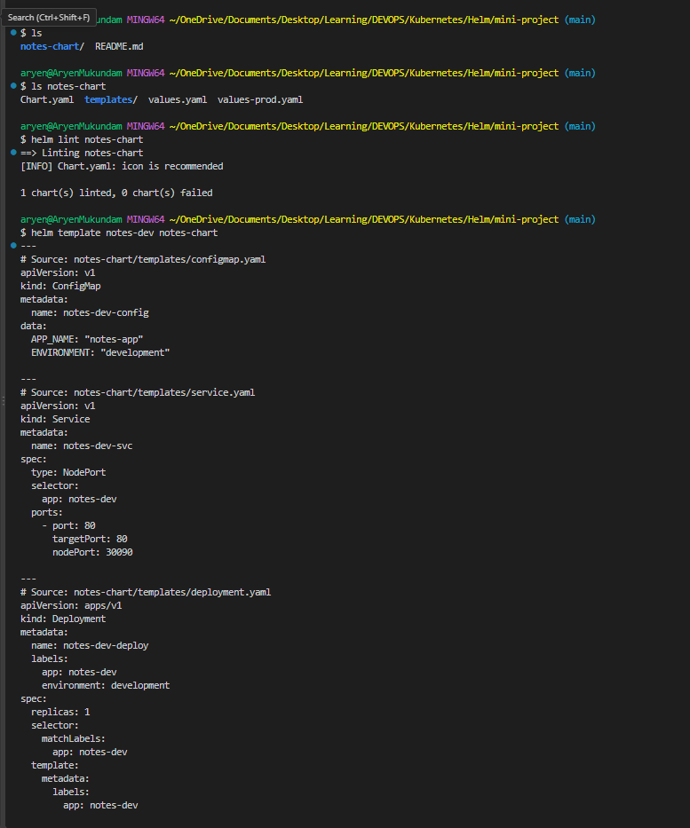
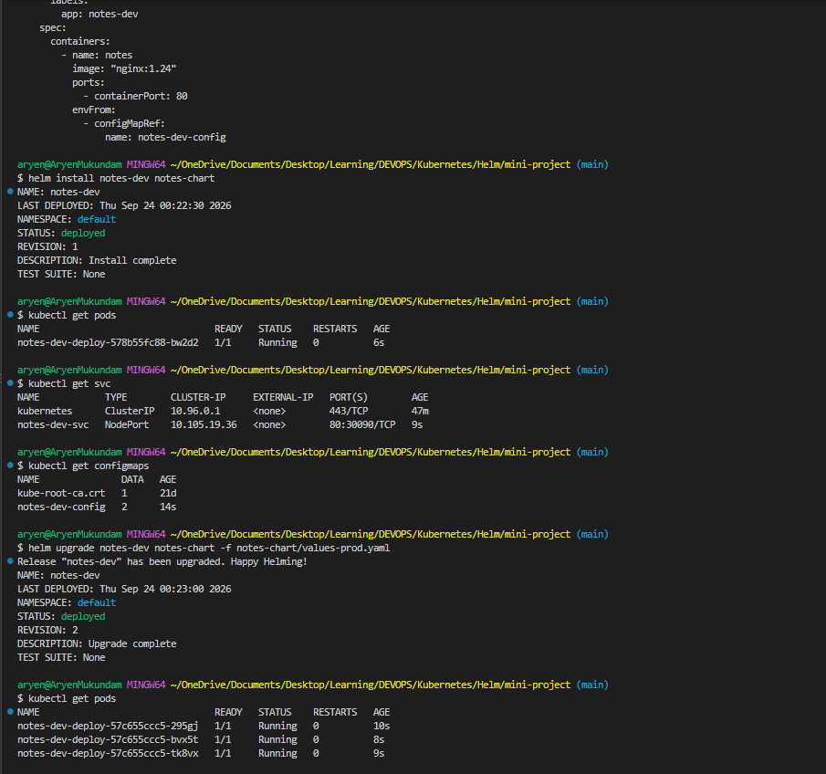
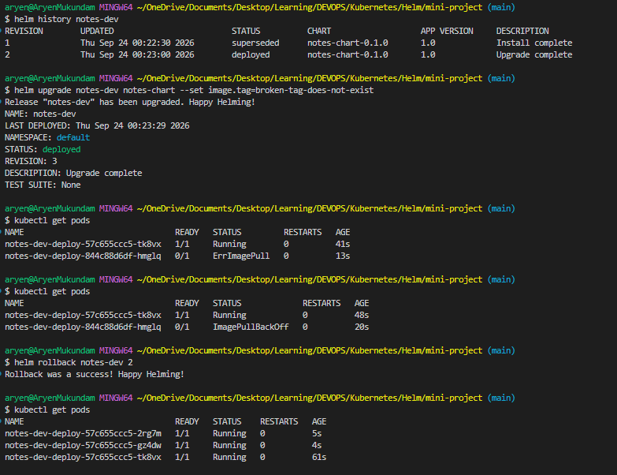

**What was practiced**

* Created a chart from scratch with Chart.yaml, values.yaml and three templates.
* Used a second values file for production.
* Installed, upgraded, broke, rolled back and uninstalled the release.
