# Session 14: Kubernetes Troubleshooting

When something breaks, do not guess. Follow the order: get -> describe -> events -> logs -> exec -> test -> fix -> verify.

---

## Task 1: Kubernetes Commands

### kubectl get

Quick view of resources and their status. Files in `01-kubectl-get/`.

```bash
kubectl get pods
kubectl get all
```

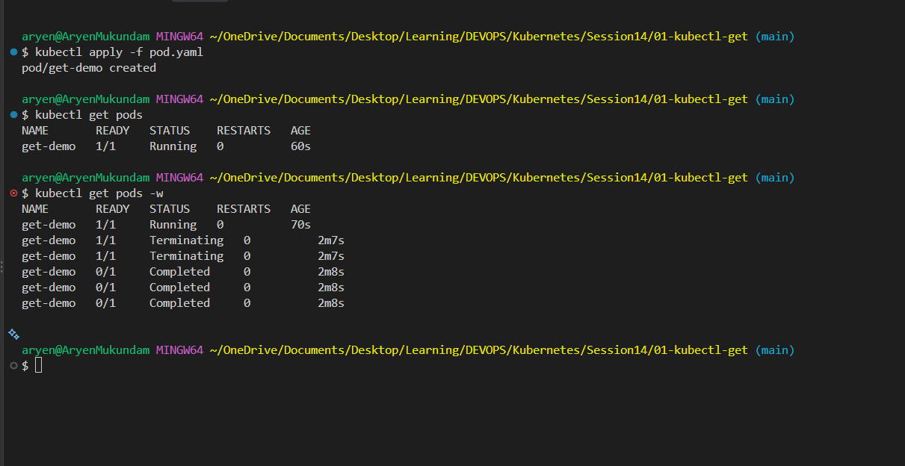
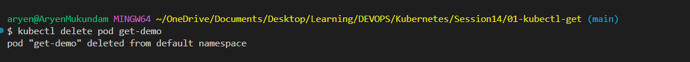

### kubectl get -o wide

Same as `get` but also shows the Pod IP and the node it is running on.

```bash
kubectl get pods -o wide
```

### kubectl describe

Full details of one resource, including its Events at the bottom. Files in `02-kubectl-describe/`.

```bash
kubectl describe pod <pod-name>
```

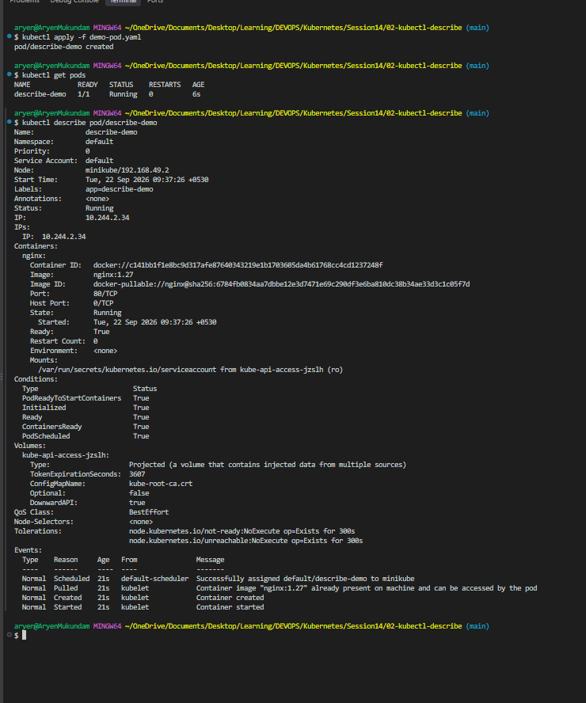

### kubectl logs

What the application inside the container printed. Files in `03-kubectl-logs/`.

```bash
kubectl logs <pod-name>
kubectl logs <pod-name> --previous     # logs of the last crashed container
```

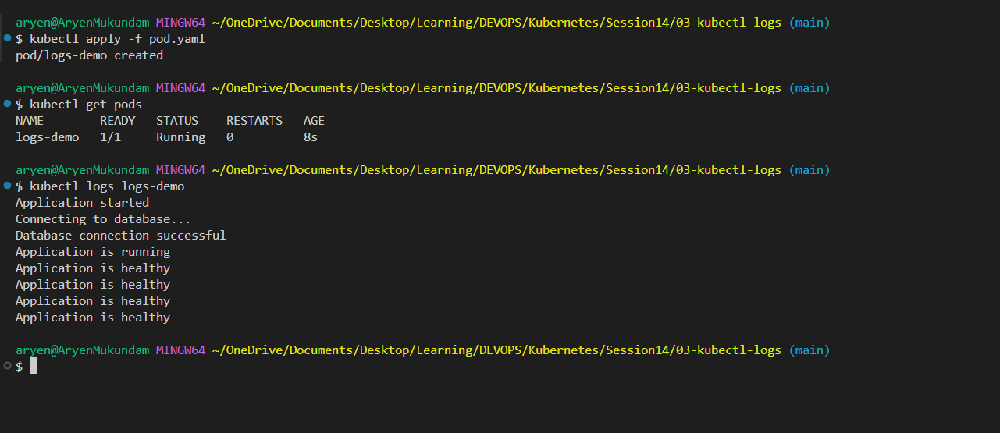

### kubectl exec

Run a command inside a running container. Files in `04-kubectl-exec/`.

```bash
kubectl exec -it <pod-name> -- sh
```

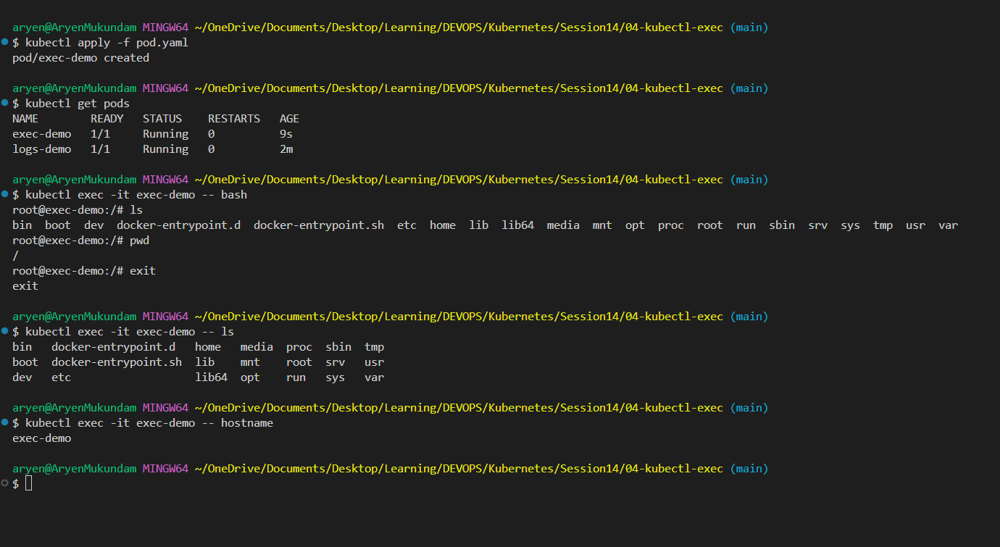

### kubectl events

What Kubernetes tried to do with the resource (schedule, pull image, start, kill). Files in `05-events/`.

```bash
kubectl get events
kubectl get events --sort-by=.lastTimestamp
kubectl events --for pod/<pod-name>
```

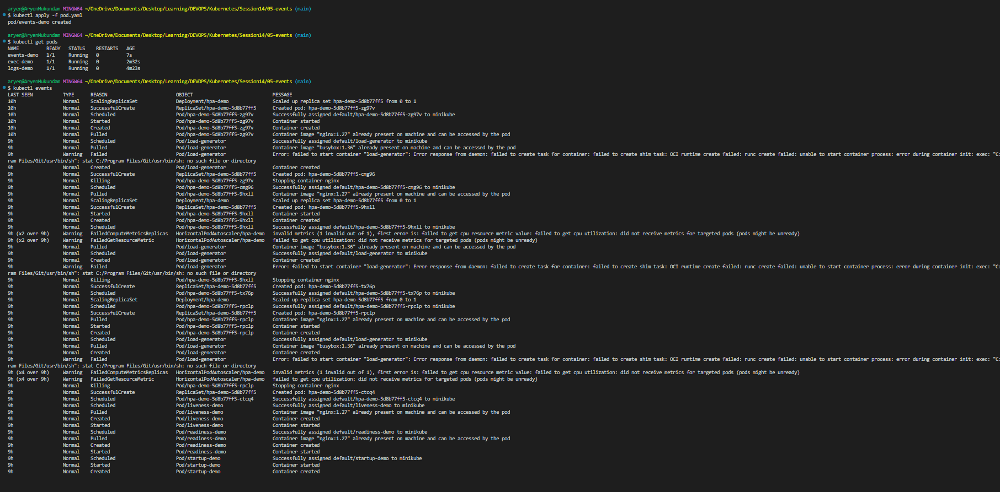
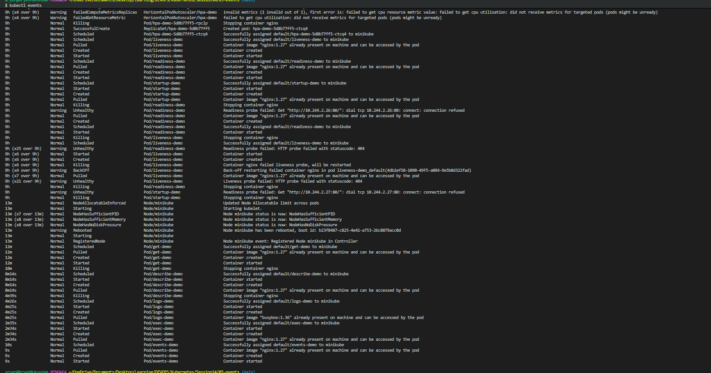
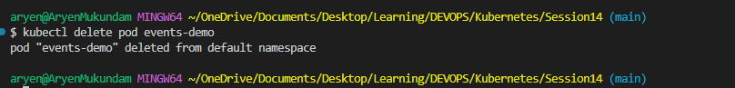
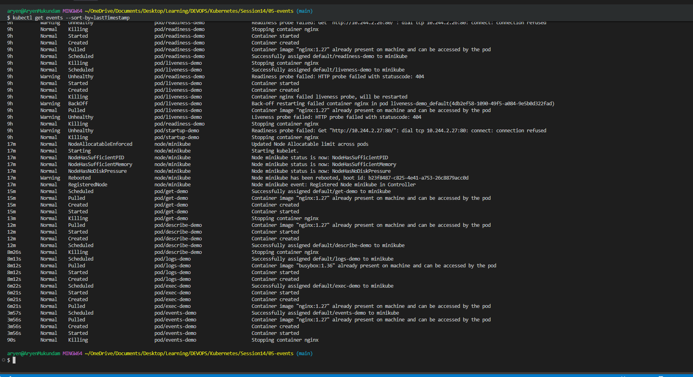

### kubectl explain

Shows the documentation for any field of a resource, straight from the cluster.

```bash
kubectl explain pod.spec.containers
kubectl explain deployment.spec.replicas
```

### kubectl top

Shows CPU and memory usage. Needs metrics-server (`minikube addons enable metrics-server`).

```bash
kubectl top nodes
kubectl top pods
```

### Events vs Logs

| | Events | Logs |
|---|---|---|
| Who writes it | Kubernetes itself | The app running inside the container |
| What it tells | What Kubernetes tried to do (schedule, pull image, start, kill) | What the app printed (errors, requests, stack traces) |
| Command | `kubectl get events` / `kubectl describe pod <pod>` | `kubectl logs <pod>` |
| Works when pod is not running? | Yes, that is exactly when it helps (Pending, ImagePullBackOff) | No, container must have started at least once |
| Kept for how long | About 1 hour, then gone | As long as the container exists (`--previous` for the last crashed one) |
| Use it for | "Why is my pod not starting?" | "Why is my app crashing or misbehaving?" |

Simple rule: pod not starting -> check Events. Pod starting but breaking -> check Logs.

---

## Task 2: Troubleshoot Common Issues

For every issue: identify, investigate, find root cause, fix, verify.

### CrashLoopBackOff

Files in `06-crashloopbackoff/`.

| Step | What |
| :--- | :--- |
| Identify | `kubectl get pods` shows `CrashLoopBackOff` with rising RESTARTS |
| Investigate | `kubectl logs crash-demo --previous` and `kubectl describe pod crash-demo` |
| Root cause | The container command runs `exit 1`, so the app crashes right after start and Kubernetes keeps restarting it |
| Fix | Change the command so the app keeps running (`fixed-pod.yaml` uses `sleep 3600`) |
| Verify | `kubectl get pods` shows `Running` and RESTARTS stops increasing |

CrashLoopBackOff is a symptom, not the cause. The real reason can be a bug, a bad config, a missing dependency or a failing probe.

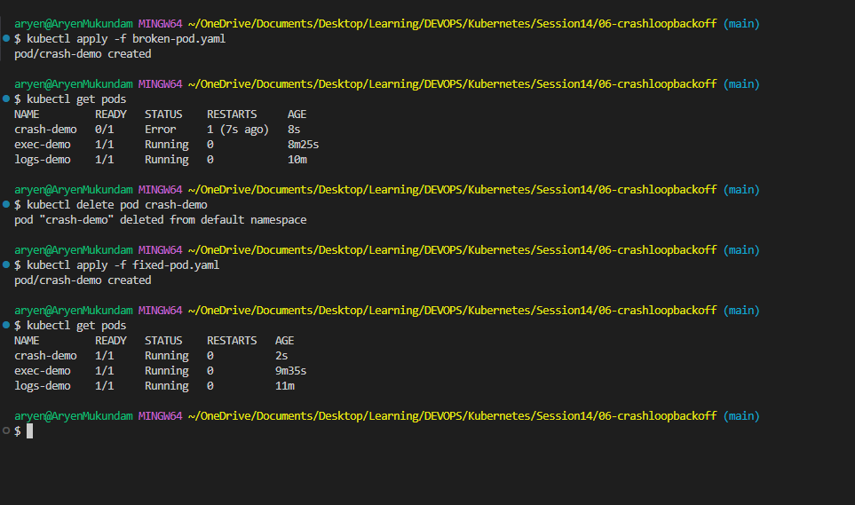

### ImagePullBackOff / ErrImagePull

Files in `07-imagepullbackoff/`.

| Step | What |
| :--- | :--- |
| Identify | `kubectl get pods` shows `ErrImagePull` first, then `ImagePullBackOff` |
| Investigate | `kubectl describe pod image-demo` and read the Events |
| Root cause | Image tag `nginx:this-image-does-not-exist` does not exist on Docker Hub |
| Fix | Use a real tag (`nginx:1.27` in `fixed-pod.yaml`) |
| Verify | `kubectl get pods` shows `Running` |

`ErrImagePull` is the first failed try. `ImagePullBackOff` means Kubernetes is waiting longer between retries. Other causes: wrong image name, private registry without a secret, no internet on the node.

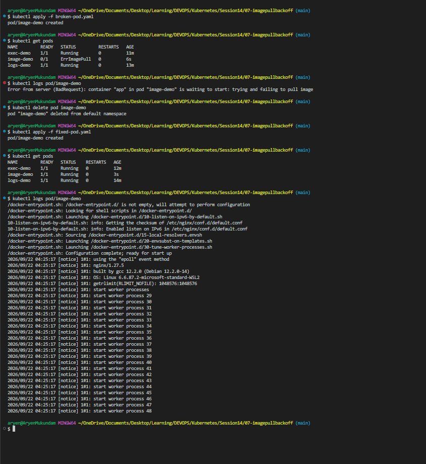

### Pending

Files in `08-pending-pods/`.

| Step | What |
| :--- | :--- |
| Identify | `kubectl get pods` shows `Pending` for a long time |
| Investigate | `kubectl describe pod pending-demo`, look at Events for `FailedScheduling` |
| Root cause | `nodeSelector` points to `node-that-does-not-exist`, so the scheduler has no node to place it on |
| Fix | Remove the wrong `nodeSelector` (`fixed-pod.yaml`) |
| Verify | `kubectl get pods` shows `Running` |

Other causes of Pending: not enough CPU or memory on any node, a PVC that is not bound, taints without tolerations.

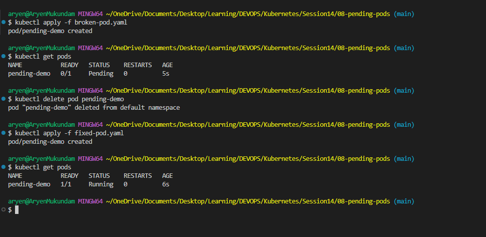

### ContainerCreating

Pod is scheduled but the container has not started yet. Normal for a few seconds. If it stays, check Events with `kubectl describe pod <pod-name>`. Common causes: image is still downloading, a volume or PVC cannot be mounted, a ConfigMap or Secret referenced by the Pod does not exist.

### Service connectivity issues

Files in `09-service-dns-troubleshooting/`.

| Step | What |
| :--- | :--- |
| Identify | Service exists but requests time out |
| Investigate | `kubectl get endpoints broken-service` shows `<none>`. `kubectl describe service broken-service` and `kubectl get pods --show-labels` |
| Root cause | Service selector is `app: does-not-exist` but the Pods have label `app: web`, so no Pod matches |
| Fix | Set the selector to `app: web` (`service.yaml`) |
| Verify | `kubectl get endpoints web-service` shows the Pod IPs |

Rule: Pod labels must match the Service selector, otherwise endpoints are empty.

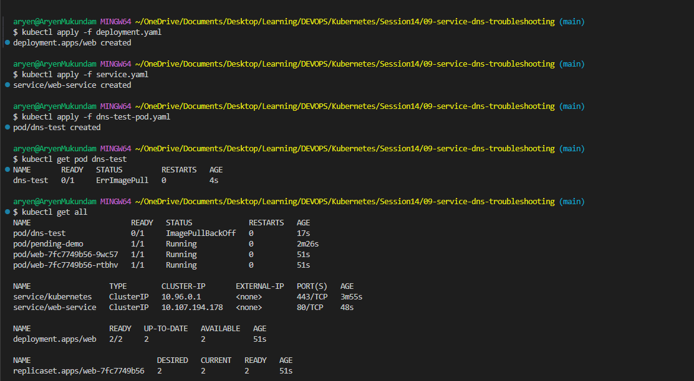

### DNS issues

| Step | What |
| :--- | :--- |
| Identify | App cannot reach a Service by name |
| Investigate | From a test Pod: `kubectl exec dns-test -- nslookup web-service`. Check CoreDNS: `kubectl get pods -n kube-system -l k8s-app=kube-dns` and `kubectl logs -n kube-system -l k8s-app=kube-dns` |
| Root cause | Wrong Service name or namespace, or CoreDNS Pods are down |
| Fix | Use `<service>.<namespace>.svc.cluster.local`, or restart CoreDNS |
| Verify | `nslookup web-service` returns the ClusterIP |

If DNS resolves but the request still fails, the problem is the Service selector or endpoints, not DNS.

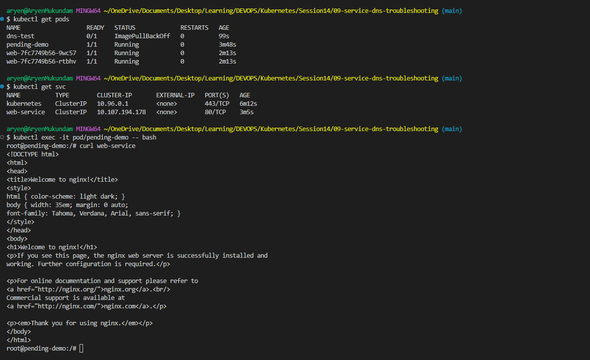

### Pod networking issues

| Step | What |
| :--- | :--- |
| Identify | Pod is Running but other Pods cannot reach it |
| Investigate | `kubectl get pods -o wide` for the Pod IP, then from another Pod `wget -qO- http://<pod-ip>:<port>`. Inside the Pod: `kubectl exec -it <pod> -- sh` then `curl localhost:<port>` |
| Root cause | App listening on a different port than `containerPort`, app bound only to `127.0.0.1`, or a NetworkPolicy blocking traffic |
| Fix | Match the port, bind the app to `0.0.0.0`, or fix the NetworkPolicy |
| Verify | Request from another Pod succeeds |

### Configuration issues

| Step | What |
| :--- | :--- |
| Identify | Pod stuck in `ContainerCreating` or `CreateContainerConfigError`, or app crashes with "missing env" |
| Investigate | `kubectl describe pod <pod>` Events say ConfigMap or Secret not found. `kubectl exec <pod> -- env` to check values |
| Root cause | ConfigMap or Secret name or key is wrong, or not created in that namespace |
| Fix | Create the missing object or fix the name/key in the Pod YAML |
| Verify | Pod is `Running` and `kubectl exec <pod> -- env` shows the value |

---

## Task 3: Mini Project


```bash
kubectl apply -f deployment.yaml
kubectl apply -f service.yaml
kubectl apply -f broken-pod.yaml
kubectl get pods -o wide
kubectl describe pod project-broken-pod
kubectl get endpoints troubleshooting-service
kubectl get pods --show-labels
kubectl describe service troubleshooting-service
```

**Output**

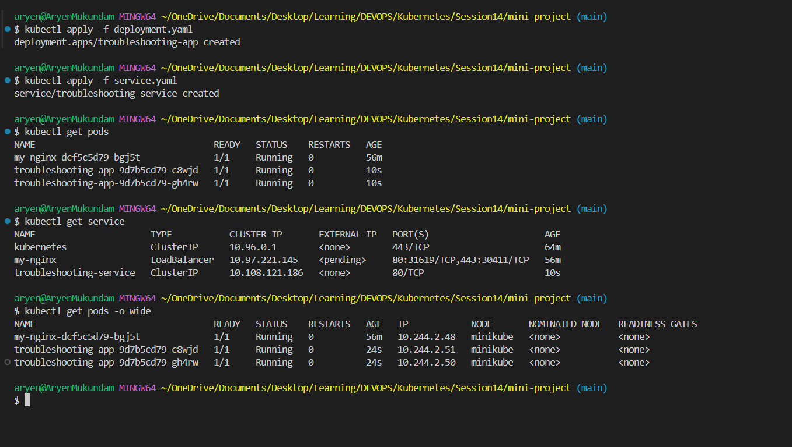
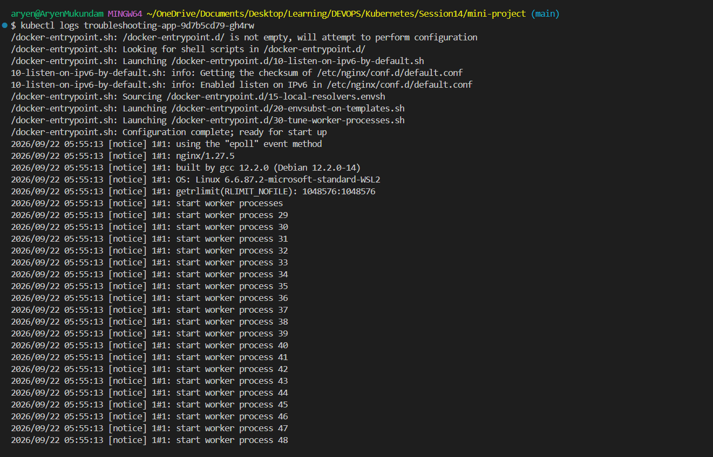
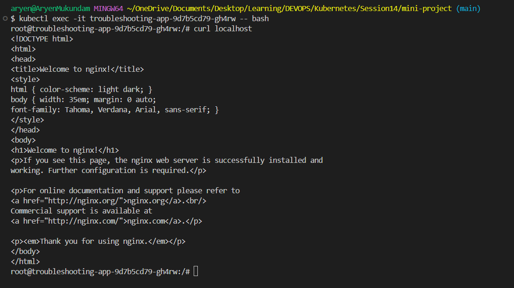
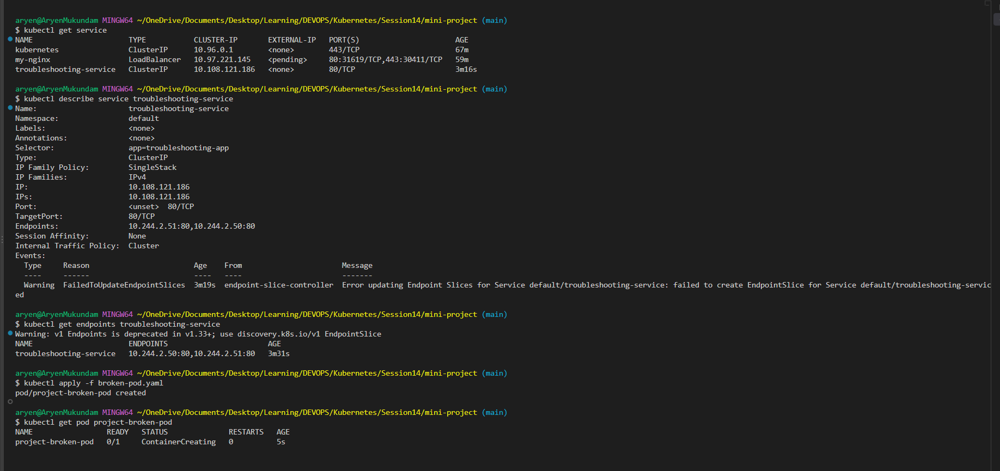
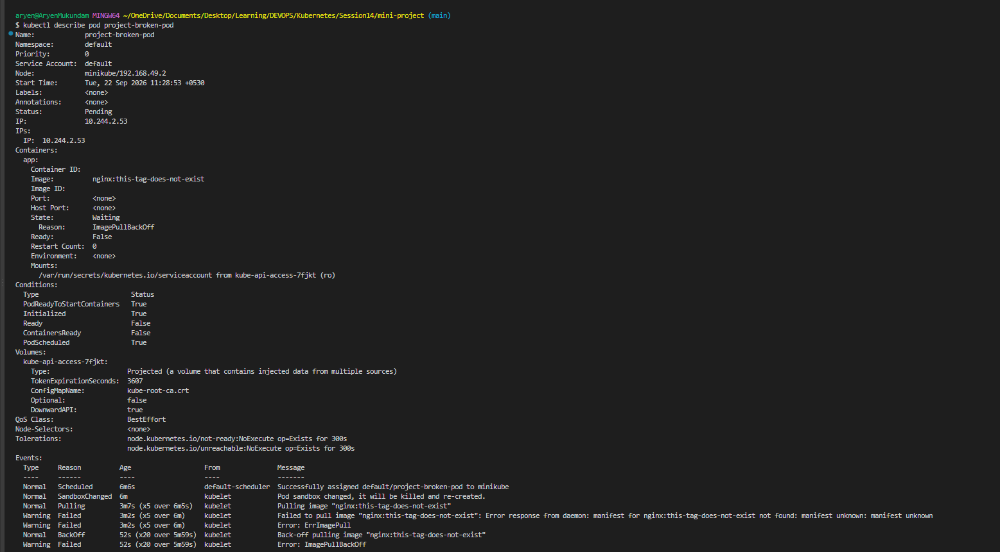

**Questions**

**Question 1:** What is the Pod status?
*Answer:* ImagePullBackOff

**Question 2:** What is the actual error?
*Answer:* ImagePullBackOff -> Kubernetes asked for this image but it does not exist in DockerHub.

**Question 3:** Which command helped you find the reason?
*Answer:* kubectl events

**Question 4:** What is wrong with the image?
*Answer:* The image name nginx is correct, but the tag this-tag-does-not-exist is wrong. There is no such version of nginx on Docker Hub, so the image can never be downloaded.

**Question 5:** How would you fix it?
*Answer:* Change the tag to a real one.

**Troubleshooting table**

| Problem | What I Saw | Command I Used | Root Cause | Fix |
| :--- | :--- | :--- | :--- | :--- |
| **Broken Pod** | Status `ImagePullBackOff` | `kubectl get pod`, `kubectl describe pod`, `kubectl events` | Image tag `this-tag-does-not-exist` is not on Docker Hub | Change tag to `nginx:1.27` |
| **Service Problem** | Endpoints `<none>`, Service not reachable | `kubectl get endpoints`, `kubectl get pods --show-labels`, `kubectl describe service` | Service selector `app: wrong-app` does not match Pod label `app: troubleshooting-app` | Change selector to `app: troubleshooting-app` |
| **Image Problem** | `ErrImagePull` then `ImagePullBackOff` in Events | `kubectl describe pod` | Kubernetes cannot pull an image that does not exist | Use a valid image name and tag |

**Final check**

```bash
kubectl get pods
kubectl get endpoints troubleshooting-service   # shows 2 Pod IPs
kubectl exec -it <pod-name> -- curl localhost   # nginx page
```
