# ConfigMap, Secret & Ingress

## 1. ConfigMap

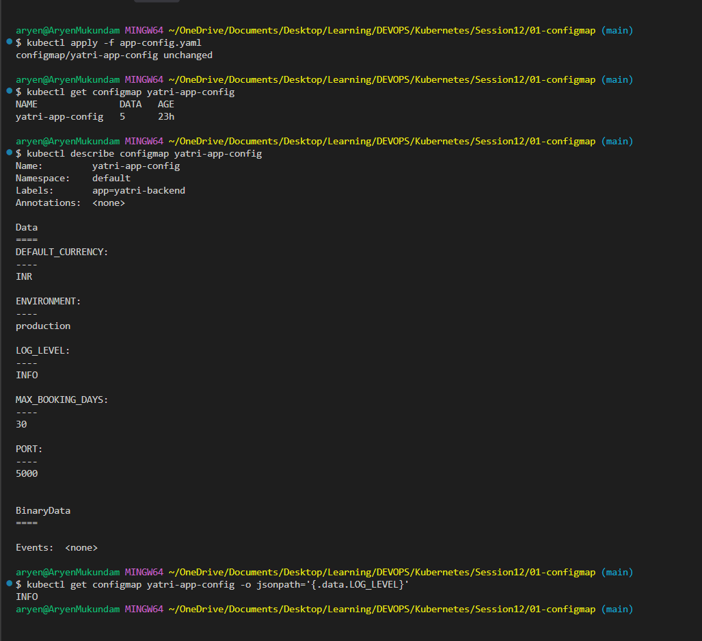

## 2. Secret

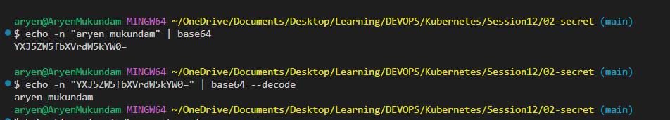

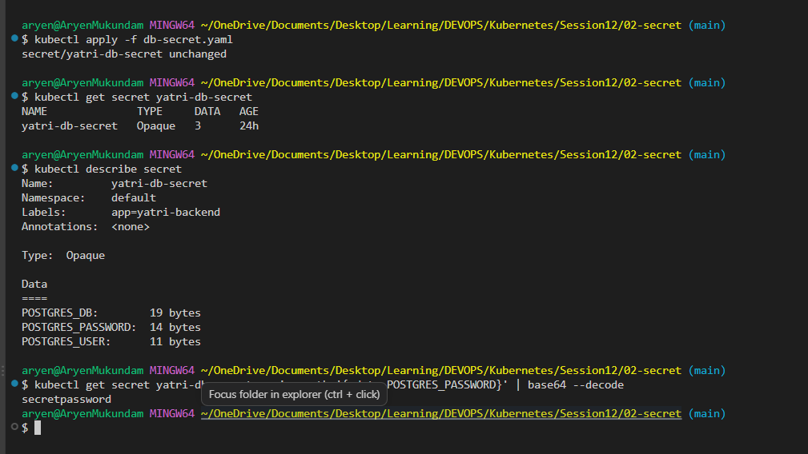

## 3. Ingress

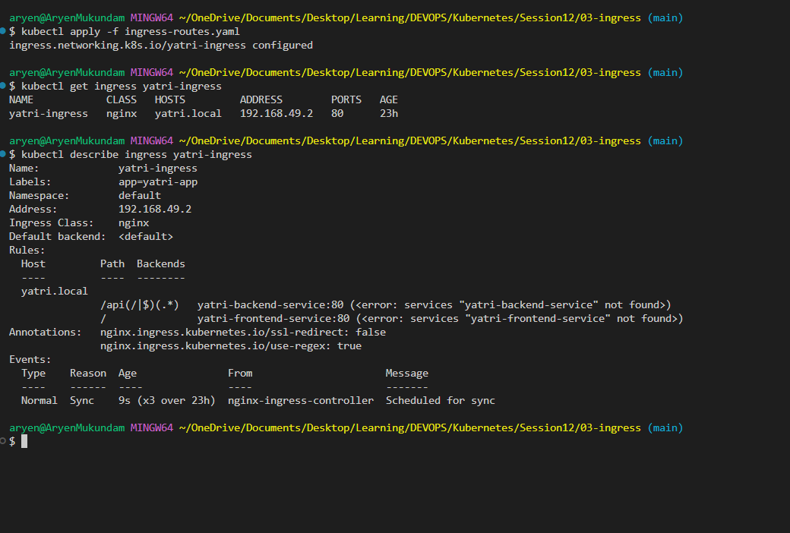

## 4. Full Demo

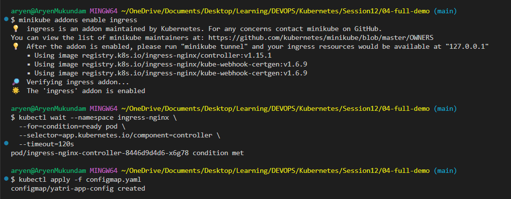

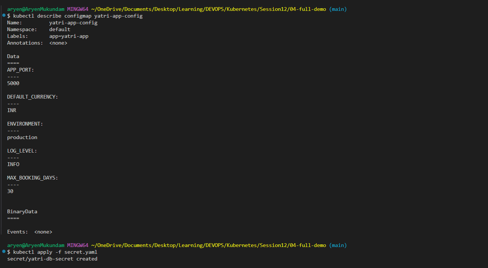

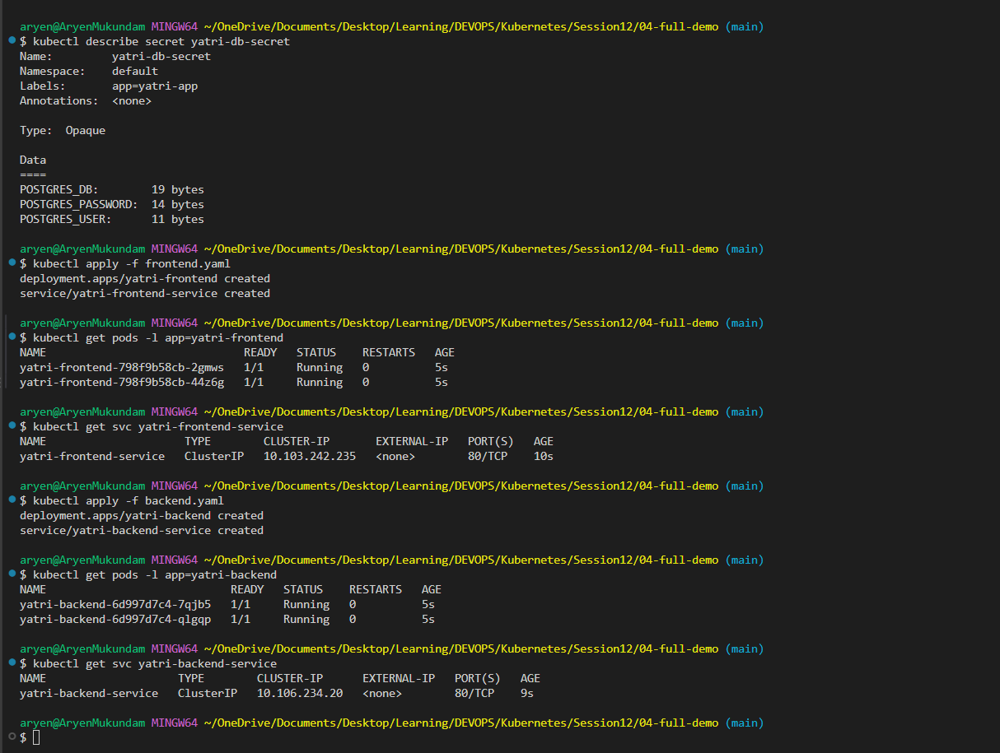

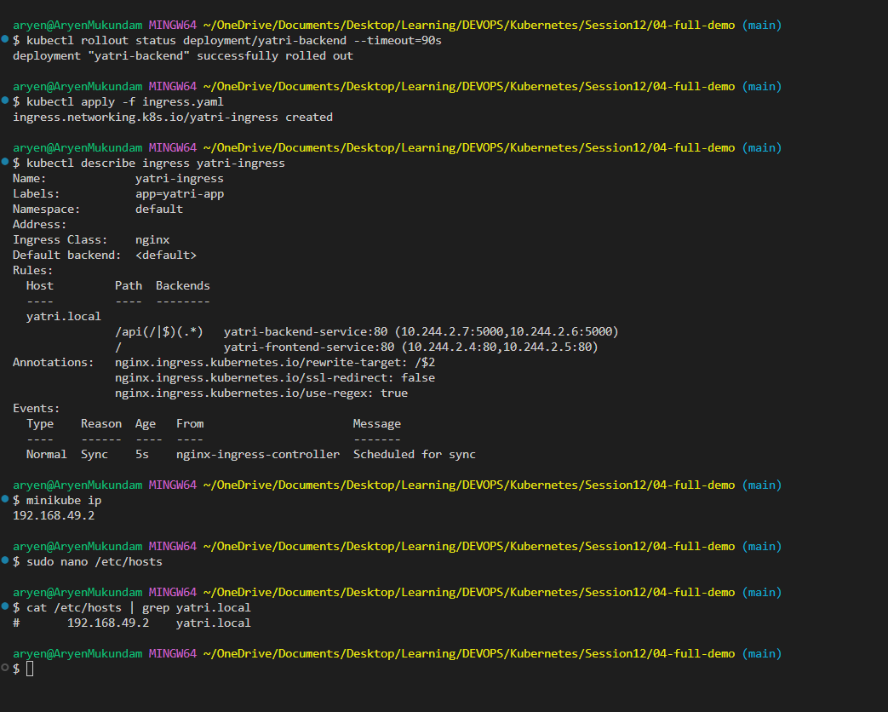

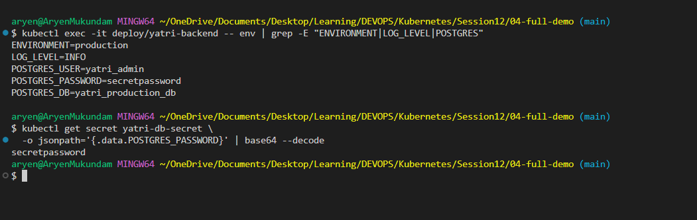

## 5. Ingress vs Ingress Controller

**What is Ingress?**
Ingress is a Kubernetes object (a YAML file) that holds routing rules. It says things like "send `/api` traffic to the backend Service and `/` traffic to the frontend Service". By itself it does nothing. It is only a set of rules.

**What is an Ingress Controller?**
An Ingress Controller is the actual program (a Pod) that reads the Ingress rules and does the routing. It is usually a reverse proxy like NGINX, Traefik or HAProxy. It is not installed by default. You have to install it (in Minikube: `minikube addons enable ingress`).

**Difference between them**

| | Ingress | Ingress Controller |
| :--- | :--- | :--- |
| What is it | A rule (YAML object) | A running Pod (NGINX, Traefik etc.) |
| Job | Says where traffic should go | Actually sends the traffic there |
| Installed by default | Yes, the API exists | No, you install it |
| Example | `ingress.yaml` | `ingress-nginx-controller` Pod |

**Why both are required**
The Ingress is only the rule book. Without a controller, nobody reads the rules and no traffic moves. The controller is the worker, but without an Ingress it has no rules to follow. You need the rules and the worker together.

```text
Browser --> Ingress Controller (NGINX Pod) --reads--> Ingress rules --> Service --> Pods
```

**Examples**

Ingress (the rule):

```yaml
apiVersion: networking.k8s.io/v1
kind: Ingress
metadata:
  name: yatri-ingress
spec:
  ingressClassName: nginx
  rules:
    - host: yatri.local
      http:
        paths:
          - path: /api
            pathType: Prefix
            backend:
              service:
                name: yatri-backend-service
                port:
                  number: 8080
          - path: /
            pathType: Prefix
            backend:
              service:
                name: yatri-frontend-service
                port:
                  number: 80
```

Ingress Controller (the worker):

```bash
minikube addons enable ingress
kubectl get pods -n ingress-nginx
```

```text
NAME                                        READY   STATUS
ingress-nginx-controller-7c6974c4d8-x2k9p   1/1     Running
```

## 6. Troubleshooting

**Problem:** the app cannot log in to the database. The database says `password authentication failed` even though the password in the Secret looks correct. The password was encoded with `echo "mypassword" | base64`.

**Troubleshooting commands** (run inside the `troubleshooting/` folder):

```bash
echo "mypassword" | base64                       # how the password was encoded
echo "mypassword" | od -c                        # look at the raw bytes
echo "bXlwYXNzd29yZAo=" | base64 --decode | wc -c  # count the characters
kubectl apply -f broken-secret.yaml
kubectl apply -f pod.yaml
kubectl logs secret-test                         # what the Pod really receives
kubectl get secret db-secret -o jsonpath="{.data.DB_PASSWORD}" | base64 --decode | od -c
```

**Before fix:**

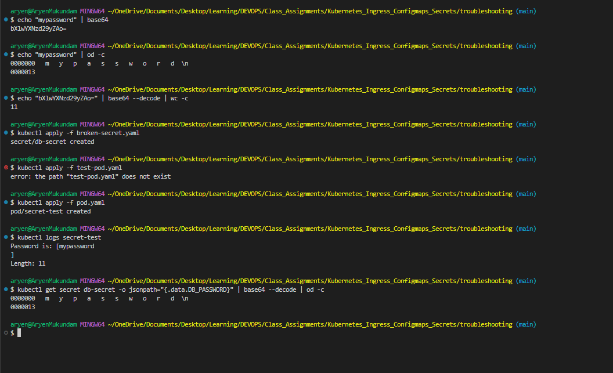

**Root cause:** `echo` adds a hidden newline (`\n`) at the end of the text. `base64` encoded that newline too, so the Secret stores `mypassword\n` which is 11 characters instead of 10. In the output you can see the `]` printed on the next line, `Length: 11`, and the `\n` in the `od -c` bytes. Quick hint: the base64 value ends with `Ao=`, that `o` is the newline.

**Fix:** encode with `echo -n` so no newline is added, put the new value in `fixed-secret.yaml`, and apply it.

```bash
echo -n "mypassword" | base64                    # bXlwYXNzd29yZA==
kubectl apply -f fixed-secret.yaml
kubectl delete pod secret-test
kubectl apply -f pod.yaml
kubectl logs secret-test
kubectl get secret db-secret -o jsonpath="{.data.DB_PASSWORD}" | base64 --decode | od -c
```

**After fix:**

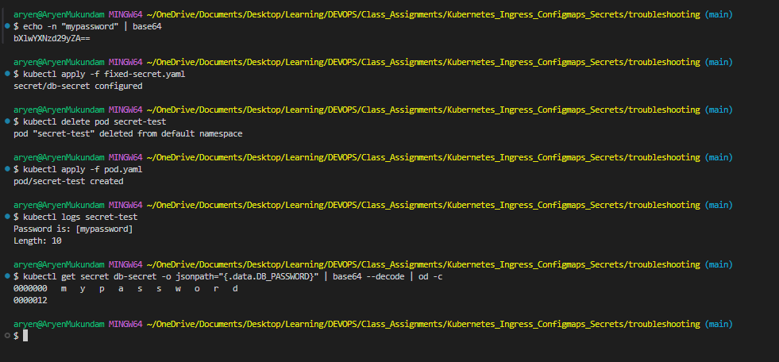


