# Kubernetes Networking & Services

## Task 1: Kubernetes Services

### 1. ClusterIP

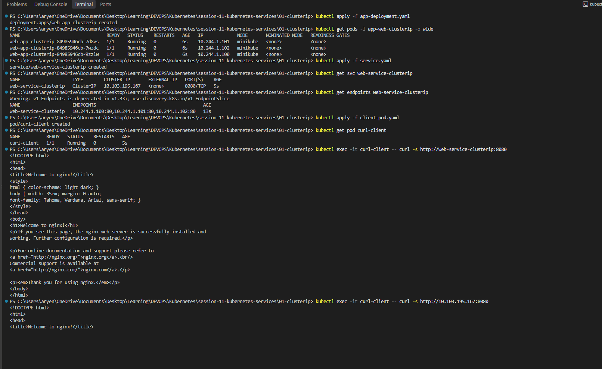
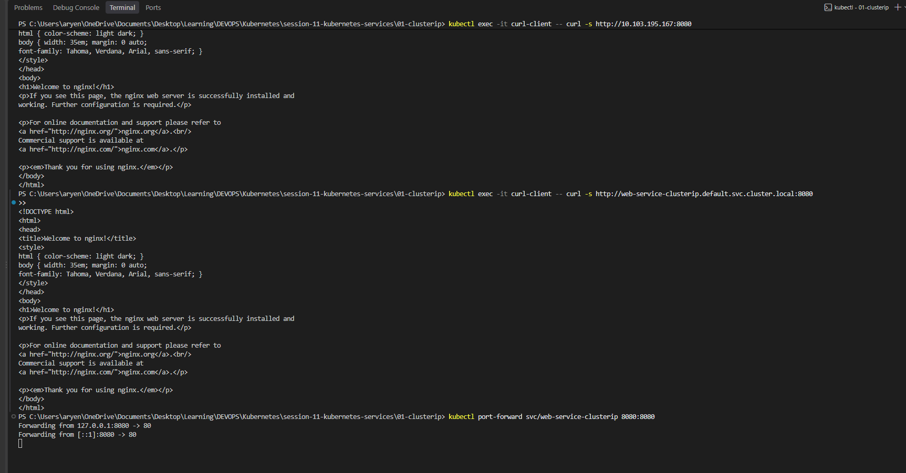
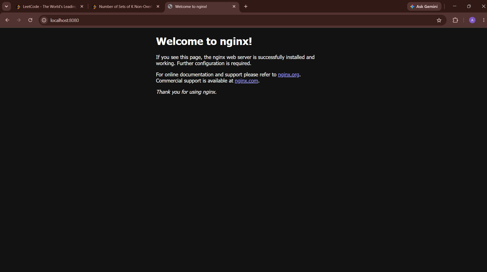

### 2. NodePort

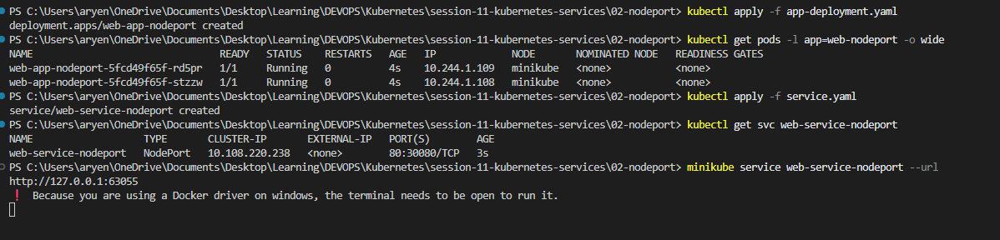
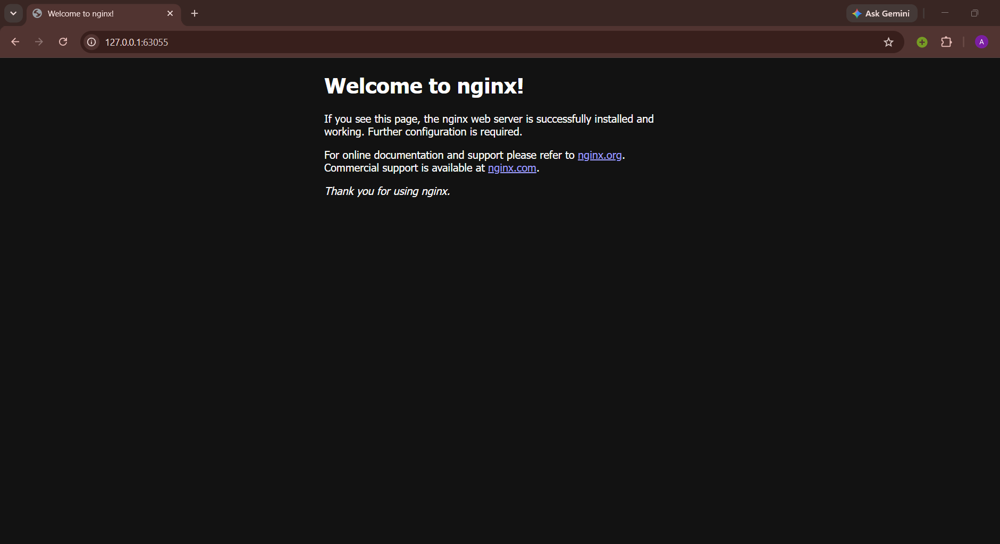

### 3. LoadBalancer

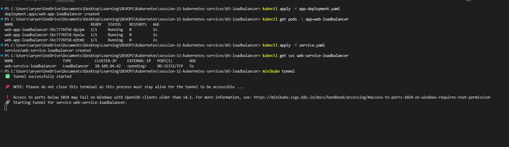
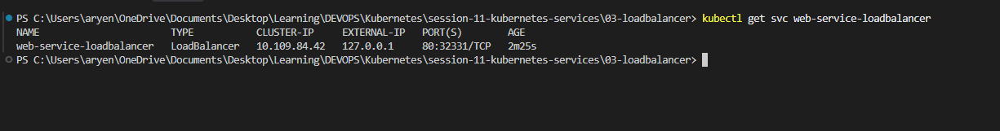
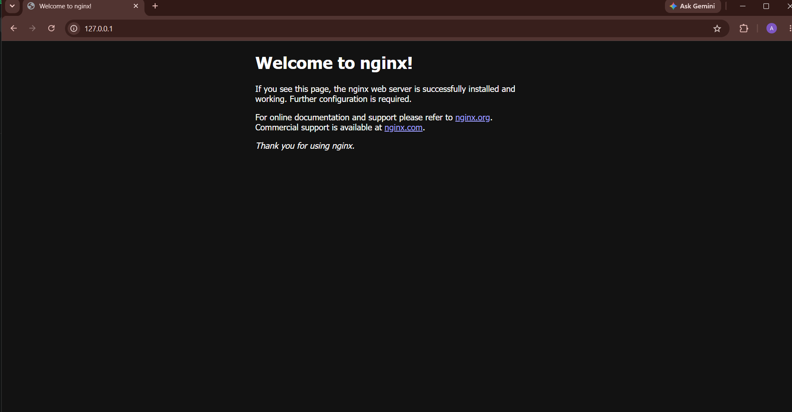
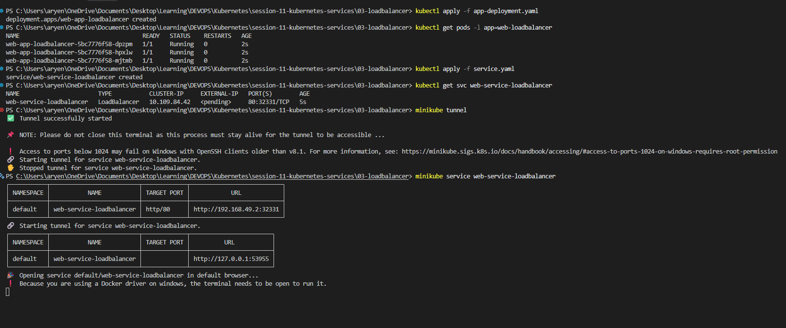
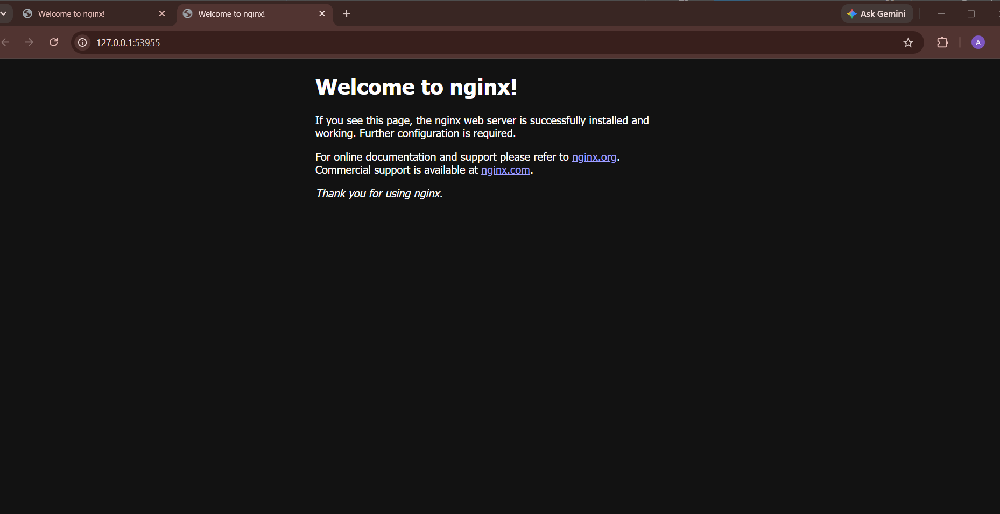

### 4. ExternalName

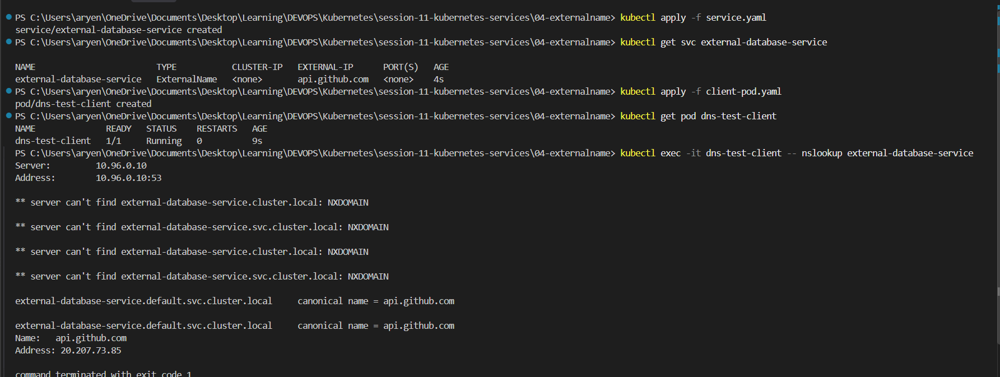

### 5. Headless

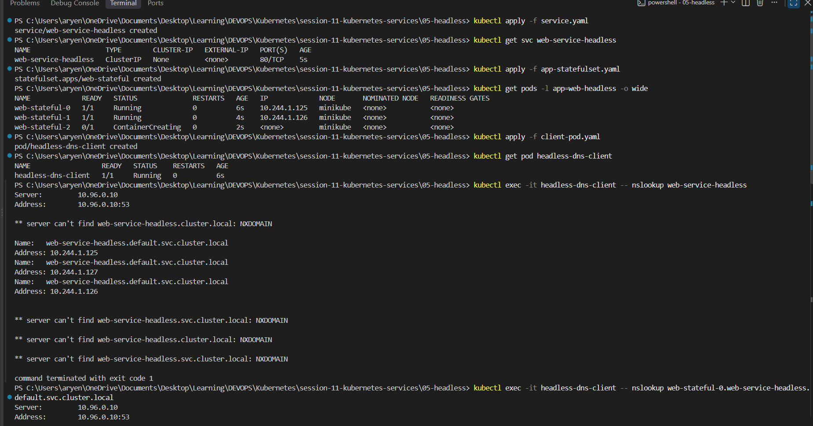
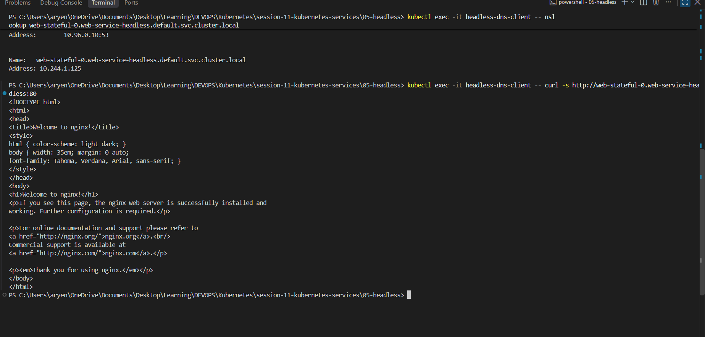

---

## Task 2: Kubernetes Object Comparison

### Deployment vs ReplicaSet

| | ReplicaSet | Deployment |
| :--- | :--- | :--- |
| **Purpose** | Keeps a fixed number of same Pods running. | Manages ReplicaSets and adds updates and rollback. |
| **Pod management** | Creates or deletes Pods to match the replica count. | Creates a ReplicaSet, and the ReplicaSet manages the Pods. |
| **Scaling** | `kubectl scale rs <name> --replicas=5` | `kubectl scale deployment <name> --replicas=5` |
| **Rolling updates** | Not supported. | Supported. Makes a new ReplicaSet and moves Pods to it slowly. Can roll back. |

**Relationship:** Deployment -> ReplicaSet -> Pods. The Deployment owns the ReplicaSet. When the Pod template changes, the Deployment creates a new ReplicaSet and keeps the old one for rollback.

### Deployment vs DaemonSet vs StatefulSet

| | Deployment | DaemonSet | StatefulSet |
| :--- | :--- | :--- | :--- |
| **Use cases** | Stateless apps (web, API). | One Pod on every node (logs, monitoring). | Stateful apps (databases, Kafka). |
| **Pod creation** | Random names, created together. | One Pod per node automatically. | Fixed names `db-0`, `db-1`, created in order. |
| **Scaling** | Change `replicas`. | No `replicas`. Grows with nodes. | Change `replicas`. Scales in order. |
| **Networking** | Normal Service with ClusterIP. | Usually no Service. | Headless Service. Each Pod gets its own DNS name. |
| **Storage** | Shared or none. | `hostPath` from the node. | Own PVC per Pod using `volumeClaimTemplates`. |
| **Example** | nginx web server | fluent-bit log agent | postgres database |

### ReplicaSet vs Service

* **ReplicaSet responsibility:** keep N Pods running and restart them if they die.
* **Service responsibility:** give the Pods one fixed IP and DNS name and send traffic to them.
* **Why a Service is required:** Pod IPs change on every restart. A Service gives a stable address so clients do not need Pod IPs.
* **How traffic reaches Pods:** client asks CoreDNS for the Service name -> gets the ClusterIP -> sends request to it -> kube-proxy forwards it to one of the Pods.

---

## Task 3: FQDN

* **What is FQDN?** Fully Qualified Domain Name. The full name of a host, for example `www.example.com`, instead of just `www`.
* **Kubernetes Service DNS:** CoreDNS gives every Service a DNS name automatically. Normal Service -> ClusterIP. Headless Service -> Pod IPs.
* **Kubernetes DNS naming convention:** `<service>.<namespace>.svc.cluster.local`. For a StatefulSet Pod: `<pod>.<service>.<namespace>.svc.cluster.local`.
* **Namespace-based DNS:** the same name can exist in many namespaces. `db.dev.svc.cluster.local` and `db.prod.svc.cluster.local` are different. A short name like `db` only works inside the same namespace. Use `db.prod` for another namespace.
* **Pod-to-Service communication:** Pod asks CoreDNS for the name -> CoreDNS returns the ClusterIP -> Pod sends traffic to the ClusterIP -> kube-proxy forwards it to a Pod.
* **Examples of Kubernetes FQDNs:**
  * `kubernetes.default.svc.cluster.local` - API server
  * `kube-dns.kube-system.svc.cluster.local` - CoreDNS
  * `web.default.svc.cluster.local` - Service `web` in `default`
  * `db-0.db.default.svc.cluster.local` - Pod `db-0` of a StatefulSet

```bash
kubectl exec -it <pod> -- nslookup web.default.svc.cluster.local
```

---

## Task 4: CoreDNS

* **What is CoreDNS?** The DNS server that runs inside the cluster. It runs as Pods in `kube-system` behind the `kube-dns` Service (10.96.0.10).
* **Why Kubernetes uses CoreDNS:** Pod IPs keep changing, so apps need names. CoreDNS watches the Kubernetes API and updates DNS records automatically. It is small, fast and plugin based.
* **How Service discovery works:** create a Service -> CoreDNS sees it through the API -> adds a record `<service>.<namespace>.svc.cluster.local` -> any Pod can resolve it.
* **How DNS queries are resolved:** Pod sends the query to 10.96.0.10 (from `/etc/resolv.conf`). If the name ends with `cluster.local`, the `kubernetes` plugin answers. Otherwise the `forward` plugin sends it to the upstream DNS. Answers are cached.
* **CoreDNS configuration:** stored in the `coredns` ConfigMap in `kube-system`. The file is called the Corefile.

```bash
kubectl get configmap coredns -n kube-system -o yaml
```

```text
.:53 {
    errors
    health
    kubernetes cluster.local in-addr.arpa ip6.arpa
    forward . /etc/resolv.conf
    cache 30
    reload
}
```

* **How to troubleshoot DNS issues:**

```bash
kubectl get pods -n kube-system -l k8s-app=kube-dns      # CoreDNS running?
kubectl logs -n kube-system -l k8s-app=kube-dns          # errors in logs?
kubectl get endpoints -n kube-system kube-dns            # endpoints present?
kubectl exec -it <pod> -- cat /etc/resolv.conf           # nameserver correct?
kubectl exec -it <pod> -- nslookup kubernetes.default    # internal DNS works?
kubectl exec -it <pod> -- nslookup google.com            # external DNS works?
```

Add `log` to the Corefile to see every query in the CoreDNS logs.
