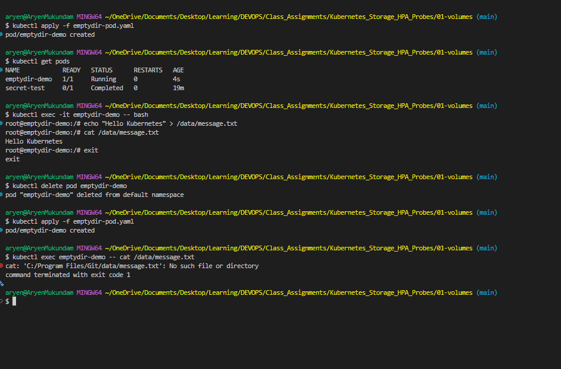
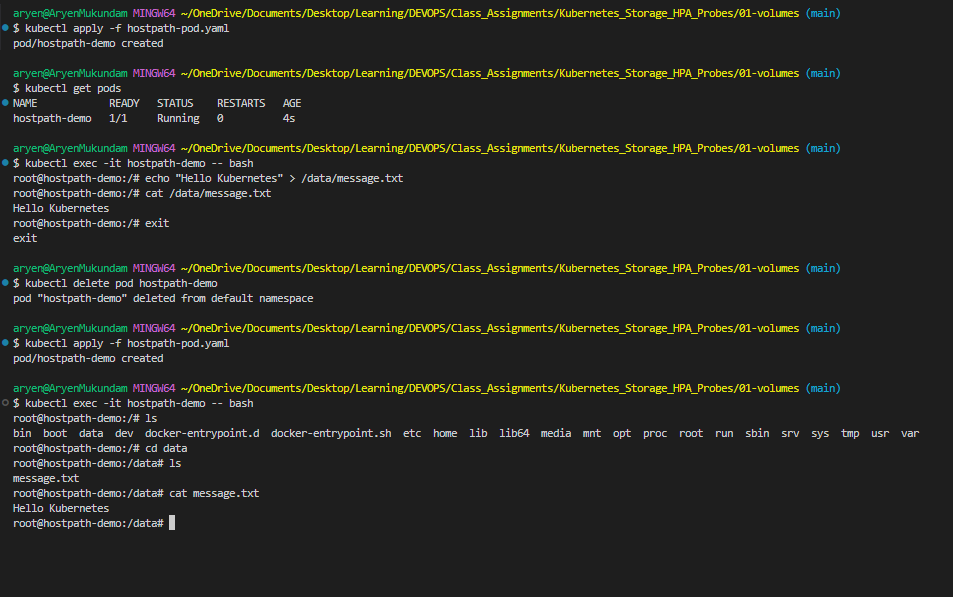
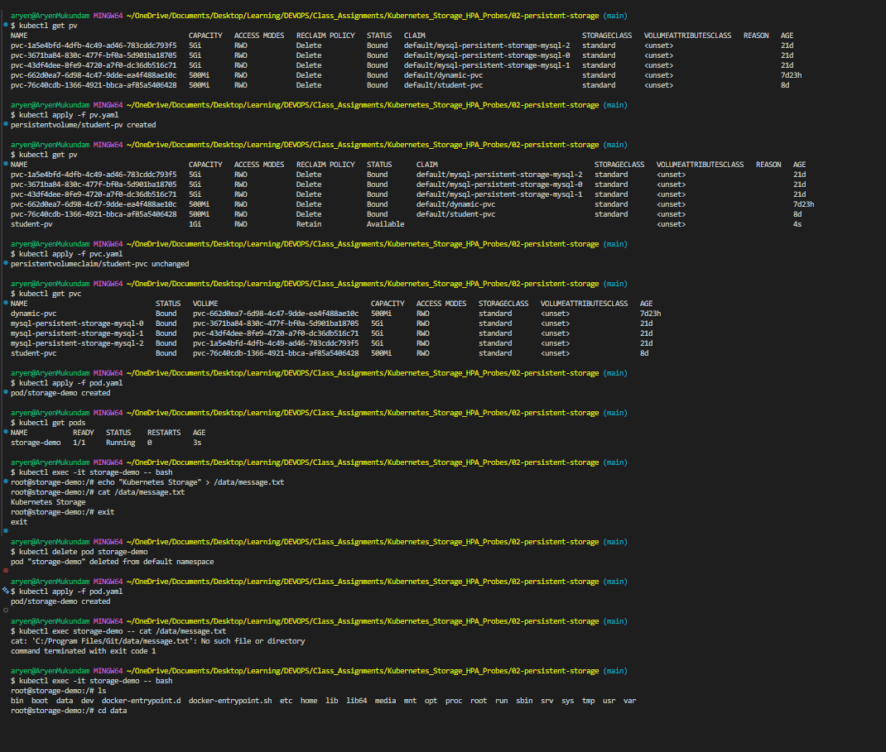
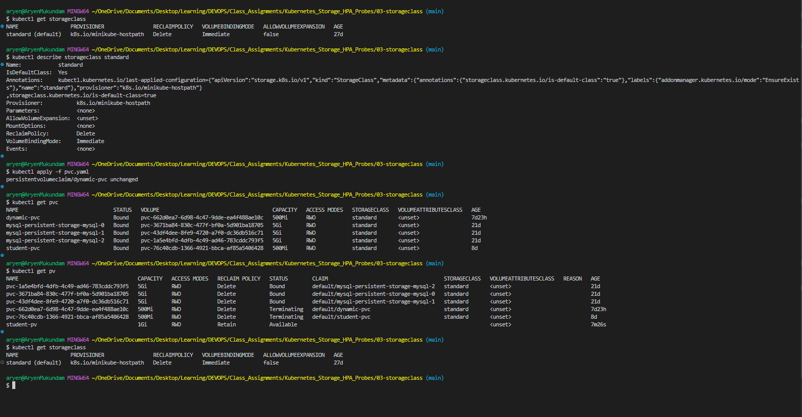
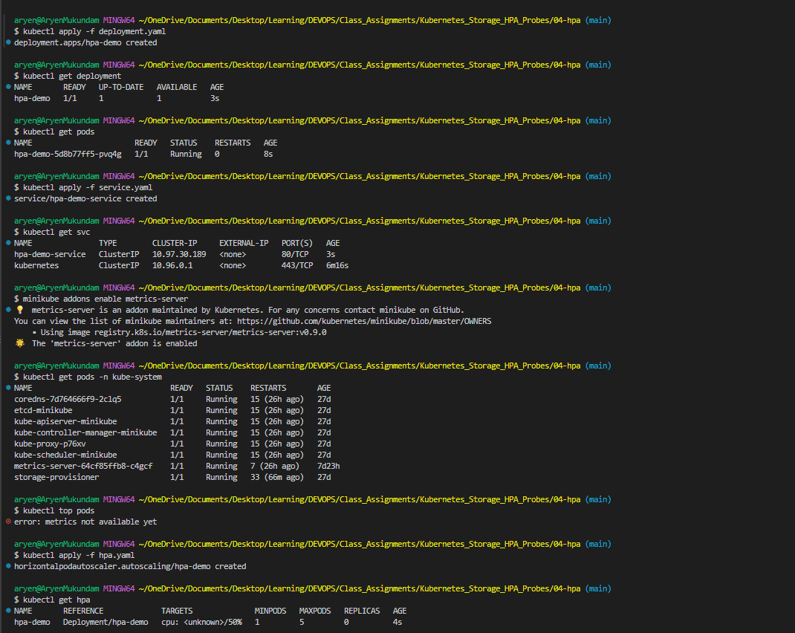
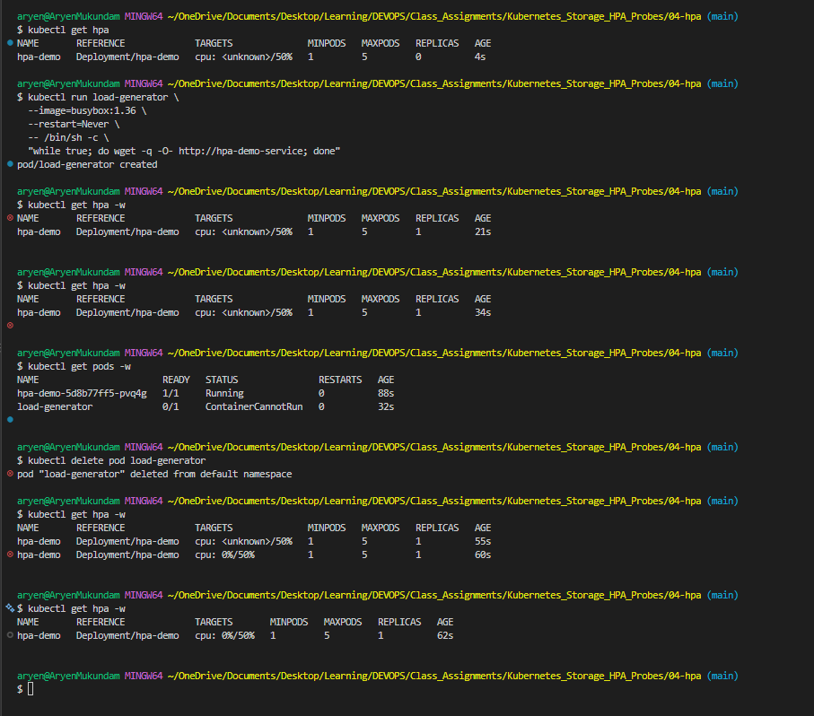
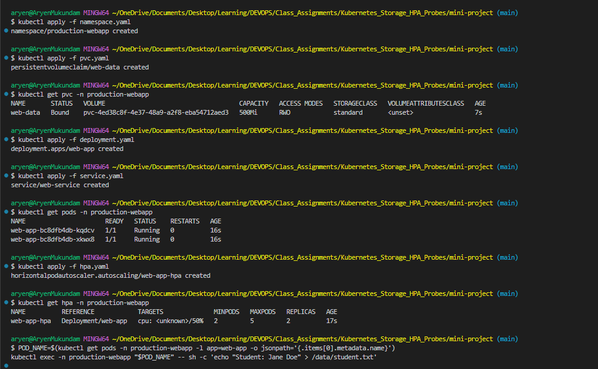
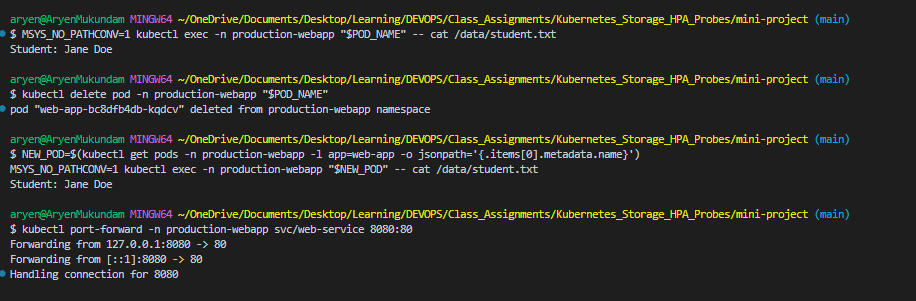
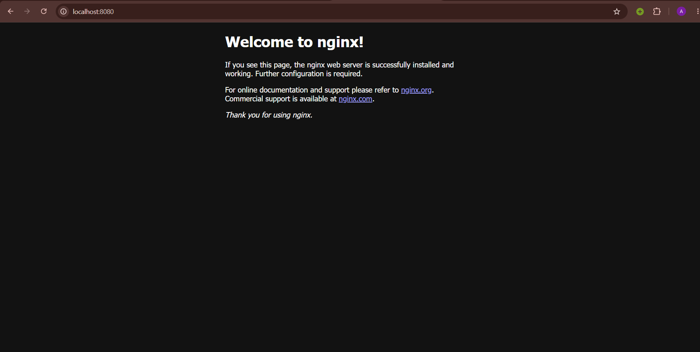
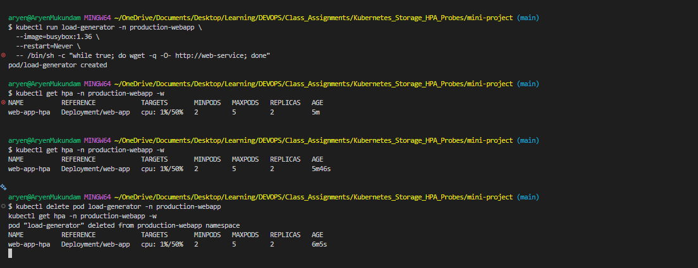

# Kubernetes Storage, HPA & Probes

## Task 1: Kubernetes Volumes

Data written inside a container is lost when the container is removed. A volume gives the container a separate place to store data. Files are in `01-volumes/`, `02-persistent-storage/` and `03-storageclass/`.

### emptyDir

An empty folder created when the Pod starts. All containers in the Pod can use it. It lives as long as the Pod lives. Delete the Pod and the data is gone. Good for temporary files and cache.

```yaml
volumes:
  - name: app-storage
    emptyDir: {}
```

```bash
kubectl apply -f emptydir-pod.yaml
kubectl exec -it emptydir-demo -- sh -c 'echo "Hello Kubernetes" > /data/message.txt'
kubectl delete pod emptydir-demo
kubectl apply -f emptydir-pod.yaml
kubectl exec emptydir-demo -- cat /data/message.txt   # file is gone
```



### hostPath

Mounts a folder from the node into the Pod. Data stays on the node even if the Pod is deleted, but only on that one node. Good for learning and local testing, not for production.

```yaml
volumes:
  - name: host-storage
    hostPath:
      path: /tmp/hostpath-data
      type: DirectoryOrCreate
```

```bash
kubectl apply -f hostpath-pod.yaml
kubectl exec -it hostpath-demo -- sh -c 'echo "Hello" > /data/message.txt'
```



### PersistentVolume (PV) and PersistentVolumeClaim (PVC)

* **PV** = storage that exists in the cluster (created by admin).
* **PVC** = a request for storage (created by developer).
* **Pod** uses the PVC. The PVC gets bound to a matching PV.

```text
Pod --> PVC --> PV --> Storage
```

PV (`pv.yaml`):

```yaml
apiVersion: v1
kind: PersistentVolume
metadata:
  name: student-pv
spec:
  capacity:
    storage: 1Gi
  accessModes:
    - ReadWriteOnce
  persistentVolumeReclaimPolicy: Retain
  hostPath:
    path: /tmp/student-data
```

PVC (`pvc.yaml`):

```yaml
apiVersion: v1
kind: PersistentVolumeClaim
metadata:
  name: student-pvc
spec:
  accessModes:
    - ReadWriteOnce
  resources:
    requests:
      storage: 500Mi
```

Pod uses it:

```yaml
volumes:
  - name: persistent-storage
    persistentVolumeClaim:
      claimName: student-pvc
```

```bash
kubectl apply -f pv.yaml
kubectl apply -f pvc.yaml
kubectl get pv,pvc                 # PVC should be Bound
kubectl apply -f pod.yaml
kubectl exec -it storage-demo -- sh -c 'echo "Kubernetes Storage" > /data/message.txt'
kubectl delete pod storage-demo
kubectl apply -f pod.yaml
kubectl exec storage-demo -- cat /data/message.txt   # file is still there
```

Access modes:

| Mode | Short | Meaning |
| :--- | :--- | :--- |
| ReadWriteOnce | RWO | One node can read and write |
| ReadOnlyMany | ROX | Many nodes can read |
| ReadWriteMany | RWX | Many nodes can read and write |



### StorageClass and Dynamic Provisioning

Creating a PV by hand for every PVC is slow. A **StorageClass** tells Kubernetes how to create storage automatically. When a PVC asks for a StorageClass, Kubernetes creates the PV for you. This is called **dynamic provisioning**.

```text
PVC --> StorageClass --> Provisioner --> PV (created automatically)
```

```bash
kubectl get storageclass
```

```text
NAME                 PROVISIONER
standard (default)   k8s.io/minikube-hostpath
```

PVC using the StorageClass (`03-storageclass/pvc.yaml`):

```yaml
apiVersion: v1
kind: PersistentVolumeClaim
metadata:
  name: dynamic-pvc
spec:
  accessModes:
    - ReadWriteOnce
  storageClassName: standard
  resources:
    requests:
      storage: 500Mi
```

```bash
kubectl apply -f pvc.yaml
kubectl get pvc          # Bound
kubectl get pv           # a new PV named pvc-xxxx was created automatically
```

If a PVC does not mention `storageClassName`, the default StorageClass is used.




## Task 2: HPA Hands-on

**HPA** (Horizontal Pod Autoscaler) adds or removes Pods automatically based on CPU usage. Files are in `04-hpa/`.

```text
App CPU usage --> Metrics Server --> HPA --> Deployment --> more / fewer Pods
```

**HPA YAML** (`hpa.yaml`):

```yaml
apiVersion: autoscaling/v2
kind: HorizontalPodAutoscaler
metadata:
  name: hpa-demo
spec:
  scaleTargetRef:
    apiVersion: apps/v1
    kind: Deployment
    name: hpa-demo
  minReplicas: 1
  maxReplicas: 5
  metrics:
    - type: Resource
      resource:
        name: cpu
        target:
          type: Utilization
          averageUtilization: 50
```

* `scaleTargetRef` = which Deployment to scale
* `minReplicas` / `maxReplicas` = lowest and highest Pod count
* `averageUtilization: 50` = keep average CPU near 50% of the request

The Deployment must have a CPU request (`cpu: 100m`) or HPA cannot calculate a percentage.

**Steps**

```bash
# 1. Deploy the application and service
kubectl apply -f deployment.yaml
kubectl apply -f service.yaml

# 2. Enable metrics server (needed by HPA)
minikube addons enable metrics-server
kubectl top pods

# 3. Configure HPA
kubectl apply -f hpa.yaml

# 4. Verify HPA
kubectl get hpa
kubectl describe hpa hpa-demo

# 5. Deploy a load generator to increase load
kubectl run load-generator --image=busybox:1.36 --restart=Never -- /bin/sh -c "while true; do wget -q -O- http://hpa-demo-service; done"

# 6. Observe CPU and Pod scaling
kubectl get hpa -w
kubectl get pods -w
kubectl top pods

# 7. Stop the load and watch it scale down
kubectl delete pod load-generator
kubectl get hpa -w
```

**Output**




When the load generator runs, CPU goes above 50% and HPA increases replicas (up to 5). After the load is removed, CPU drops and after a few minutes HPA scales back down to 1.

---

## Task 3: Mini Project


**Deploy**

```bash
cd mini-project
kubectl apply -f namespace.yaml
kubectl apply -f pvc.yaml
kubectl apply -f deployment.yaml
kubectl apply -f service.yaml
kubectl apply -f hpa.yaml
kubectl get pvc,pods,svc,hpa -n production-webapp
```

**Verify storage persistence**

```bash
POD=$(kubectl get pods -n production-webapp -l app=web-app -o jsonpath='{.items[0].metadata.name}')
kubectl exec -n production-webapp $POD -- sh -c 'echo "Student: Aryen" > /data/student.txt'
kubectl delete pod -n production-webapp $POD
NEW=$(kubectl get pods -n production-webapp -l app=web-app -o jsonpath='{.items[0].metadata.name}')
kubectl exec -n production-webapp $NEW -- cat /data/student.txt   # data still there
```

**Verify service**

```bash
kubectl port-forward -n production-webapp svc/web-service 8080:80
curl http://localhost:8080
```

**Verify HPA scaling**

```bash
kubectl run load-generator -n production-webapp --image=busybox:1.36 --restart=Never -- /bin/sh -c "while true; do wget -q -O- http://web-service; done"
kubectl get hpa -n production-webapp -w
kubectl delete pod load-generator -n production-webapp
```

**Output**





