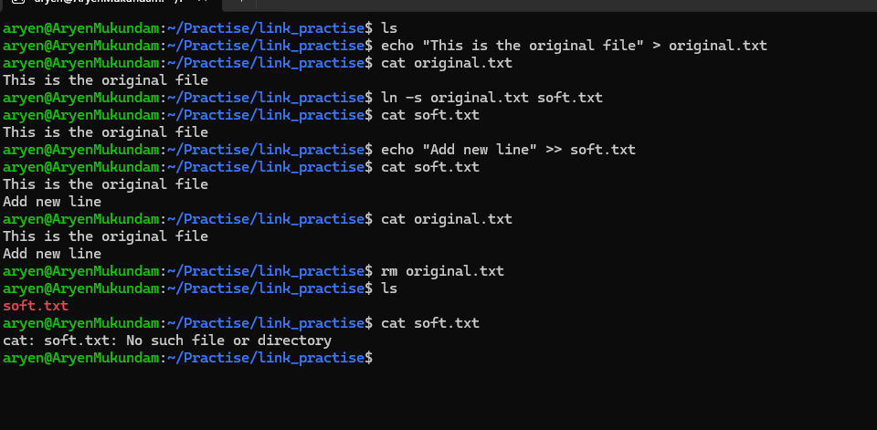
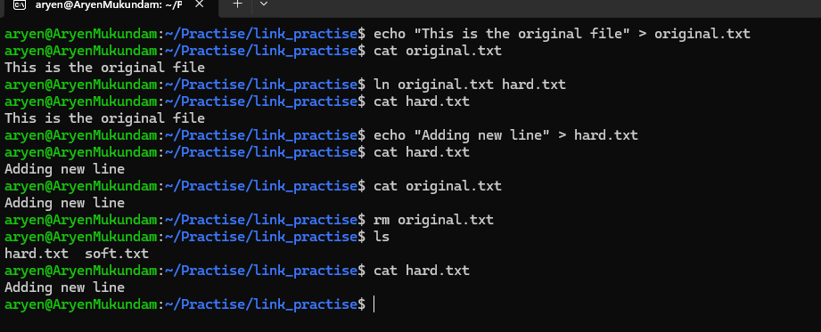
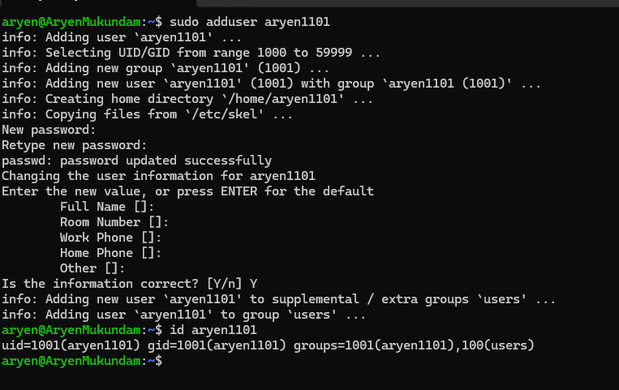
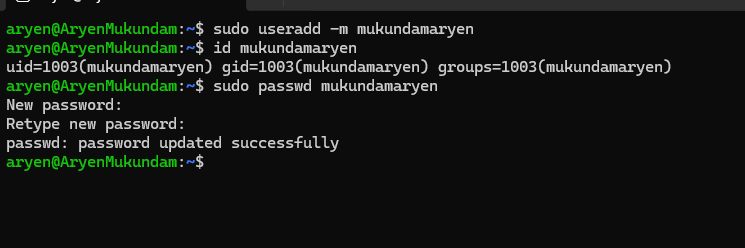
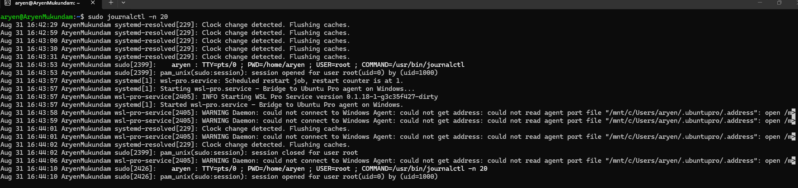
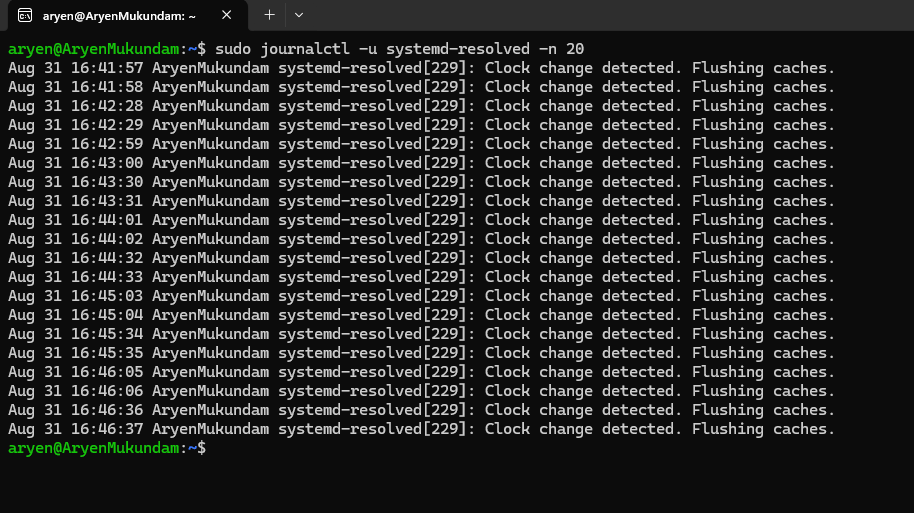

# Linux Fundamentals


## Task 1: Soft Link & Hard Link


- Learn the difference between soft links and hard links.
- Learn the commands to create both.
- Practice creating and deleting soft and hard links.
- Prepare for this as an interview question.

### What is a link?

A link is basically another way to access a file. Linux has two important types:

- Soft link (Symbolic link)
- Hard link

### Soft Link

A soft link, also called a symbolic link, is a special file that contains a reference/path to another file or directory.

**Syntax**

```bash
ln -s source_file link_name
```

**Example**

```bash
ln -s original.txt soft.txt
```

Here:

- `original.txt` -> original file
- `soft.txt` -> symbolic link

The soft link points to the path/name of the original file.



### Hard Link

A hard link is another name for the same file data and inode.

Instead of pointing to a pathname, a hard link points to the same inode as the original file.

**Syntax**

```bash
ln source_file link_name
```

**Example**

```bash
ln original.txt hard.txt
```

Here:

- `original.txt` -> original directory entry
- `hard.txt` -> another entry pointing to the same inode



---

## Task 2: adduser vs useradd

- Learn the difference between `adduser` and `useradd`.
- Understand which command is preferred on Ubuntu/Linux and why.
- Create a test user using the recommended command.

### adduser

`adduser` is a user-friendly command used to create a new user. It interactively asks for password and user details, and automatically creates the home directory.

**Syntax**

```bash
sudo adduser username
```

**Example**

```bash
sudo adduser testuser
```



### useradd

`useradd` is a lower-level command used to create users. It usually requires options to configure the account.

**Syntax**

```bash
sudo useradd -m username
```

`-m` -> creates the home directory

**Example**

```bash
sudo useradd -m testuser
```



### Which command is preferred on Ubuntu/Linux?

For manually creating users on Ubuntu, `adduser` is generally preferred.

It is because `adduser` is easier and more user-friendly, as it:

- Automatically creates the home directory.
- Asks for the user's password.
- Allows you to enter user information interactively.
- Handles common user setup automatically.

---

## Task 3: journalctl

- Learn what `journalctl` is used for.
- Learn how to view system and service logs using `journalctl`.
- Practice checking logs for a specific service.

### What is journalctl?

`journalctl` is a Linux command used to view system and service logs collected by systemd. It helps us troubleshoot errors, failed services, boot problems, etc.

**Example**

```bash
sudo journalctl
```

To see only the latest logs:

```bash
sudo journalctl -n 20
```

`-n 20` -> shows the last 20 log entries.



### Check Logs for a Specific Service

Use `-u` followed by the service name.

```bash
sudo journalctl -u service_name
```

For example, to check SSH logs:

```bash
sudo journalctl -u ssh
```


