# Networking Fundamentals


## 1. hostname

### Command

```bash
hostname
```

### Explanation

Shows the hostname of the system. The hostname is the name given to a machine so it can be identified on a network.


---

## 2. whoami

### Command

```bash
whoami
```

### Explanation

Shows the username of the currently logged-in user. This is helpful to confirm whether we are running as a normal user or as `root`. 


---

## 3. ip a

### Command

```bash
ip a
```

### Explanation

Shows all network interfaces along with their IP addresses. It also displays the MAC address, subnet prefix and whether the interface is UP or DOWN. 

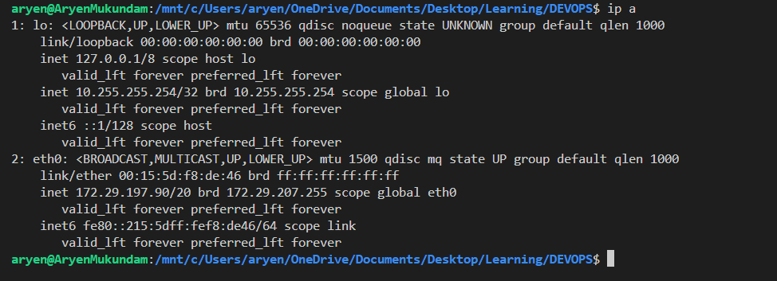

---

## 4. hostname -I

### Command

```bash
hostname -I
```

### Explanation

Shows only the IP addresses assigned to the system. Unlike `ip a`, it prints just the addresses without any extra details. This makes it handy inside scripts when we only need the IP.

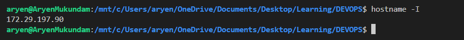

---

## 5. ip route

### Command

```bash
ip route
```

### Explanation

Shows the routing table of the system. The routing table works like a map that tells the machine where to send packets. It is the `default` entry points to the gateway, which is used for any destination outside the local network.

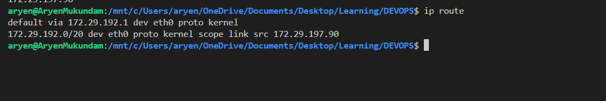

---

## 6. ping

### Command

```bash
ping -c 4 8.8.8.8
```

### Explanation

Tests network connectivity using the ICMP protocol. It sends Echo Request packets and waits for Echo Reply packets from the destination. The `-c 4` option sends only 4 packets and then stops, and the reply time shows how fast the connection is.

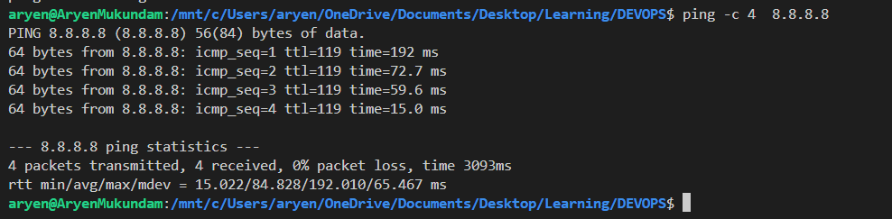

---

## 7. nslookup

### Command

```bash
nslookup example.com
```

### Explanation

Checks DNS resolution by converting a domain name into an IP address. It also shows which DNS server answered the query. This command is very useful when a website is not opening and we want to confirm whether DNS is the problem.

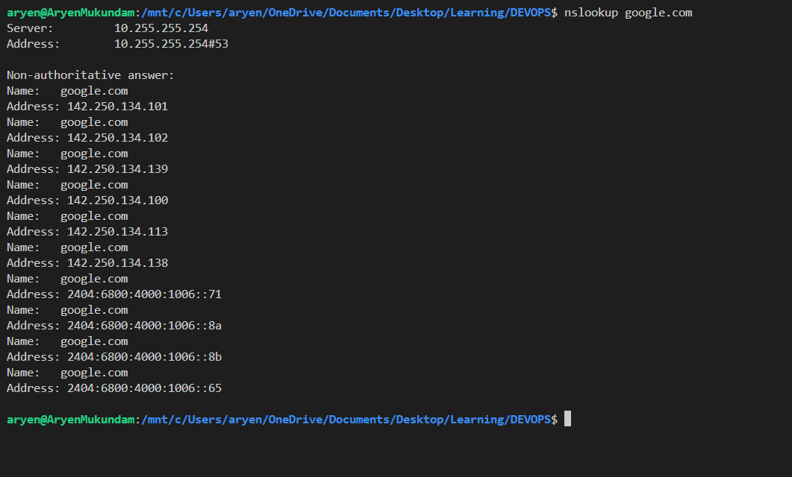

---

## 8. curl

### Command

```bash
curl https://example.com
```

For only the response headers:

```bash
curl -I https://example.com
```

### Explanation

Makes an HTTP/HTTPS request to a web server from the terminal. The normal command prints the full response body, usually the HTML of the page. The `-I` option shows only the headers, which is a quick way to check the status code such as `200 OK` or `404 Not Found`.

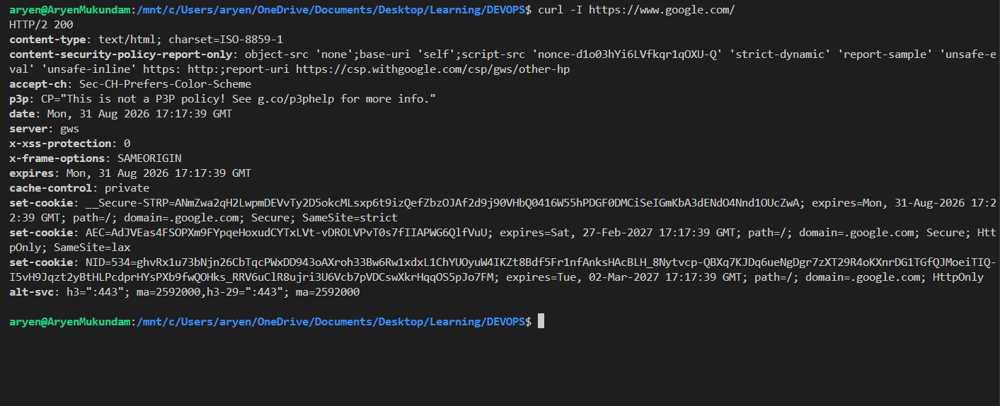

---

## 9. ss

### Command

```bash
ss -tuln
```

### Explanation

Shows network connections and listening ports on the system. The options mean: `t` for TCP, `u` for UDP, `l` for listening sockets and `n` for numeric output instead of service names. It is the modern replacement for the older `netstat` command.

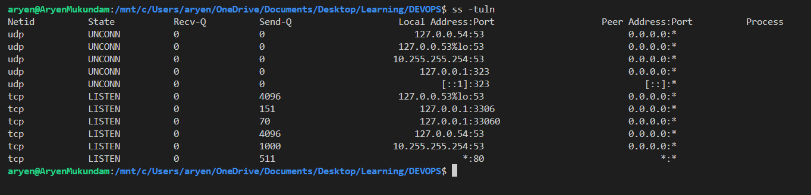

---

## 10. /etc/hosts

### Command

```bash
cat /etc/hosts
```

### Explanation

Shows the local hostname-to-IP mappings stored on the machine. The system checks this file before asking a DNS server, so entries here take priority. It is often used for testing a domain locally or for blocking a website.

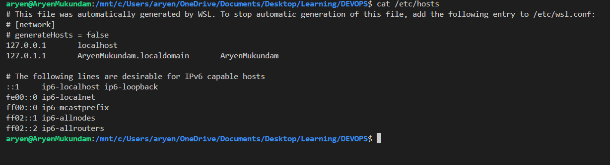

---

## 11. tracepath

### Command

```bash
tracepath example.com
```

### Explanation

Shows the network path taken to reach a destination, hop by hop. It also displays the delay at each hop and the path MTU. Unlike `traceroute`, it does not need root privileges to run.

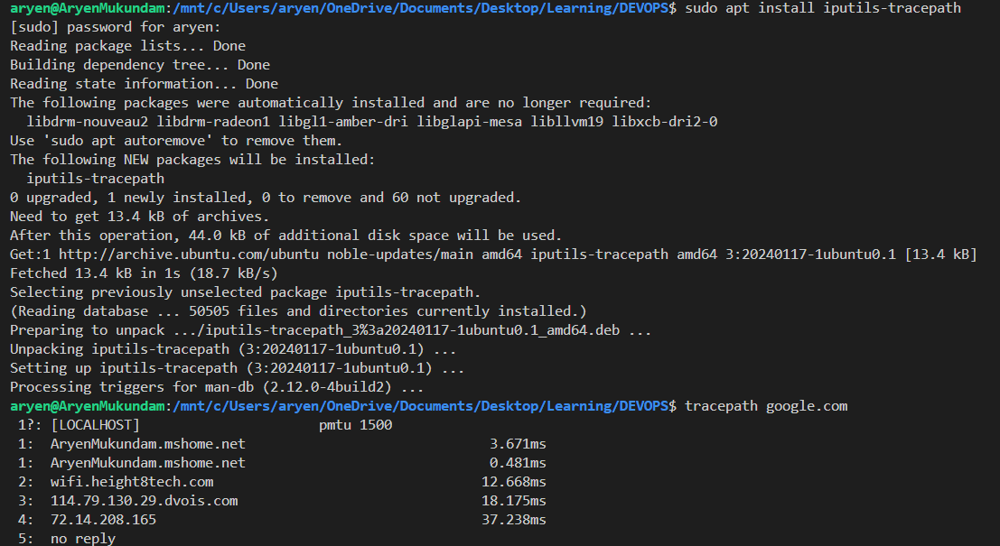

---

## 12. traceroute

### Command

```bash
traceroute example.com
```

### Explanation

Shows the route packets take to reach a destination, listing every router in between. It helps find out at which hop the network is slow or breaking. Some hops may appear as `* * *` because routers or firewalls can block diagnostic replies.

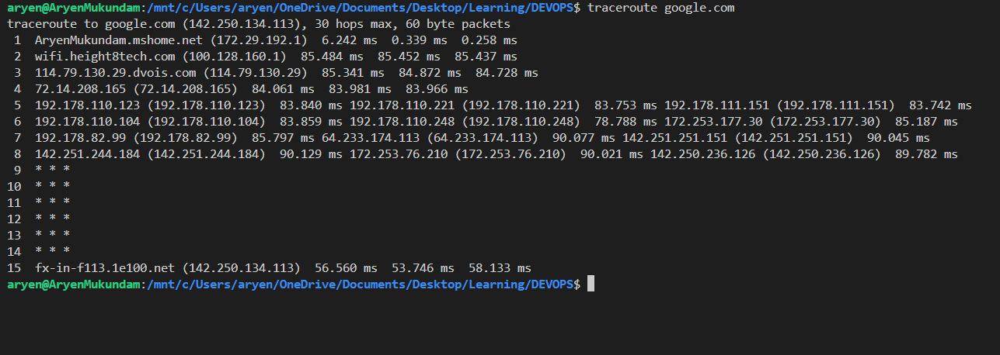

---

## 13. telnet

### Command

```bash
telnet example.com 80
```

### Explanation

Used to test whether a TCP port on a remote machine is accepting connections. If the connection succeeds, the port is open and the service is reachable. Telnet sends data without encryption, so it should not be used for remote login - `nc -vz example.com 80` is the safer option for port testing.

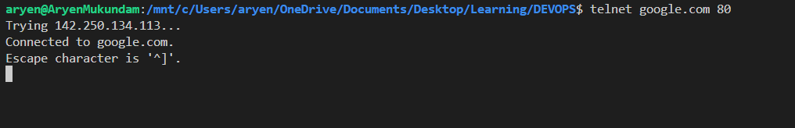
