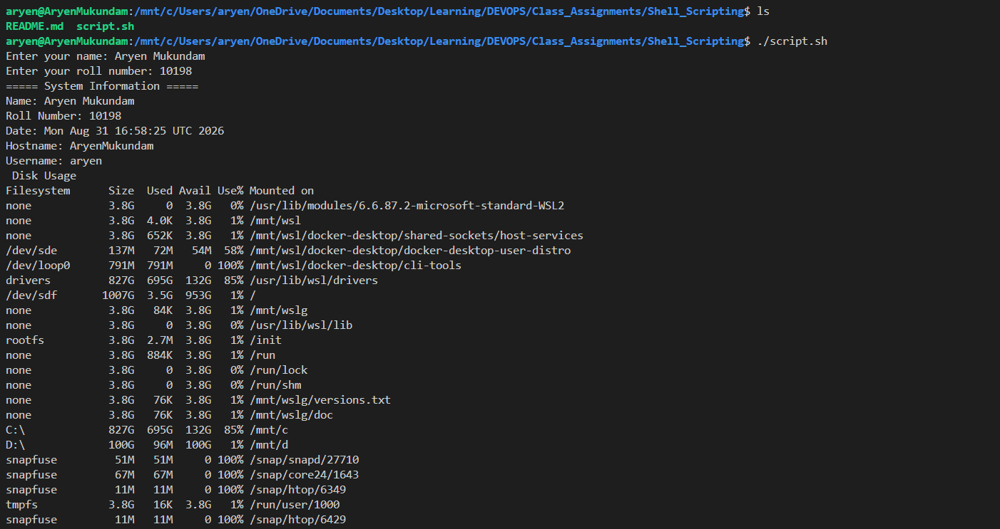
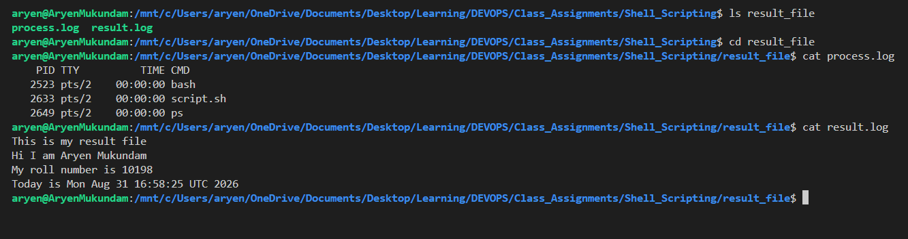

# Shell Scripting

## Task: System Information Script
- Create a shell script that:
- Prints the current date.
- Prints the hostname.
- Prints the username.
- Prints the disk usage.
- Prints the running processes.
- Uses variables to store and use data.
- Takes user input using read -p.
- Creates a directory using mkdir.
- Creates a file using touch.
Stores the running processes information in the file using > output redirection

## script.sh

```bash
#!/bin/bash

mkdir -p result_file

cd result_file

touch result.log
touch process.log

echo "This is my result file" > result.log

read -p "Enter your name: " name
read -p "Enter your roll number: " roll_no

current_date=$(date)
hostname=$(hostname)
username=$(whoami)
disk_usage=$(df -h)
processes=$(ps)

echo "===== System Information ====="

echo "Name: $name"
echo "Roll Number: $roll_no"
echo "Date: $current_date"
echo "Hostname: $hostname"
echo "Username: $username"

echo " Disk Usage "
echo "$disk_usage"

echo " Running Processes "
echo "$processes"

echo "$processes" > process.log

echo "Hi I am $name" >> result.log
echo "My roll number is $roll_no" >> result.log
echo "Today is $current_date" >> result.log
```

## Output

```
$ chmod +x script.sh
$ ./script.sh
Enter your name: Aryen Mukundam
Enter your roll number: 10198
===== System Information =====
Name: Aryen Mukundam
Roll Number: 10198
Date: Mon Aug 31 16:58:25 UTC 2026
Hostname: AryenMukundam
Username: aryen
 Disk Usage
Filesystem      Size  Used Avail Use% Mounted on
none            3.8G     0  3.8G   0% /usr/lib/modules/6.6.87.2-microsoft-standard-WSL2
none            3.8G  4.0K  3.8G   1% /mnt/wsl
none            3.8G  652K  3.8G   1% /mnt/wsl/docker-desktop/shared-sockets/host-services
/dev/sde        137M   72M   54M  58% /mnt/wsl/docker-desktop/docker-desktop-user-distro
/dev/loop0      791M  791M     0 100% /mnt/wsl/docker-desktop/cli-tools
drivers         827G  695G  132G  85% /usr/lib/wsl/drivers
/dev/sdf       1007G  3.5G  953G   1% /
none            3.8G   84K  3.8G   1% /mnt/wslg
none            3.8G     0  3.8G   0% /usr/lib/wsl/lib
rootfs          3.8G  2.7M  3.8G   1% /init
none            3.8G  884K  3.8G   1% /run
none            3.8G     0  3.8G   0% /run/lock
none            3.8G     0  3.8G   0% /run/shm
none            3.8G   76K  3.8G   1% /mnt/wslg/versions.txt
none            3.8G   76K  3.8G   1% /mnt/wslg/doc
C:\             827G  695G  132G  85% /mnt/c
D:\             100G   96M  100G   1% /mnt/d
snapfuse         51M   51M     0 100% /snap/snapd/27710
snapfuse         67M   67M     0 100% /snap/core24/1643
snapfuse         11M   11M     0 100% /snap/htop/6349
tmpfs           3.8G   16K  3.8G   1% /run/user/1000
snapfuse         11M   11M     0 100% /snap/htop/6429
 Running Processes
    PID TTY          TIME CMD
   2523 pts/2    00:00:00 bash
   2633 pts/2    00:00:00 script.sh
   2649 pts/2    00:00:00 ps
```



```
$ ls result_file
process.log  result.log

$ cd result_file

$ cat process.log
    PID TTY          TIME CMD
   2523 pts/2    00:00:00 bash
   2633 pts/2    00:00:00 script.sh
   2649 pts/2    00:00:00 ps

$ cat result.log
This is my result file
Hi I am Aryen Mukundam
My roll number is 10198
Today is Mon Aug 31 16:58:25 UTC 2026
```


