# Terraform & Infrastructure as Code


---

## Task 1: Terraform S3 Demo

Project folder: `terraform-s3-demo/`

```text
terraform-s3-demo/
├── terraform.tf
├── providers.tf
├── variables.tf
├── terraform.tfvars
├── main.tf
├── outputs.tf
├── .gitignore
└── README.md
```

### terraform init

```bash
terraform init
```

### terraform fmt

```bash
terraform fmt
```

### terraform validate

```bash
terraform validate
```

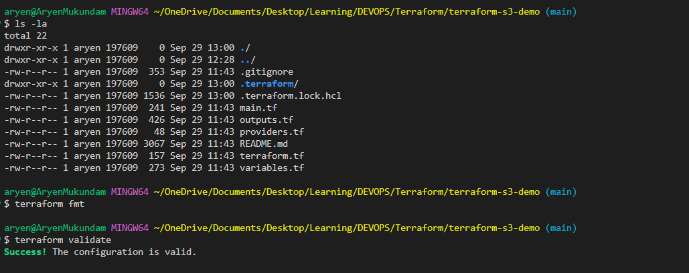
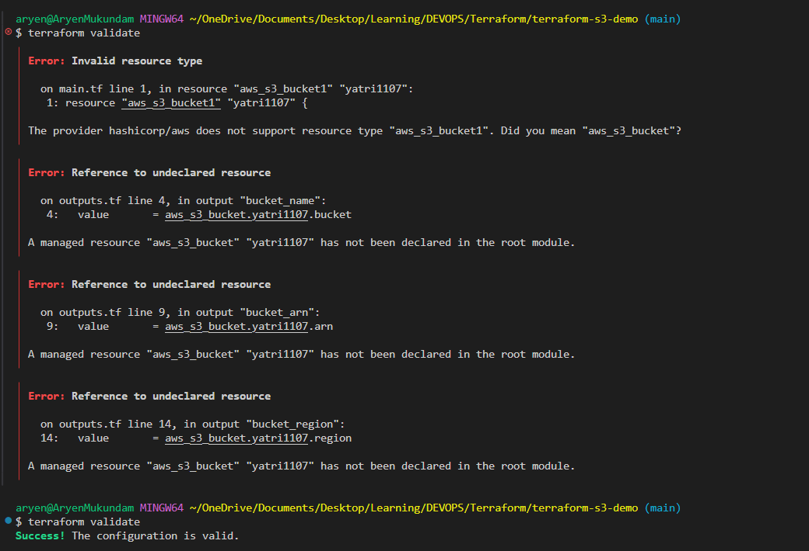

### terraform plan

```bash
terraform plan
```

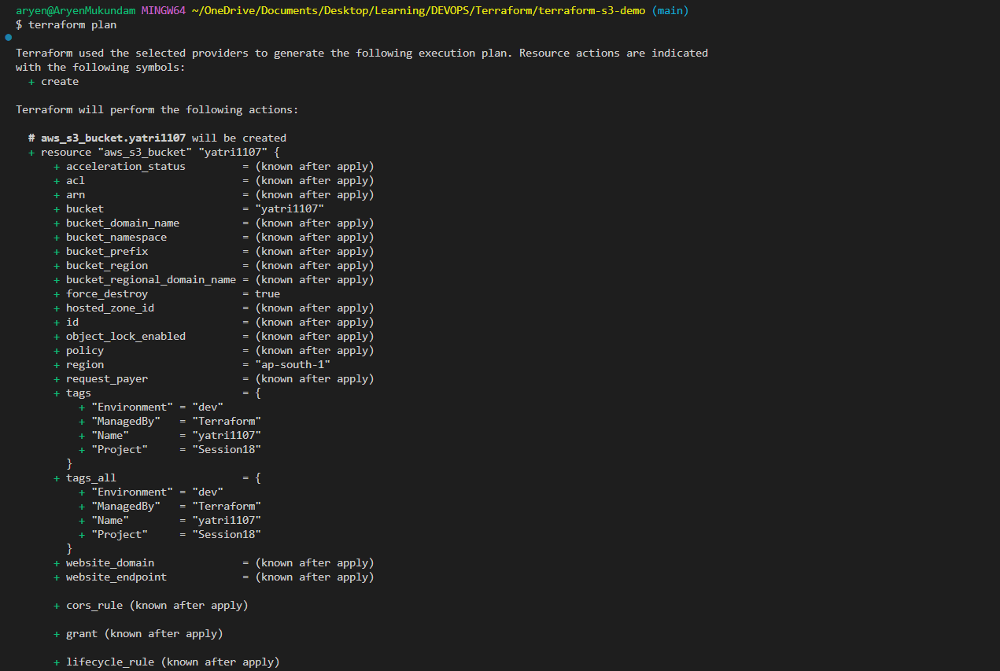
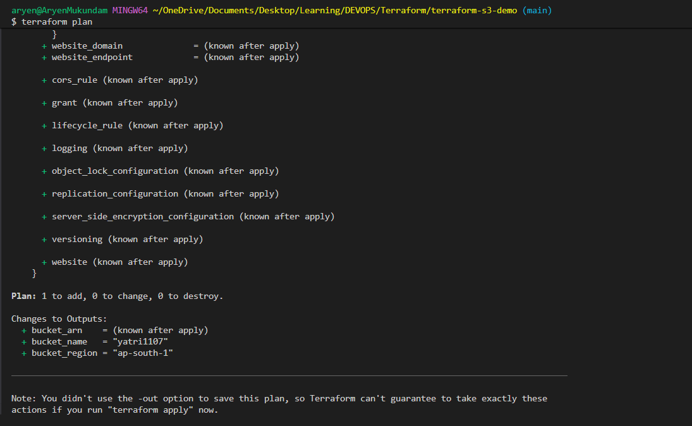

### terraform apply

```bash
terraform apply
```

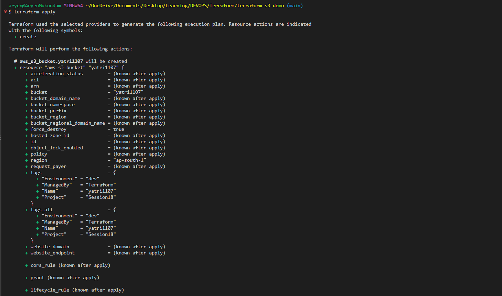
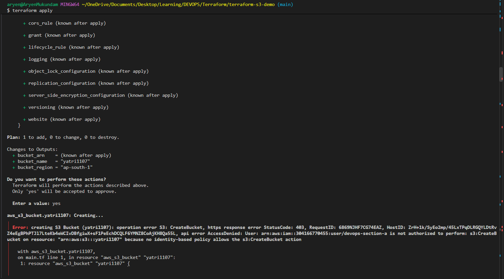
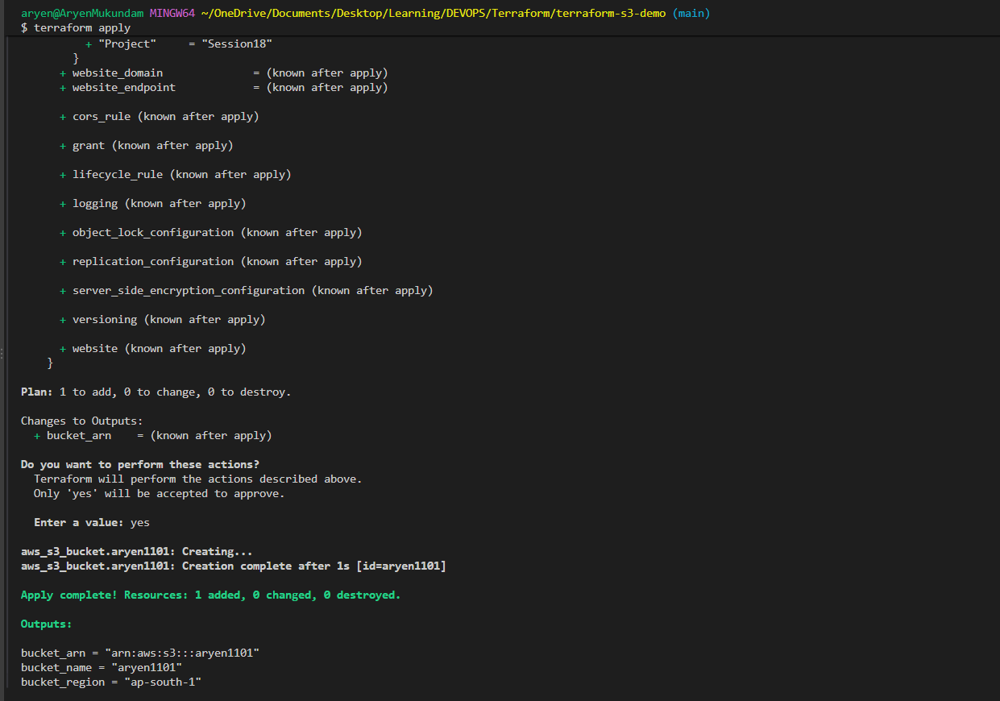

### terraform show

```bash
terraform show
```

### terraform output

```bash
terraform output
```

### terraform destroy

```bash
terraform plan -destroy
terraform destroy
```

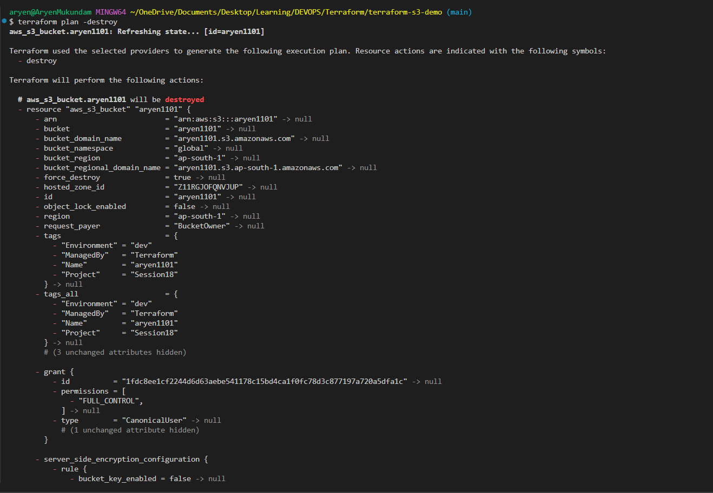
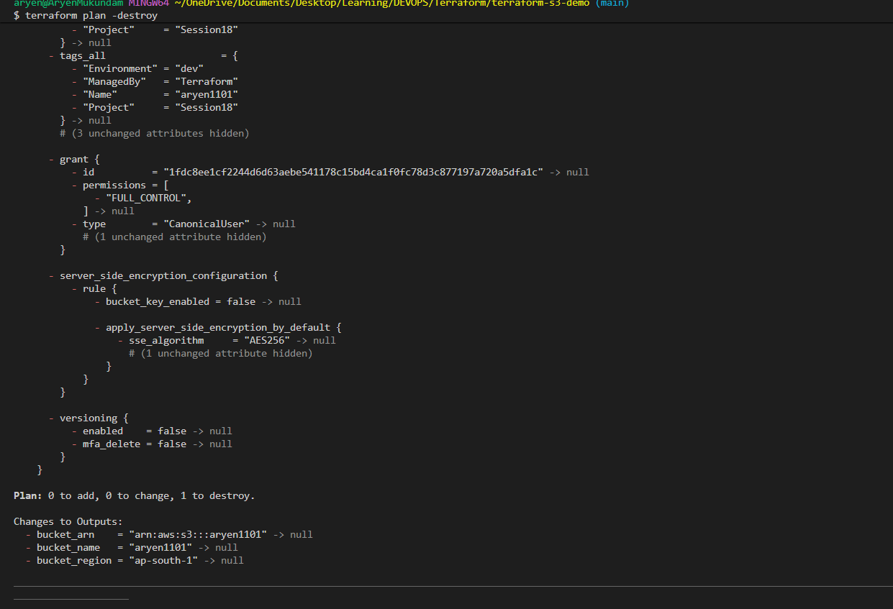
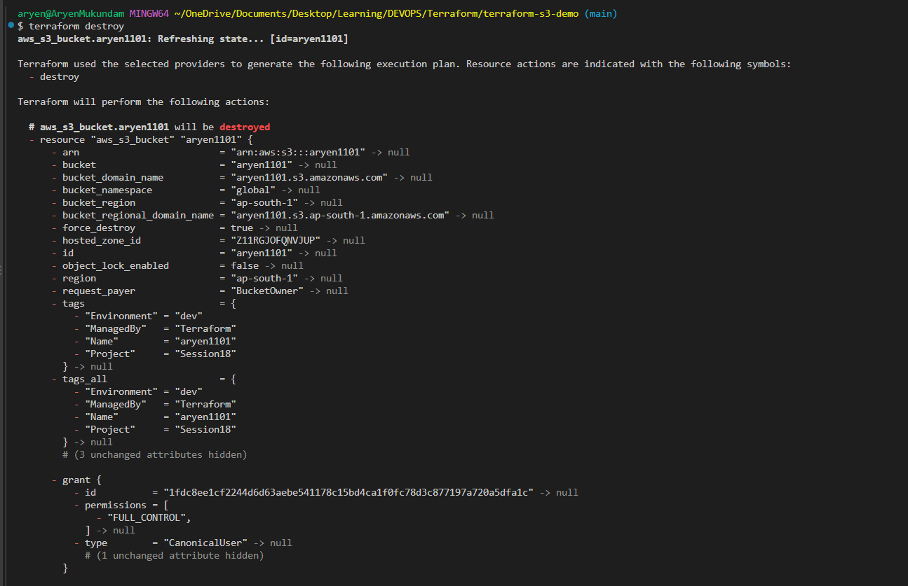
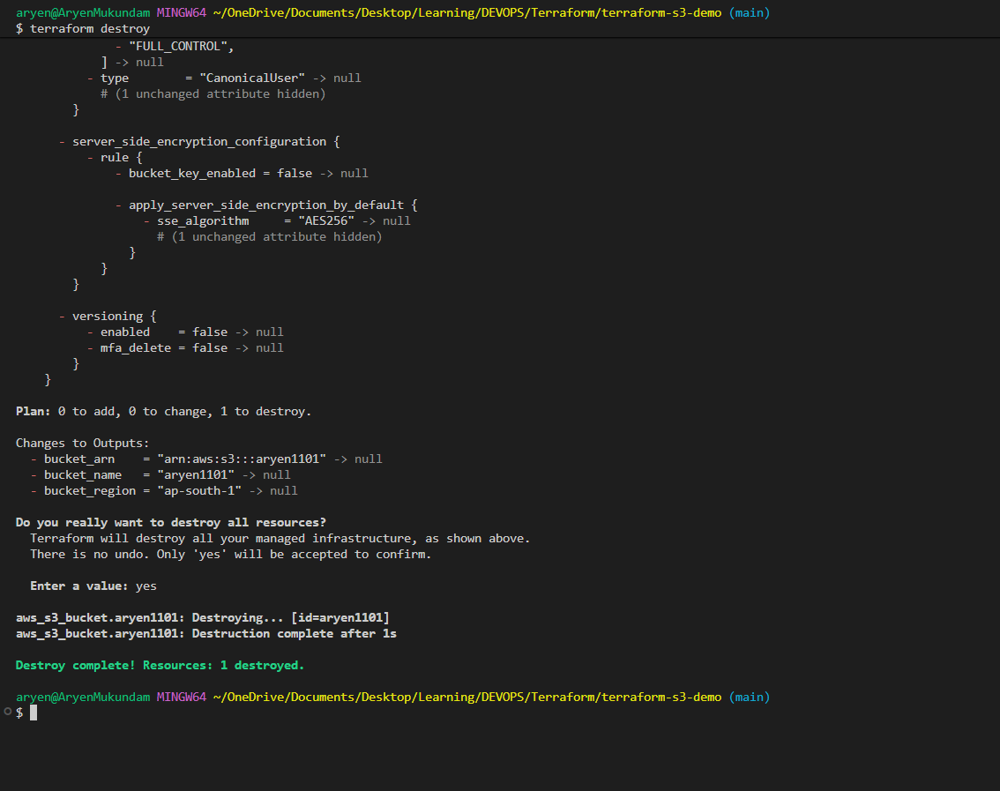

---

## Task 2: AWS Services Research

### 01. IAM - Governance

IAM (Identity and Access Management) is the service that decides who can get into my AWS account and what they are allowed to do once inside. Every single request to AWS, whether it comes from the console, the CLI or Terraform, is checked by IAM first. It is free and it is global, so the same users and rules work in every region.

**Users.** A user is one person or one application that needs access. Each user gets their own identity with a password for the console and, if needed, access keys for the CLI and tools like Terraform. The keys I typed into `aws configure` belong to an IAM user. The root account should not be used for daily work.

**Groups.** A group is a bunch of users that share the same permissions. Instead of attaching the same policy to ten developers one by one, I attach it once to a `developers` group and add the users to it. A new team member gets everything by just joining the group.

**Roles.** A role is like a user without a permanent password or keys. Something assumes the role and gets temporary credentials that expire on their own. Roles are used when an EC2 instance needs to read S3, when Lambda needs to write to DynamoDB, or when another AWS account needs access to mine. They are safer than keys because nothing long lived is stored on the server.

**Policies.** A policy is a JSON document that says what is allowed or denied. It has three main parts: Effect (Allow or Deny), Action (the API calls, like `s3:GetObject`) and Resource (the ARN it applies to). AWS gives ready made policies such as `AmazonS3ReadOnlyAccess`, and I can write my own for exact control.

**Permissions.** Permissions are the actual rights that a user, group or role ends up with after all its policies are combined. A new user starts with nothing. When a request comes in, AWS checks for an explicit Deny first, then for an Allow, and if neither is found the request is denied. This is why my first `terraform apply` failed with AccessDenied: the user had no policy allowing `s3:CreateBucket` for that name.

**Least privilege.** Give only the permissions needed for the job and nothing extra. A backup script that uploads to one bucket should not have full S3 access, and certainly not admin. If its keys leak, the damage stays small.

**IAM best practices.** Do not use the root account, turn on MFA for root and for all users, use groups instead of attaching policies to individual users, use roles for EC2 and Lambda instead of keys, rotate keys and delete unused ones, and never put keys in code, screenshots or git. Turn on CloudTrail so there is a record of who did what.

**Common use cases.** Separate logins for each team member with the right level of access, an EC2 instance reading from S3 through a role, a CI/CD pipeline deploying with a limited user, cross account access between a dev and a prod account, and read only access for auditors.

### 02. EC2 - Compute

EC2 (Elastic Compute Cloud) is a virtual server in AWS. I pick the operating system, the size, the disk and the network, and within a minute I have a machine I can SSH into. I pay only for the time it is running. Most other things in AWS are built on top of EC2 in some way.

**AMI.** An Amazon Machine Image is the template the server starts from. It holds the operating system and any software that was pre installed, for example Amazon Linux 2023 or Ubuntu 24.04. I can also make my own AMI from a running instance, so if I set up a web server once I can launch ten identical copies from it.

**Instance types.** The instance type decides how much CPU, memory, storage and network the server gets. The name tells the story: in `t3.micro`, `t` is the family, `3` is the generation and `micro` is the size. The t family is small and cheap (free tier), c is for CPU heavy work, r is for memory heavy work like databases, and g or p have GPUs for machine learning.

**Key pairs.** A key pair is how I log in to a Linux instance over SSH. AWS keeps the public key and I download the private `.pem` file once when I create it. If I lose that file I cannot log in to the instance any more, so it has to be kept safe.

**Security Groups.** A security group is the firewall around the instance. It has inbound rules for what can come in and outbound rules for what can go out. By default everything inbound is blocked and everything outbound is allowed. For a web server I would open port 22 only from my IP and ports 80 and 443 from anywhere. It is stateful, so if a request is allowed in, the reply is allowed out automatically.

**EBS.** Elastic Block Store is the hard disk of the instance. The root volume holds the OS and I can attach more volumes for data. EBS lives separately from the instance, so stopping the instance keeps the data, and I can take snapshots as backups. The usual type is `gp3` SSD.

**Public vs private IP.** Every instance gets a private IP inside the VPC that stays the same for its whole life and is used by other servers in the same VPC. A public IP is only given if the subnet is public and the option is on, and it changes every time the instance stops and starts. An Elastic IP is a public IP I reserve so it never changes. A database server should only have a private IP.

**Instance lifecycle.** An instance goes pending, then running. From running I can stop it, which keeps the disk and stops the compute bill, or terminate it, which deletes it for good. A reboot is like restarting a laptop, the IP and data stay. Stopping a dev machine at night is an easy way to save money.

**Common use cases.** Hosting a website or API, running a Jenkins or GitHub Actions runner, a bastion host to reach private servers, batch jobs and data processing, Kubernetes worker nodes, and test machines that are started when needed.

### 03. S3 - Storage

S3 (Simple Storage Service) is object storage. I upload files into buckets and AWS keeps them safe, copies them across several data centres, and serves them over HTTPS from anywhere. There is no disk to manage and no limit on how much I can store. I pay for the space used and the requests made. It is not a file system for a server, it is a very large and very reliable cloud drive that programs talk to through an API.

**Buckets.** A bucket is the top level container. The name must be unique across all of AWS, not just my account, which is why a name like `aryen1101` works but `test` never will. Names are lowercase with letters, numbers and hyphens. A bucket lives in one region and is private by default.

**Objects.** An object is a file plus its metadata. Each object has a key, which is its full name including any folder path such as `photos/2024/trip.jpg`. S3 has no real folders, the slashes are just part of the key. An object can be from 0 bytes up to 5 TB.

**Storage classes.** Storage classes let me pay less for data I touch less often. Standard is for data used all the time. Intelligent-Tiering lets AWS move objects for me. Standard-IA and One Zone-IA are cheaper for data used maybe once a month. Glacier and Glacier Deep Archive are very cheap for archives but take minutes to hours to retrieve.

**Versioning.** With versioning on, S3 keeps every version of an object. If I overwrite or delete a file by mistake, the old version is still there and I can restore it. Deleting only adds a delete marker on top. It uses more storage, so it is usually paired with a lifecycle rule to remove old versions.

**Lifecycle policies.** A lifecycle rule tells S3 to do something automatically after a number of days. For logs it might be: keep in Standard for 30 days, move to Standard-IA, move to Glacier at 90 days, delete after a year. Nobody has to remember to clean up.

**Encryption.** Every new object is encrypted at rest by default with SSE-S3, where AWS manages the key. In my destroy plan this showed up as `sse_algorithm = "AES256"`. I can choose SSE-KMS instead to use my own KMS key and get an audit trail. Data in transit goes over HTTPS.

**Bucket policies.** A bucket policy is a JSON document attached to the bucket that says who can do what with it, and it works together with IAM. A common one gives everyone `s3:GetObject` for a static website. Block Public Access is on by default and stops such policies from working until I turn it off on purpose, which is a good safety net.

**Common use cases.** Backups and database dumps, hosting a static website, application and CloudTrail logs, user uploads like images and documents, a data lake for analytics, and Terraform remote state so a team shares one state file.

### 04. VPC - Networking

A VPC (Virtual Private Cloud) is my own private network inside AWS. Everything I launch, like EC2 instances and RDS databases, sits inside a VPC. I decide the IP range, how it is split into subnets, what can reach the internet and what stays hidden. Every account gets a default VPC so things work out of the box, but for real projects I create my own with public subnets for things the internet must reach and private subnets for everything else.

**CIDR.** CIDR is how the IP range is written. `10.0.0.0/16` means the first 16 bits are fixed and the rest are free, which gives 65,536 addresses. A `/24` gives 256. AWS reserves 5 addresses in every subnet, so a `/24` really has 251 usable. I use the private ranges like `10.0.0.0/8` and pick one that does not overlap with other networks I may connect later.

**Subnets.** A subnet is a slice of the VPC range that lives in one Availability Zone. It cannot stretch across zones. For high availability I create at least two subnets of each type in two zones. A subnet is only called public or private because of where its route table points.

**Route tables.** A route table is the list of rules that says where traffic goes based on its destination. Every subnet is attached to exactly one. The `local` route is always there and lets everything inside the VPC talk to each other. A public route table sends `0.0.0.0/0` to the Internet Gateway, a private one sends it to a NAT Gateway or nowhere.

**Internet Gateway.** The Internet Gateway is the door between the VPC and the internet. There is one per VPC. For a server to be reachable from outside it needs three things: a route to the IGW, a public IP, and a security group that allows the traffic.

**NAT Gateway.** A NAT Gateway lets servers in a private subnet reach the internet, for updates or API calls, while nobody on the internet can start a connection to them. It sits in a public subnet with an Elastic IP. It costs per hour and per GB, so small labs often skip it.

**Security Groups.** A security group is a firewall on the instance. It only has Allow rules and it is stateful. Rules can point at other security groups, for example allow port 3306 only from the web servers' group. This is the main way I control traffic between servers.

**Network ACLs.** A Network ACL is a firewall on the subnet. Unlike a security group it has both Allow and Deny rules, it is stateless so both directions need rules, and rules are checked in number order with the first match winning. Most of the time the default NACL is left alone. It is handy for blocking one bad IP from a whole subnet.

**Public vs private subnet.** A public subnet routes `0.0.0.0/0` to the Internet Gateway and its instances get public IPs, so it is where load balancers, bastion hosts and NAT Gateways go. A private subnet routes to a NAT or nothing, its instances have only private IPs, and it is where app servers, databases and caches go. Only things that must be reached from the internet belong in the public subnet.

### 05. DynamoDB & RDS - Database Services

AWS gives two very different kinds of managed database. DynamoDB is NoSQL and made for huge scale with simple lookups. RDS is the classic relational database with tables, joins and SQL. In both cases AWS handles the servers, patching and backups.

**DynamoDB**

**NoSQL.** DynamoDB is a key value and document database with no fixed schema. Two items in the same table can have different fields and there are no joins. I design the table around how the app reads data, not around normalised tables. In return I get single digit millisecond speed at any size and no servers to manage.

**Tables.** A table is the only structure, there is no database above it. Each table has a name, a key, and either on demand pricing (pay per request) or provisioned capacity (fixed reads and writes per second).

**Items.** An item is one record, like a row in SQL. It is stored as JSON and can be up to 400 KB.

**Attributes.** Attributes are the fields inside an item, such as `total` or `status`. Apart from the key attributes, every item can have its own set.

**Partition key.** The partition key is required. DynamoDB hashes it to decide which physical partition stores the item, so a good partition key has many different values to spread data evenly. `user_id` is good, `country` is bad because most items would land in a few partitions.

**Sort key.** The sort key is optional. Together with the partition key it makes the full primary key. Items with the same partition key are stored side by side, ordered by the sort key, so I can ask for all orders of user `u123` from June in one query.

**Use cases.** Shopping carts and user sessions, gaming leaderboards, IoT data with millions of writes per second, serverless apps with Lambda, and anything that needs a fast key lookup at very high scale.

**RDS**

**Relational database.** RDS (Relational Database Service) runs a normal SQL database for me. Data lives in tables with fixed columns, tables link with foreign keys, and I query with SQL including joins and transactions. AWS installs it, patches it, backs it up and can fail it over. I connect with the same drivers and tools I would use on my own server.

**Supported engines.** MySQL, PostgreSQL, MariaDB, Oracle, Microsoft SQL Server, and Amazon Aurora, which is AWS's own MySQL and PostgreSQL compatible engine built for speed and scale.

**DB instances.** A DB instance is the actual database server. I choose the engine and version, the instance class such as `db.t3.micro` for free tier or `db.r6g.large` for memory heavy work, the storage type and size, and the VPC and subnets it sits in. It gets an endpoint like `mydb.abc123.ap-south-1.rds.amazonaws.com` for the app to connect to.

**Security.** Put the instance in a private subnet so it has no public IP. Use a security group that allows the database port only from the app servers' group. Turn on encryption at rest with KMS when creating it, since it cannot be added later without a restore. Force SSL, and keep the password in Secrets Manager instead of code.

**Backups.** Automated backups run daily and keep transaction logs, so I can restore to any second in the retention window of 1 to 35 days. Manual snapshots are taken when I want and kept until I delete them, which is useful before a big change. A restore always creates a new instance.

**Multi-AZ.** Multi-AZ keeps a standby copy in a second Availability Zone and every write goes to both. If the main one fails, AWS switches the endpoint to the standby in about a minute and the app does not need to change anything. It is for availability, not for extra read speed, because the standby cannot be queried.

**Read replicas.** A read replica is a copy the app can read from. Writes still go to the main instance and are copied over a little later. I can have several replicas, even in other regions, to take reporting and read heavy traffic off the main database.

**Use cases.** Web and mobile app backends that need transactions, e-commerce orders and payments, anything that already runs on MySQL or PostgreSQL and just needs to be managed, and reporting on top of relational data.
