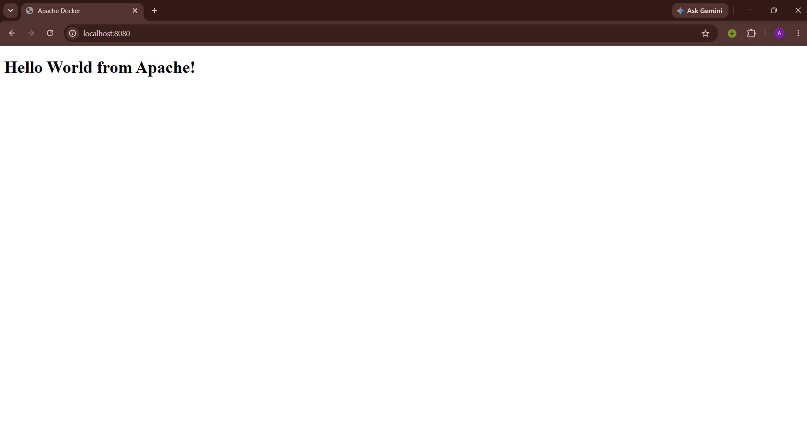

# Apache Web App

## Image



## Commands

Build the image from the Dockerfile:

```bash
docker build -t apache-webapp .
```

Run the container and map host port `8080` to container port `80`:

```bash
docker run -d --name apache-container -p 8080:80 apache-webapp
```

