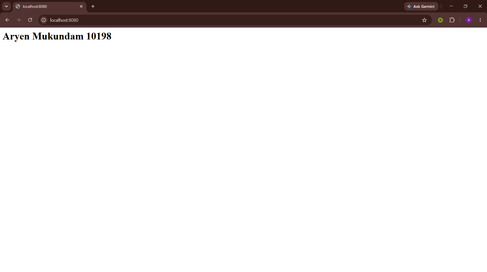
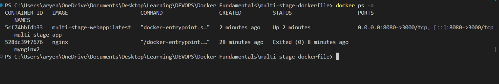

## Multi-stage Dockerfile



## Commands

Build the image from the Dockerfile:

```bash
docker build -t multi-stage-webapp .  
```

Run the container and map host port `8080` to container port `8080`:

```bash
docker run -it -d -p 8080:3000 --name multi-stage-app multi-stage-webapp:latest
```


