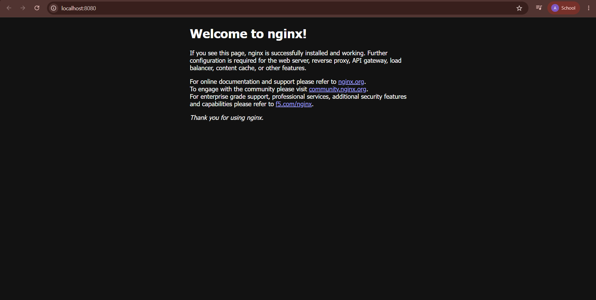

# Nginx Web App

## Image

### Running the Official Nginx Image



### Running the Custom Nginx Image


## Commands

### 1. Run the Official Image

Pull the official image from Docker Hub:

```bash
docker pull nginx
```

Run it and map host port `8080` to container port `80`:

```bash
docker run -d --name nginx-app -p 8080:80 nginx
```

### 2. Build and Run the Custom Image

Build the image from the local Dockerfile:

```bash
docker build -t nginx-webapp .
```

Run the custom image:

```bash
docker run -d --name nginx-webapp-container -p 8080:80 nginx-webapp:latest
```

