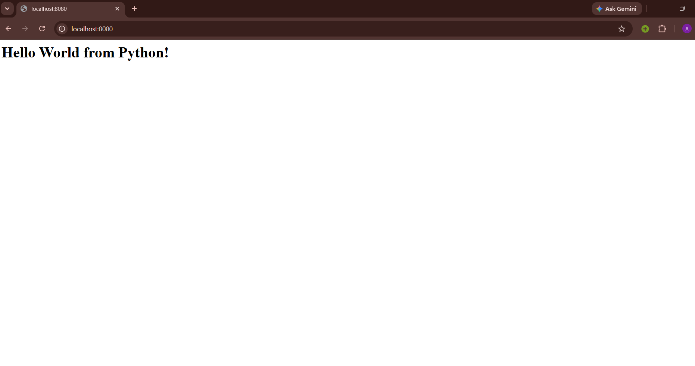

# Python Web App

## Image



## Commands

Build the image from the Dockerfile:

```bash
docker build -t python-webapp .
```

Run the container and map host port `8080` to container port `8080`:

```bash
docker run -d --name python-container -p 8080:8080 python-webapp
```

