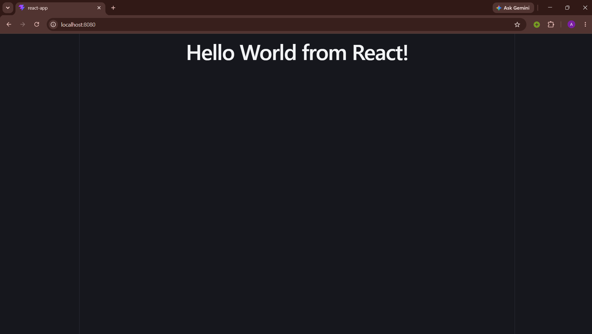

## React Web App



## Commands

Build the image from the Dockerfile:

```bash
docker build -t react-webapp .  
```

Run the container and map host port `8080` to container port `8080`:

```bash
docker run -d --name react-containers -p 8080:80 react-webapp
```
