# Session 14 - Kubernetes Troubleshooting (Practice)

## 1. kubectl get

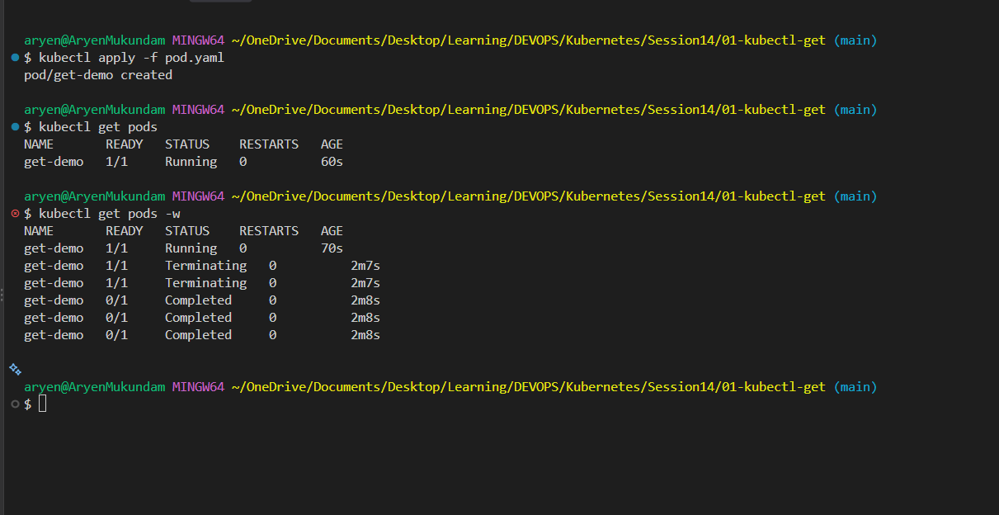
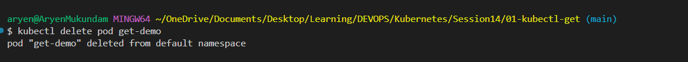

## 2. kubectl describe

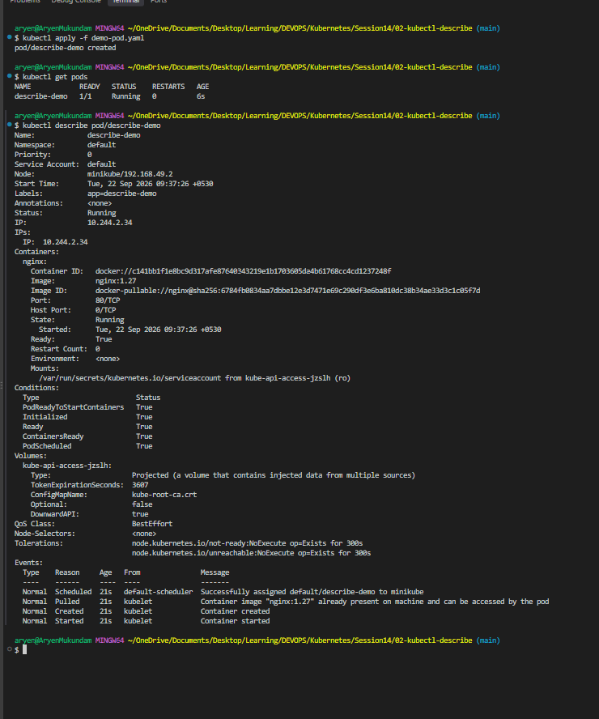

## 3. kubectl logs

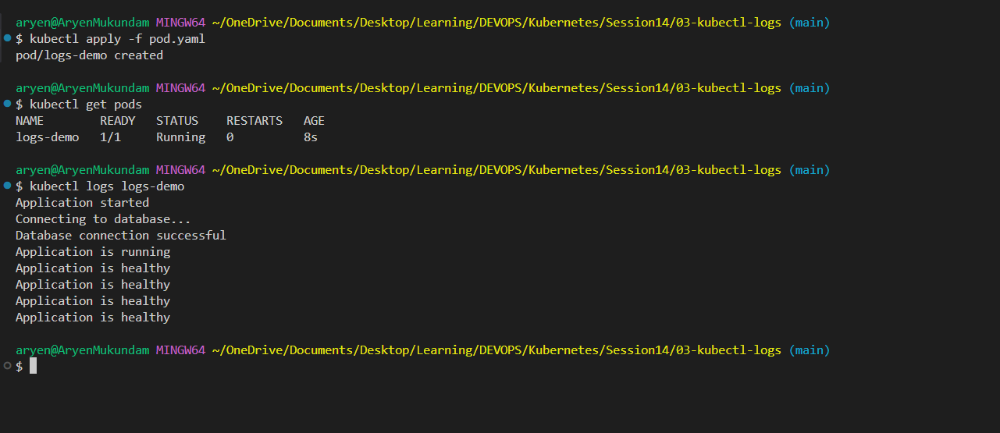

## 4. kubectl exec

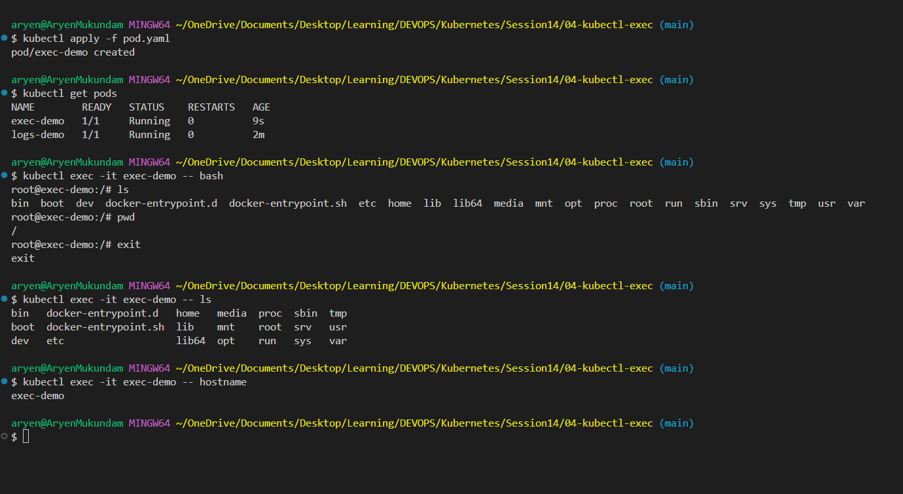

## 5. Events

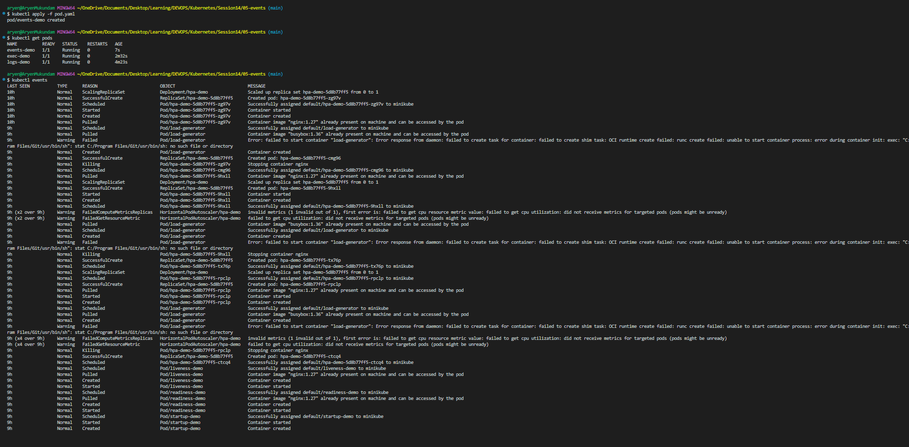
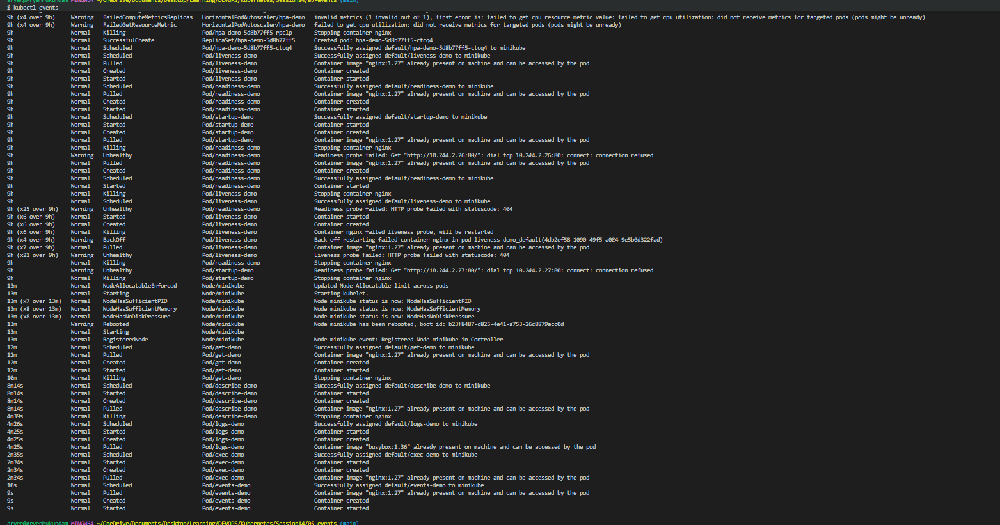
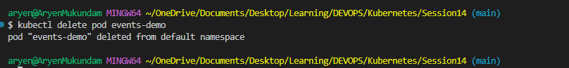
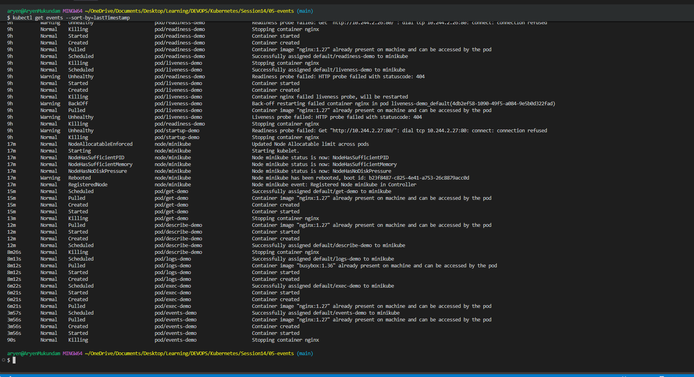

## 6. CrashLoopBackOff

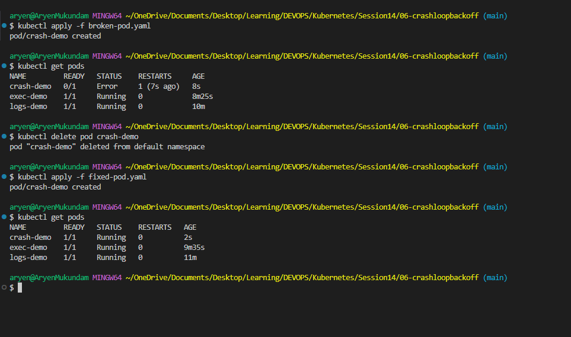

## 7. ImagePullBackOff

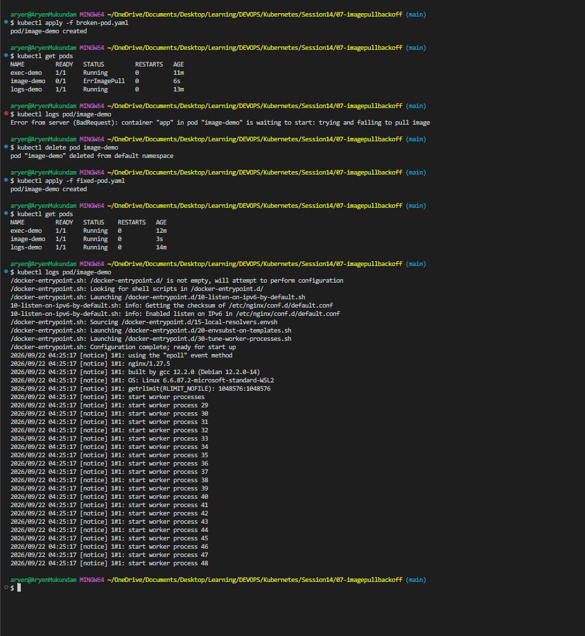

## 8. Pending Pods

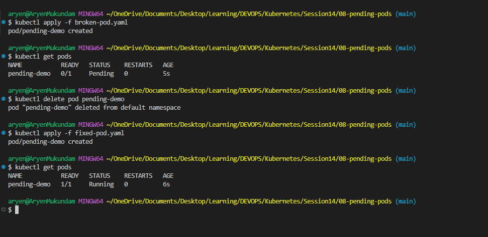

## 9. Service and DNS Troubleshooting

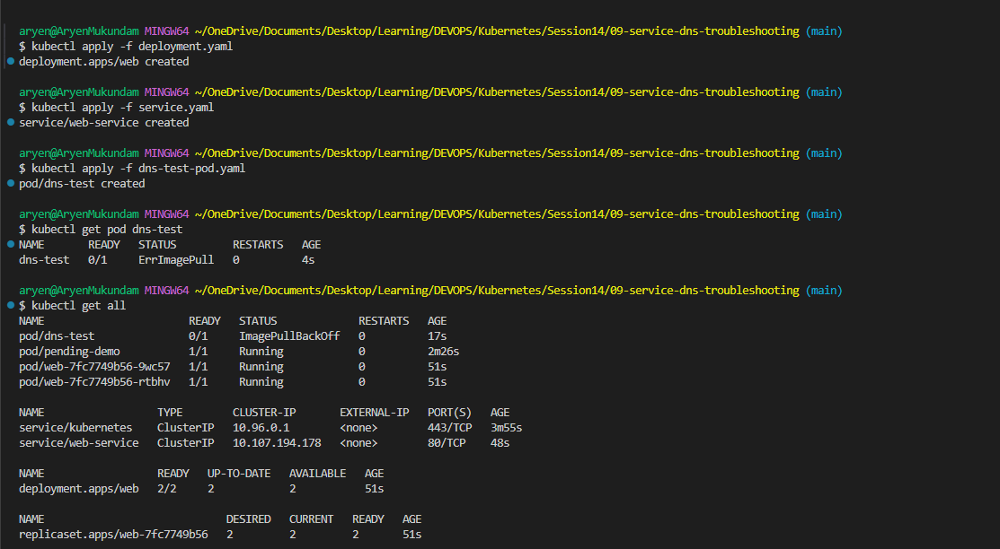
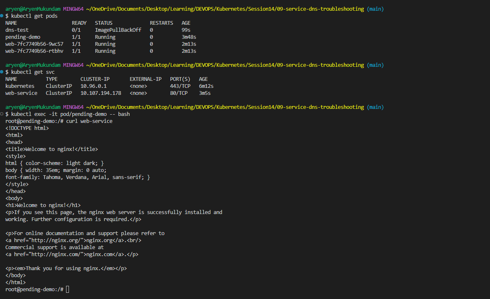

---

Mini-Project ->
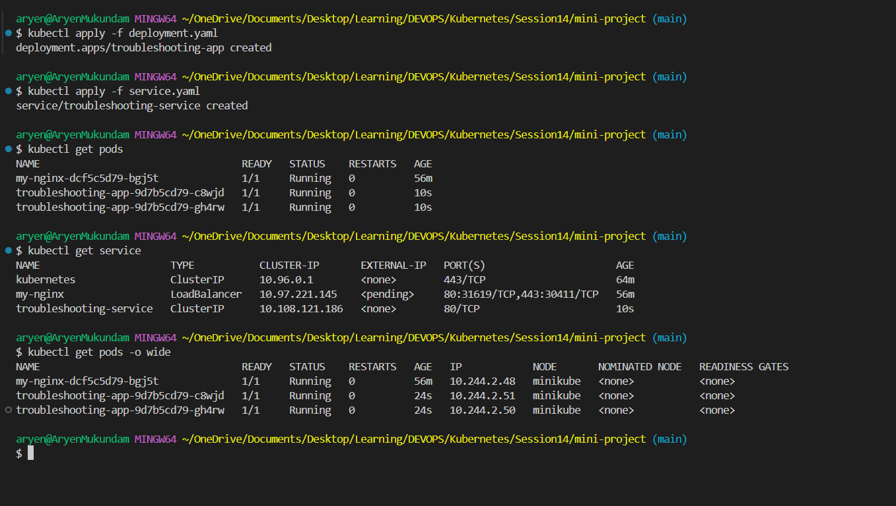
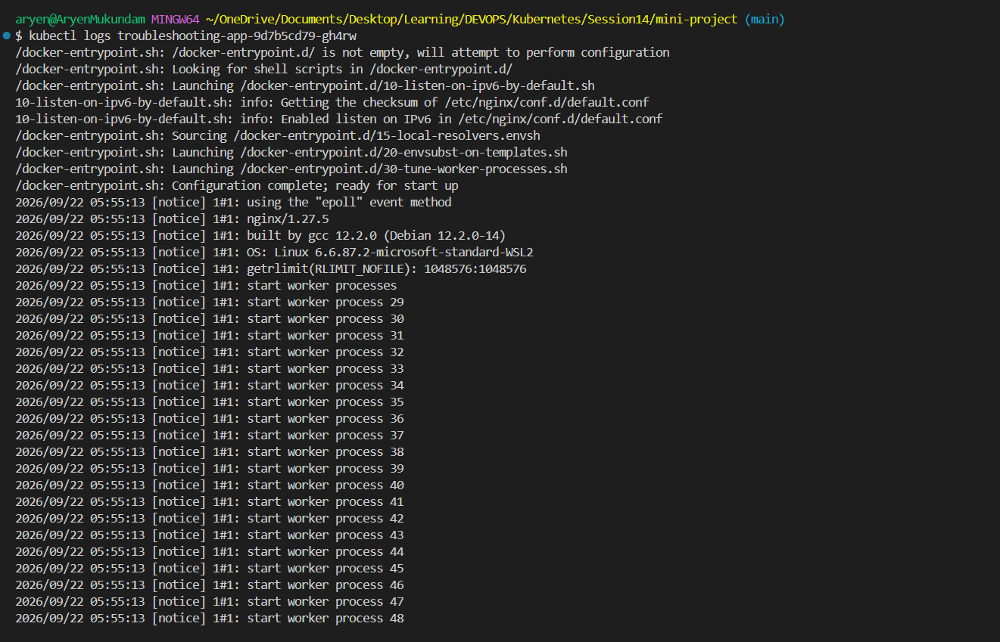
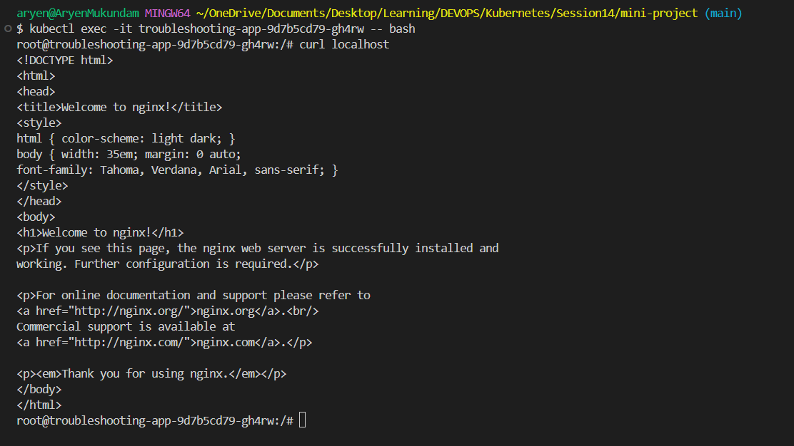
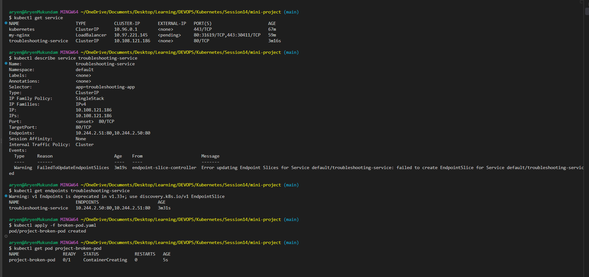
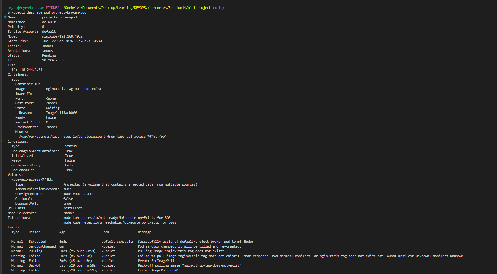

Question 1: What is the Pod status?
Answer: ImagePullBackOff

Question 2: What is the actual error?
Answer: ImagePullBackOff -> Kubenetes asked for this image but it does not exist in DockerHub.

Question 3: Which command helped you find the reason?
Answer: kubectl events

Question 4: What is wrong with the image?
Answer: The image name nginx is correct, but the tag this-tag-does-not-exist is wrong. There is no such version of nginx on Docker Hub, so the image can never be downloaded.

Question 5: How would you fix it?
Answer: Change the tag to a real one.

# Task

## Events vs Logs

| | Events | Logs |
|---|---|---|
| Who writes it | Kubernetes itself | The app running inside the container |
| What it tells | What Kubernetes tried to do (schedule, pull image, start, kill) | What the app printed (errors, requests, stack traces) |
| Command | `kubectl get events` / `kubectl describe pod <pod>` | `kubectl logs <pod>` |
| Works when pod is not running? | Yes, that is exactly when it helps (Pending, ImagePullBackOff) | No, container must have started at least once |
| Kept for how long | About 1 hour, then gone | As long as the container exists (`--previous` for the last crashed one) |
| Use it for | "Why is my pod not starting?" | "Why is my app crashing or misbehaving?" |

Simple rule: pod not starting -> check Events. Pod starting but breaking -> check Logs.
